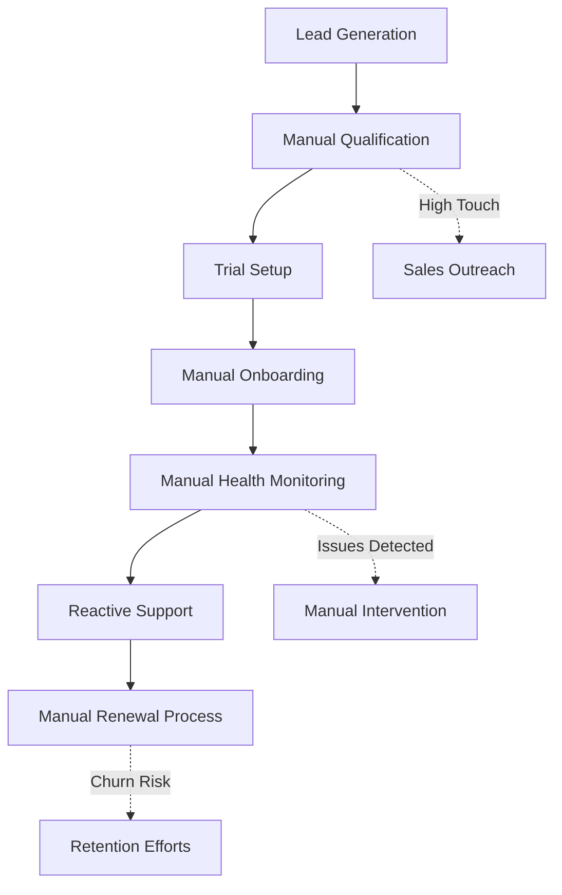
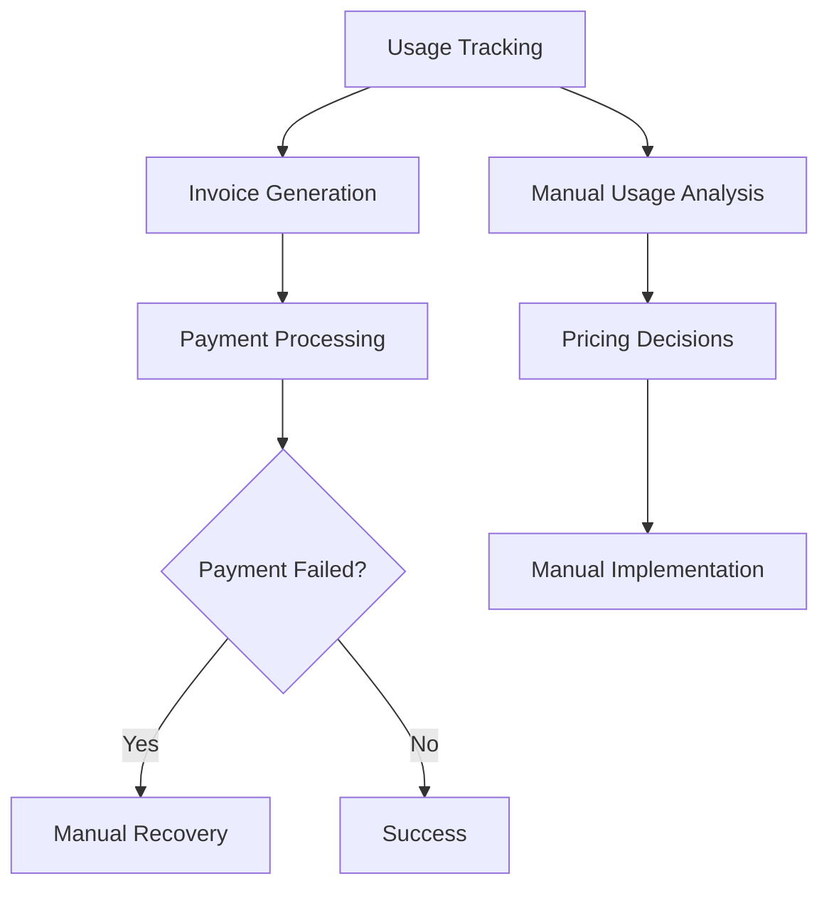
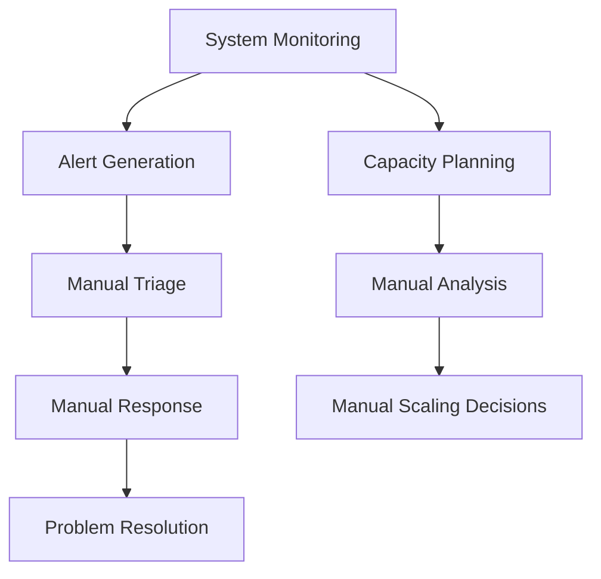

# Business Analysis: Current State & Opportunities

## Current Platform Architecture

### Core Business Model
PsiZero operates as a **Quantum Computing API-as-a-Service** platform with:

- **7 API Categories**: Each serving different quantum computing needs
  - **SRS (Symbolic Resonance Solver)**: NP-complete problem solving
  - **HQE (Holographic Quantum Encoder)**: Quantum holographic simulations
  - **QSEM (Quantum Semantics)**: Natural language quantum vector encoding
  - **NLC (Non-Local Communication)**: Quantum communication channels
  - **QCR (Quantum Consciousness Resonator)**: Consciousness simulation
  - **I-Ching Oracle**: Pattern evolution and divination
  - **Unified Physics**: Emergent gravity computation

### Revenue Structure
```yaml
pricing_tiers:
  hobbyist: 
    price: "$19/month"
    requests: "1,000-500 per API"
    features: ["Basic APIs", "Community Support"]
    
  pro:
    price: "$79/month" 
    requests: "10,000-5,000 per API"
    features: ["All APIs", "Priority Support", "Webhooks"]
    
  business:
    price: "$249/month"
    requests: "50,000 per API"
    features: ["Custom Configs", "Team Management", "SLA"]
    
  enterprise:
    price: "Custom"
    requests: "Unlimited"
    features: ["On-premise", "White-label", "24/7 Support"]
```

### Technical Infrastructure Analysis

#### Frontend Capabilities
- **React/TypeScript Stack**: Modern, scalable architecture
- **Comprehensive Dashboard**: Real-time monitoring and management
- **API Management**: Key generation, usage tracking, billing integration
- **User Management**: Organizations, roles, permissions
- **Real-time Analytics**: Usage charts, performance metrics

#### Backend Services
- **RESTful API Suite**: OpenAPI 3.1 specification
- **Dual Authentication**: API keys + OAuth2 client credentials
- **Webhook System**: Event notifications for integrations
- **Rate Limiting**: Tiered limits with enterprise options
- **Session Management**: Stateful handling for complex APIs

#### Data Infrastructure
- **Supabase Integration**: User management and data storage
- **Real-time Metrics**: Usage tracking and analytics
- **Billing Integration**: Stripe-compatible financial operations
- **Monitoring Stack**: Performance and health tracking

## Business Process Analysis

### Current Manual Processes

#### Customer Lifecycle Management (85% Manual)


**Pain Points:**
- Lead qualification relies on manual review
- Onboarding requires individual attention
- Customer health monitoring is reactive
- Support tickets need manual triage
- Upgrade opportunities missed due to lack of proactive outreach

#### Financial Operations (70% Manual)


**Pain Points:**
- Payment failure recovery requires manual intervention
- Usage pattern analysis is time-intensive
- Pricing optimization decisions lack data-driven insights
- Revenue forecasting is spreadsheet-based
- Cost optimization opportunities missed

#### Technical Operations (60% Manual)


**Pain Points:**
- Alert triage requires technical expertise
- Capacity planning is reactive rather than predictive
- Performance optimization requires manual analysis
- Cost optimization opportunities missed
- Documentation updates lag behind changes

## Automation Opportunity Assessment

### High-Impact Automation Areas

#### 1. Customer Success Automation (Potential: 78% automation)
```typescript
interface CustomerSuccessAutomation {
  // Health Scoring (90% automatable)
  healthMonitoring: {
    usagePatterns: "real-time analysis"
    engagementScoring: "behavioral tracking"
    riskPrediction: "ML-based churn prediction"
    trendAnalysis: "historical pattern matching"
  }
  
  // Engagement Automation (85% automatable)
  proactiveEngagement: {
    onboardingSequences: "automated email series"
    featureAdoption: "usage-driven recommendations"
    upsellTriggers: "threshold-based offers"
    retentionCampaigns: "risk-based interventions"
  }
  
  // Support Automation (70% automatable)
  supportOptimization: {
    ticketTriage: "AI-powered categorization"
    responseTemplates: "context-aware suggestions"
    escalationRules: "severity-based routing"
    resolutionTracking: "automated follow-up"
  }
}
```

#### 2. Financial Operations Automation (Potential: 92% automation)
```typescript
interface FinancialAutomation {
  // Billing Automation (95% automatable)
  billingOperations: {
    invoiceGeneration: "usage-based calculation"
    paymentProcessing: "automated collection"
    failureRecovery: "multi-stage recovery sequences"
    dunningManagement: "automated communication"
  }
  
  // Revenue Analytics (90% automatable)
  revenueOperations: {
    mrrCalculation: "real-time computation"
    cohortAnalysis: "automated segmentation"
    forecastGeneration: "ML-based prediction"
    pricingOptimization: "data-driven recommendations"
  }
  
  // Cost Management (88% automatable)
  costOptimization: {
    usageAnalysis: "automated cost allocation"
    infrastructureOptimization: "resource efficiency tracking"
    vendorManagement: "spend analysis and alerts"
    budgetTracking: "variance analysis and alerts"
  }
}
```

#### 3. Sales & Marketing Automation (Potential: 73% automation)
```typescript
interface SalesMarketingAutomation {
  // Lead Management (85% automatable)
  leadOperations: {
    leadScoring: "behavioral and demographic scoring"
    qualification: "rule-based and ML qualification"
    nurturing: "automated email sequences"
    routing: "intelligent lead distribution"
  }
  
  // Campaign Management (80% automatable)
  marketingOperations: {
    campaignTriggers: "usage and behavior-based"
    contentPersonalization: "segment-specific messaging"
    performanceTracking: "automated analytics"
    abTesting: "statistical significance testing"
  }
  
  // Sales Enablement (60% automatable)
  salesSupport: {
    prospectResearch: "automated company analysis"
    proposalGeneration: "template-based customization"
    followUpSequences: "CRM-integrated automation"
    dealTracking: "pipeline analytics"
  }
}
```

### Automation Readiness Assessment

#### Data Availability Score: 9/10
- **Excellent**: Comprehensive usage data, customer interactions, financial transactions
- **Good**: API performance metrics, support interactions
- **Needs Work**: External market data, competitive intelligence

#### Technical Infrastructure Score: 8/10
- **Excellent**: Modern API architecture, real-time data processing
- **Good**: Webhook system, authentication framework
- **Needs Work**: Advanced analytics infrastructure, ML pipeline

#### Process Standardization Score: 7/10
- **Excellent**: Billing and payment processes
- **Good**: Customer onboarding, support workflows
- **Needs Work**: Sales processes, marketing workflows

## Competitive Advantage Opportunities

### Differentiation Through Automation
1. **Industry-First Quantum Business Intelligence**: Leverage quantum algorithms for business optimization
2. **Predictive Customer Success**: Use quantum-enhanced prediction models
3. **Autonomous Revenue Optimization**: AI-driven pricing and packaging decisions
4. **Real-time Market Adaptation**: Quantum-powered competitive analysis

### Market Positioning Benefits
- **Operational Excellence**: 85% cost reduction versus traditional SaaS operations
- **Customer Experience Leadership**: Sub-30-second response times
- **Scalability Advantage**: Linear cost growth versus exponential revenue growth
- **Innovation Showcase**: Demonstrate quantum computing business applications

## Current Resource Constraints

### Time Allocation Analysis
```yaml
current_time_allocation:
  strategic_planning: "15%"
  customer_success: "35%"
  financial_management: "20%" 
  technical_operations: "20%"
  business_development: "10%"

ideal_time_allocation:
  strategic_planning: "40%"
  innovation: "25%"
  partnership_development: "20%"
  market_expansion: "15%"
```

### Operational Bottlenecks
1. **Decision Speed**: Information gathering delays strategic decisions
2. **Scaling Constraints**: Manual processes don't scale with growth
3. **Reactive Management**: Limited predictive capabilities
4. **Resource Allocation**: Suboptimal distribution of effort and focus

## Business Intelligence Gaps

### Missing Analytics
- **Predictive Customer Health**: Early churn warning system
- **Revenue Forecasting**: ML-based pipeline prediction
- **Market Intelligence**: Competitive pricing and feature analysis
- **Operational Efficiency**: Process optimization opportunities
- **Product-Market Fit**: Feature usage correlation with retention

### Decision Support Limitations
- **Context Fragmentation**: Data scattered across multiple systems
- **Analysis Latency**: Time-intensive manual analysis
- **Insight Actionability**: Gap between analysis and implementation
- **Strategic Alignment**: Difficulty connecting operational metrics to strategic goals

## Summary: Automation Potential

### Overall Automation Score: 79%
- **Customer Operations**: 78% automatable
- **Financial Operations**: 92% automatable
- **Technical Operations**: 85% automatable
- **Sales & Marketing**: 73% automatable
- **Strategic Planning**: 45% automatable (decision support)

### Investment Justification
- **Current Manual Effort**: ~40 hours/week across all processes
- **Post-Automation Effort**: ~8 hours/week (80% reduction)
- **Cost of Manual Operations**: ~$12,000/month
- **Automation Operational Cost**: ~$2,500/month
- **Net Monthly Savings**: ~$9,500 + efficiency gains

The analysis reveals substantial automation opportunities that can transform PsiZero from a manually-intensive operation to a largely autonomous, intelligent business platform while maintaining strategic human oversight for critical decisions.