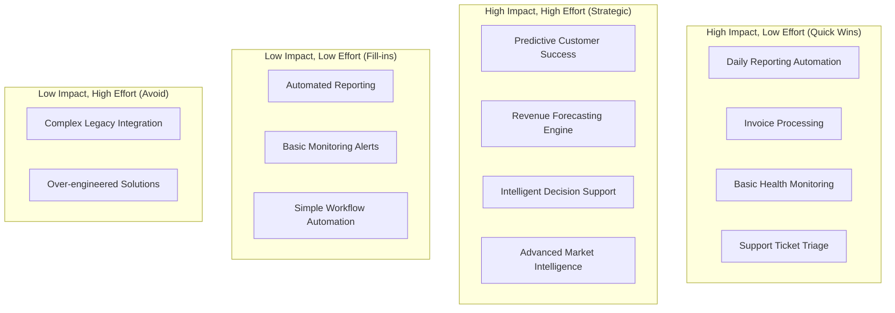

# Automation Strategy: Areas & Priorities

## Automation Framework Overview

### Strategic Approach
Transform PsiZero from manual operations to an intelligent, largely autonomous business platform through targeted automation across five core domains:

1. **Customer Lifecycle Management**
2. **Financial Operations** 
3. **Technical Operations**
4. **Sales & Marketing**
5. **Business Intelligence**

### Automation Principles
- **Human-in-the-Loop**: Maintain strategic oversight while automating tactical execution
- **Gradual Deployment**: Phased rollout with validation at each stage
- **Fail-Safe Design**: Automated rollback and escalation mechanisms
- **Continuous Learning**: AI models that improve from outcomes and feedback
- **Transparent Operations**: Full audit trails and explainable decisions

## Priority Matrix: Impact vs Effort



## Domain 1: Customer Lifecycle Management

### Current State
- **85% Manual**: Onboarding, health monitoring, support, retention
- **Reactive Approach**: Issues addressed after they occur
- **Limited Insights**: Basic usage metrics without behavioral analysis
- **Inconsistent Experience**: Varies based on available attention

### Target State
- **78% Automated**: Proactive engagement and intervention
- **Predictive Approach**: Issues prevented before they occur
- **Rich Insights**: Behavioral patterns and predictive analytics
- **Consistent Experience**: Standardized, high-quality interactions

### Automation Opportunities

#### 1. Customer Onboarding (90% Automation Potential)
```typescript
interface OnboardingAutomation {
  // Welcome Sequence
  welcomeWorkflow: {
    trigger: "new_signup"
    actions: [
      "send_welcome_email",
      "create_onboarding_checklist", 
      "schedule_check_in_calls",
      "provide_getting_started_resources"
    ]
    personalization: "industry_and_use_case_specific"
  }
  
  // Progress Tracking
  progressMonitoring: {
    milestones: [
      "first_api_call",
      "first_successful_request", 
      "10_requests_completed",
      "first_production_use"
    ]
    interventions: "automated_assistance_on_stalling"
    celebration: "milestone_achievement_recognition"
  }
  
  // Success Metrics
  successCriteria: {
    timeToFirstValue: "<24 hours"
    completionRate: ">85%"
    satisfactionScore: ">4.5/5"
  }
}
```

#### 2. Health Monitoring & Risk Detection (85% Automation Potential)
```typescript
interface HealthMonitoring {
  // Health Scoring Algorithm
  healthScore: {
    usageMetrics: {
      apiCallFrequency: "weight: 0.3"
      apiCallSuccess: "weight: 0.2" 
      featureAdoption: "weight: 0.2"
      supportTickets: "weight: 0.1"
      billingStatus: "weight: 0.2"
    }
    
    engagementMetrics: {
      loginFrequency: "weight: 0.3"
      dashboardUsage: "weight: 0.2"
      documentationAccess: "weight: 0.1"
      communityParticipation: "weight: 0.1"
      feedbackProvision: "weight: 0.3"
    }
  }
  
  // Risk Prediction Models
  churnPrediction: {
    algorithm: "machine_learning_classifier"
    features: [
      "usage_decline_rate",
      "support_ticket_sentiment",
      "billing_issues_history",
      "competitive_intelligence",
      "market_segment_trends"
    ]
    accuracy_target: ">85%"
    prediction_horizon: "30_days"
  }
  
  // Intervention Triggers
  interventionRules: {
    healthScore: {
      critical: "<40: immediate_personal_outreach"
      warning: "<60: automated_engagement_campaign"
      good: ">80: upsell_opportunity_identification"
    }
    
    churnRisk: {
      high: ">75%: customer_success_manager_alert"
      medium: ">50%: automated_retention_sequence"
      low: "<25%: continue_monitoring"
    }
  }
}
```

#### 3. Support Automation (70% Automation Potential)
```typescript
interface SupportAutomation {
  // Intelligent Triage
  ticketTriage: {
    classification: {
      technical: "api_errors, integration_issues, performance"
      billing: "payment_failures, plan_changes, invoicing"
      feature: "feature_requests, enhancement_ideas"
      general: "questions, feedback, consultation"
    }
    
    prioritization: {
      critical: "service_down, security_breach, data_loss"
      high: "functionality_broken, billing_dispute"
      medium: "feature_question, minor_bug"
      low: "general_inquiry, enhancement_request"
    }
    
    routing: {
      technical: "engineering_team"
      billing: "finance_team" 
      feature: "product_team"
      general: "customer_success"
    }
  }
  
  // Automated Responses
  responseAutomation: {
    knowledgeBase: "ai_powered_answer_generation"
    templateLibrary: "context_aware_template_selection"
    escalationRules: "complexity_and_sentiment_based"
    followUpTracking: "automated_satisfaction_surveys"
  }
  
  // Performance Metrics
  successMetrics: {
    firstResponseTime: "<30_seconds"
    resolutionTime: "<4_hours_average"
    customerSatisfaction: ">4.5/5"
    escalationRate: "<15%"
  }
}
```

## Domain 2: Financial Operations

### Current State
- **70% Manual**: Invoice processing, payment recovery, financial analysis
- **Reactive Billing**: Issues handled after they occur
- **Limited Forecasting**: Spreadsheet-based revenue projections
- **Delayed Insights**: Monthly financial reviews with historical data

### Target State
- **92% Automated**: Intelligent billing and revenue optimization
- **Proactive Management**: Issues prevented and opportunities captured
- **Predictive Forecasting**: ML-based revenue and cash flow prediction
- **Real-time Insights**: Daily financial intelligence and trend analysis

### Automation Opportunities

#### 1. Billing & Payment Operations (95% Automation Potential)
```typescript
interface BillingAutomation {
  // Automated Billing Cycle
  billingOperations: {
    usageAggregation: "real_time_api_call_metering"
    invoiceGeneration: "usage_based_calculation_with_overages"
    deliveryScheduling: "customizable_billing_cycles"
    paymentProcessing: "automated_collection_sequences"
  }
  
  // Payment Failure Recovery
  dunningManagement: {
    softDeclines: {
      retrySchedule: [1, 3, 7, 14] // days
      communication: "automated_email_sequence"
      serviceRestriction: "gradual_api_rate_limiting"
    }
    
    hardDeclines: {
      immediateAction: "payment_method_update_request"
      communication: "personal_outreach_trigger"
      gracePeriod: "7_days_with_service_maintenance"
    }
    
    recoverySequence: [
      "automated_email_retry",
      "sms_notification", 
      "phone_call_trigger",
      "customer_success_intervention",
      "account_suspension_warning"
    ]
  }
  
  // Revenue Recognition
  revenueTracking: {
    subscriptionRevenue: "automated_mrr_calculation"
    usageRevenue: "real_time_overage_tracking"
    deferredRevenue: "gaap_compliant_recognition"
    refundProcessing: "automated_credit_application"
  }
}
```

#### 2. Financial Analytics & Forecasting (90% Automation Potential)
```typescript
interface FinancialAnalytics {
  // Revenue Forecasting
  forecastingEngine: {
    mrrPrediction: {
      model: "time_series_with_seasonal_adjustment"
      inputs: [
        "historical_mrr_growth",
        "new_customer_acquisition_rate",
        "churn_rate_predictions",
        "expansion_revenue_trends",
        "market_seasonality_factors"
      ]
      accuracy_target: ">92%"
      horizon: "12_months_with_confidence_intervals"
    }
    
    cashFlowProjection: {
      model: "multi_variate_regression"
      factors: [
        "revenue_forecast",
        "payment_timing_patterns",
        "operational_expenses",
        "growth_investments",
        "seasonal_variations"
      ]
      updateFrequency: "daily"
    }
  }
  
  // Performance Analytics
  performanceTracking: {
    kpiDashboard: {
      mrr: "monthly_recurring_revenue_with_growth_rate"
      arr: "annual_recurring_revenue_projection"
      ltv: "customer_lifetime_value_by_segment"
      cac: "customer_acquisition_cost_by_channel"
      paybackPeriod: "cac_payback_time_analysis"
      churnRate: "monthly_and_annual_churn_by_cohort"
    }
    
    cohortAnalysis: {
      retentionCurves: "monthly_cohort_retention_tracking"
      revenueExpansion: "expansion_revenue_by_cohort"
      segmentPerformance: "industry_and_size_based_analysis"
    }
  }
}
```

#### 3. Cost Management & Optimization (88% Automation Potential)
```typescript
interface CostOptimization {
  // Infrastructure Cost Management
  infrastructureOptimization: {
    usageBasedScaling: "automated_resource_scaling"
    costAllocation: "per_customer_cost_tracking"
    vendorOptimization: "spend_analysis_and_recommendations"
    wasteElimination: "unused_resource_identification"
  }
  
  // Budget Management
  budgetTracking: {
    categoryBudgets: {
      infrastructure: "cloud_and_saas_costs"
      personnel: "salary_and_contractor_costs"
      marketing: "acquisition_and_retention_costs"
      operations: "tools_and_services_costs"
    }
    
    varianceAnalysis: {
      thresholds: "10%_variance_triggers_alert"
      rootCauseAnalysis: "automated_drill_down"
      forecastAdjustment: "dynamic_budget_updates"
    }
  }
  
  // ROI Analysis
  investmentTracking: {
    featureROI: "development_cost_vs_revenue_impact"
    channelROI: "marketing_spend_vs_acquisition_efficiency"
    toolROI: "operational_cost_vs_productivity_gains"
    automationROI: "implementation_cost_vs_savings"
  }
}
```

## Domain 3: Technical Operations

### Current State
- **60% Manual**: Monitoring, capacity planning, performance optimization
- **Reactive Monitoring**: Issues addressed after performance degradation
- **Manual Scaling**: Capacity decisions based on historical usage
- **Siloed Metrics**: Performance data not integrated with business metrics

### Target State
- **85% Automated**: Predictive monitoring and self-healing systems
- **Proactive Optimization**: Issues prevented through predictive analytics
- **Intelligent Scaling**: ML-driven capacity planning and resource allocation
- **Integrated Intelligence**: Technical metrics tied to business outcomes

### Automation Opportunities

#### 1. Performance Monitoring & Optimization (90% Automation Potential)
```typescript
interface PerformanceAutomation {
  // Intelligent Monitoring
  monitoringSystem: {
    metricsCollection: {
      apiLatency: "p50, p95, p99_response_times"
      errorRates: "by_endpoint_and_customer"
      throughput: "requests_per_second_by_api"
      availability: "uptime_tracking_with_sla_monitoring"
    }
    
    anomalyDetection: {
      algorithm: "statistical_and_ml_based_detection"
      thresholds: "dynamic_based_on_historical_patterns"
      falsePositiveReduction: "context_aware_filtering"
      impactAssessment: "business_impact_scoring"
    }
    
    alerting: {
      intelligentEscalation: "severity_and_business_impact_based"
      contextualAlerts: "root_cause_analysis_included"
      notificationChannels: "slack, email, sms, phone"
      alertFatiguePrevention: "smart_grouping_and_suppression"
    }
  }
  
  // Self-Healing Systems
  autoRemediation: {
    commonIssues: {
      highLatency: "automatic_scaling_trigger"
      errorSpikes: "circuit_breaker_activation"
      memoryLeaks: "service_restart_sequence"
      databaseSlow: "query_optimization_suggestions"
    }
    
    escalationRules: {
      autoResolution: "simple_issues_resolved_automatically"
      humanIntervention: "complex_issues_escalated_with_context"
      customerNotification: "proactive_communication_for_impacts"
    }
  }
}
```

#### 2. Capacity Planning & Resource Management (85% Automation Potential)
```typescript
interface CapacityManagement {
  // Predictive Scaling
  scalingAutomation: {
    demandForecasting: {
      model: "time_series_with_business_events"
      inputs: [
        "historical_usage_patterns",
        "customer_growth_projections", 
        "seasonal_demand_variations",
        "marketing_campaign_impacts",
        "product_launch_schedules"
      ]
      horizon: "30_days_with_hourly_granularity"
    }
    
    resourceOptimization: {
      autoScaling: "predictive_horizontal_and_vertical_scaling"
      costOptimization: "spot_instance_and_reserved_capacity_management"
      performanceTuning: "automated_configuration_optimization"
    }
  }
  
  // Infrastructure Management
  infrastructureAutomation: {
    deploymentPipeline: "automated_ci_cd_with_canary_releases"
    configurationManagement: "infrastructure_as_code_with_drift_detection"
    securityPatching: "automated_vulnerability_remediation"
    backupManagement: "automated_backup_and_recovery_testing"
  }
}
```

## Domain 4: Sales & Marketing

### Current State
- **75% Manual**: Lead qualification, campaign management, content creation
- **Limited Personalization**: Generic messaging and timing
- **Reactive Approach**: Campaigns triggered by calendar rather than behavior
- **Disconnected Analytics**: Marketing metrics not tied to revenue outcomes

### Target State
- **73% Automated**: Behavioral-triggered campaigns and intelligent lead management
- **Dynamic Personalization**: AI-driven content and timing optimization
- **Proactive Engagement**: Behavior-based campaign triggers
- **Unified Analytics**: Marketing activities directly tied to revenue outcomes

### Automation Opportunities

#### 1. Lead Management & Qualification (85% Automation Potential)
```typescript
interface LeadAutomation {
  // Intelligent Lead Scoring
  leadScoring: {
    demographicScoring: {
      companySize: "employees_and_revenue_based_scoring"
      industry: "quantum_computing_fit_assessment"
      geography: "market_maturity_evaluation"
      technology: "api_adoption_likelihood"
    }
    
    behavioralScoring: {
      websiteEngagement: "page_views_time_spent_content_consumed"
      documentationUsage: "api_docs_tutorial_completion"
      trialBehavior: "api_calls_success_rate_feature_adoption"
      communicationEngagement: "email_opens_clicks_responses"
    }
    
    predictiveScoring: {
      conversionProbability: "ml_model_based_on_historical_conversions"
      timeToConversion: "estimated_sales_cycle_length"
      valuePotential: "projected_customer_lifetime_value"
    }
  }
  
  // Automated Qualification
  qualificationWorkflow: {
    initialScreening: "automated_form_analysis_and_company_research"
    progressiveQualification: "behavioral_trigger_based_questioning"
    scoringUpdates: "real_time_score_adjustment_based_on_actions"
    routingRules: "score_and_fit_based_sales_assignment"
  }
}
```

#### 2. Campaign Management & Personalization (80% Automation Potential)
```typescript
interface CampaignAutomation {
  // Behavioral Trigger Campaigns
  triggerBasedCampaigns: {
    onboardingSequences: {
      trigger: "trial_signup"
      personalization: "industry_use_case_company_size"
      contentSeries: [
        "welcome_and_getting_started",
        "relevant_use_cases_and_examples",
        "advanced_features_introduction",
        "success_stories_from_similar_companies",
        "conversion_focused_value_demonstration"
      ]
      optimization: "a_b_testing_of_content_timing_frequency"
    }
    
    engagementCampaigns: {
      lowUsage: "feature_adoption_and_education_campaigns"
      highUsage: "upsell_and_expansion_opportunities"
      churnRisk: "retention_focused_value_reinforcement"
      advocacy: "case_study_and_referral_campaigns"
    }
  }
  
  // Content Personalization
  contentOptimization: {
    dynamicContent: "industry_role_stage_specific_messaging"
    timingOptimization: "send_time_optimization_by_recipient"
    channelOptimization: "email_slack_in_app_notification_preference"
    performanceTracking: "engagement_and_conversion_rate_analysis"
  }
}
```

## Domain 5: Business Intelligence

### Current State
- **80% Manual**: Data analysis, report generation, insight discovery
- **Historical Focus**: Reports based on past performance
- **Fragmented Data**: Information scattered across multiple systems
- **Limited Predictive Capability**: Reactive rather than proactive insights

### Target State
- **95% Automated**: Real-time intelligence with predictive analytics
- **Forward-Looking**: Predictive models and trend analysis
- **Unified Intelligence**: Comprehensive business intelligence platform
- **Actionable Insights**: Automated recommendation generation

### Automation Opportunities

#### 1. Automated Reporting & Analytics (95% Automation Potential)
```typescript
interface BusinessIntelligence {
  // Automated Reporting
  reportingEngine: {
    dailyDashboard: {
      metrics: [
        "revenue_performance_vs_targets",
        "customer_health_summary",
        "api_performance_overview", 
        "support_ticket_status",
        "key_opportunities_and_risks"
      ]
      delivery: "automated_morning_briefing"
      personalization: "role_based_metric_prioritization"
    }
    
    weeklyAnalysis: {
      trends: "week_over_week_performance_analysis"
      cohorts: "customer_cohort_performance_tracking"
      forecasts: "updated_revenue_and_growth_projections"
      recommendations: "data_driven_action_suggestions"
    }
    
    monthlyStrategic: {
      performance: "monthly_business_review_automation"
      benchmarking: "industry_and_competitor_comparison"
      planning: "next_month_goal_setting_and_resource_allocation"
    }
  }
  
  // Predictive Analytics
  predictiveIntelligence: {
    revenueForecasting: "ml_based_revenue_prediction_with_confidence_intervals"
    customerLifecycle: "churn_prediction_and_expansion_opportunity_identification"
    marketTrends: "industry_trend_analysis_and_impact_assessment"
    competitiveIntelligence: "competitor_monitoring_and_threat_assessment"
  }
}
```

## Implementation Priority Sequence

### Phase 1: Foundation (Weeks 1-4)
**Quick Wins & Infrastructure**
1. **Daily Reporting Automation** (Week 1)
2. **Basic Health Monitoring** (Week 2)
3. **Invoice Processing Automation** (Week 3)
4. **Support Ticket Triage** (Week 4)

### Phase 2: Intelligence (Weeks 5-8)
**Analytics & Prediction**
1. **Customer Health Scoring** (Week 5)
2. **Revenue Forecasting** (Week 6)
3. **Churn Prediction** (Week 7)
4. **Performance Monitoring** (Week 8)

### Phase 3: Autonomous Operations (Weeks 9-12)
**End-to-End Automation**
1. **Customer Lifecycle Automation** (Week 9-10)
2. **Financial Operations Automation** (Week 11-12)

### Phase 4: Advanced Intelligence (Weeks 13-16)
**Strategic Capabilities**
1. **Market Intelligence** (Week 13-14)
2. **Strategic Decision Support** (Week 15-16)

## Success Metrics by Domain

### Customer Operations
- **Onboarding Completion Rate**: >85%
- **Customer Health Score**: Average >75
- **Churn Prediction Accuracy**: >85%
- **Support Response Time**: <30 seconds

### Financial Operations
- **Billing Automation Rate**: >95%
- **Payment Recovery Rate**: >80%
- **Forecast Accuracy**: >92%
- **Cost Reduction**: >40%

### Technical Operations
- **Uptime**: >99.5%
- **Auto-Resolution Rate**: >70%
- **Performance Optimization**: >30% improvement
- **Capacity Planning Accuracy**: >90%

### Sales & Marketing
- **Lead Scoring Accuracy**: >80%
- **Campaign Conversion Rates**: >15% improvement
- **Content Personalization Effectiveness**: >25% engagement increase
- **Sales Cycle Reduction**: >20%

### Business Intelligence
- **Report Automation**: >95%
- **Insight Accuracy**: >90%
- **Decision Speed**: >75% reduction in analysis time
- **Predictive Model Performance**: >85% accuracy

This automation strategy provides a comprehensive roadmap for transforming PsiZero into an intelligent, largely autonomous business platform while maintaining strategic human oversight and ensuring customer success throughout the transformation.