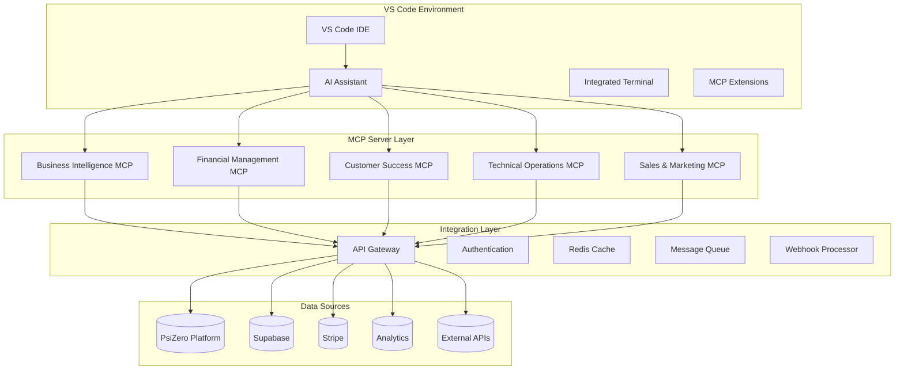
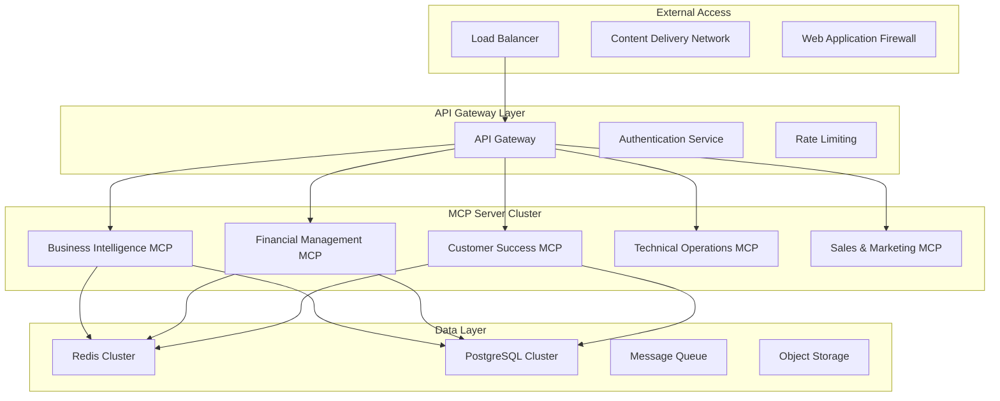

# MCP Server Architecture & Integration Design

## Overview

The MCP (Model Context Protocol) server architecture forms the backbone of PsiZero's business automation system, providing standardized interfaces for AI-driven business operations while maintaining security, reliability, and scalability.

## Architectural Principles

### Design Philosophy
- **Modular Architecture**: Each business domain has dedicated MCP servers
- **Standardized Interfaces**: Consistent API design across all servers
- **Event-Driven Communication**: Real-time data flow and response triggers
- **Fail-Safe Operations**: Graceful degradation and automatic recovery
- **Security by Design**: Zero-trust architecture with encrypted communications

### Integration Strategy


## Core MCP Server Specifications

### Base MCP Server Interface
```typescript
interface BaseMCPServer {
  // Core Properties
  name: string
  version: string
  description: string
  capabilities: ServerCapability[]
  
  // Lifecycle Management
  initialize(config: ServerConfig): Promise<InitializationResult>
  healthCheck(): Promise<HealthStatus>
  shutdown(): Promise<void>
  
  // Command Execution
  executeCommand(command: Command): Promise<CommandResult>
  listCommands(): Promise<Command[]>
  
  // Resource Management
  listResources(): Promise<Resource[]>
  readResource(uri: string): Promise<ResourceContent>
  
  // Tool Integration
  listTools(): Promise<Tool[]>
  callTool(name: string, arguments: ToolArguments): Promise<ToolResult>
  
  // Event Handling
  onNotification(notification: Notification): void
  sendNotification(notification: Notification): Promise<void>
  
  // Security & Authentication
  authenticate(credentials: Credentials): Promise<AuthResult>
  authorize(action: string, resource: string): Promise<boolean>
}

interface ServerConfig {
  dataConnections: DataConnection[]
  authConfig: AuthenticationConfig
  cachingConfig: CacheConfig
  rateLimits: RateLimitConfig
  logging: LoggingConfig
}
```

## 1. Business Intelligence MCP Server

### Purpose & Scope
Primary intelligence hub for data analysis, reporting, and predictive insights across all business domains.

### Core Capabilities
```typescript
interface BusinessIntelligenceMCP extends BaseMCPServer {
  // Dashboard & Reporting
  generateDashboard(params: DashboardParams): Promise<Dashboard>
  createReport(type: ReportType, filters: ReportFilters): Promise<Report>
  scheduleReport(schedule: ReportSchedule): Promise<ScheduleResult>
  
  // Analytics & Insights
  analyzeMetrics(metrics: string[], timeframe: TimeRange): Promise<MetricAnalysis>
  generateInsights(dataSource: string, context?: string): Promise<Insight[]>
  detectAnomalies(dataset: string, sensitivity: number): Promise<Anomaly[]>
  
  // Predictive Analytics
  forecastMetric(metric: string, horizon: string): Promise<Forecast>
  predictTrend(dataset: string, variables: string[]): Promise<TrendPrediction>
  modelPerformance(modelId: string): Promise<ModelMetrics>
  
  // Data Integration
  connectDataSource(source: DataSourceConfig): Promise<ConnectionResult>
  queryData(query: DataQuery): Promise<QueryResult>
  refreshData(sources?: string[]): Promise<RefreshResult>
}

interface DashboardParams {
  type: 'executive' | 'operational' | 'financial' | 'customer' | 'technical'
  timeframe: TimeRange
  metrics: string[]
  segments?: string[]
  realTime?: boolean
}

interface Insight {
  id: string
  type: 'opportunity' | 'risk' | 'trend' | 'anomaly'
  priority: 'low' | 'medium' | 'high' | 'critical'
  title: string
  description: string
  dataPoints: DataPoint[]
  recommendations: Recommendation[]
  confidence: number
  impact: {
    financial?: number
    operational?: number
    strategic?: number
  }
}
```

### Data Connections
```yaml
data_sources:
  psizero_api:
    type: "REST API"
    endpoint: "https://api.psizero.dev"
    auth: "bearer_token"
    refresh_interval: "1_minute"
    
  supabase:
    type: "PostgreSQL"
    connection: "encrypted_connection_string"
    read_replicas: true
    refresh_interval: "5_minutes"
    
  stripe:
    type: "REST API" 
    endpoint: "https://api.stripe.com"
    auth: "api_key"
    webhooks: true
    
  analytics_warehouse:
    type: "BigQuery"
    project: "psizero-analytics"
    datasets: ["usage", "performance", "customer"]
    refresh_interval: "15_minutes"
```

## 2. Financial Management MCP Server

### Purpose & Scope
Automated financial operations including billing, revenue recognition, cost management, and financial forecasting.

### Core Capabilities
```typescript
interface FinancialManagementMCP extends BaseMCPServer {
  // Billing Operations
  processInvoices(criteria?: BillingCriteria): Promise<InvoiceResult[]>
  handlePaymentFailures(): Promise<PaymentRecoveryAction[]>
  calculateUsageCharges(customerId: string, period: BillingPeriod): Promise<UsageCharges>
  applyCredits(customerId: string, amount: number, reason: string): Promise<CreditResult>
  
  // Revenue Management
  calculateMRR(date?: Date): Promise<MRRCalculation>
  recognizeRevenue(period: BillingPeriod): Promise<RevenueRecognition>
  trackSubscriptionChanges(): Promise<SubscriptionChange[]>
  generateRevenueReport(period: ReportPeriod): Promise<RevenueReport>
  
  // Financial Forecasting
  forecastRevenue(horizon: string, scenarios?: string[]): Promise<RevenueForecast>
  predictCashFlow(months: number): Promise<CashFlowProjection>
  analyzeCustomerLTV(segmentId?: string): Promise<LTVAnalysis>
  
  // Cost Management
  trackOperationalCosts(): Promise<CostBreakdown>
  optimizeInfrastructureCosts(): Promise<CostOptimization[]>
  allocateCosts(method: AllocationMethod): Promise<CostAllocation>
  
  // Financial Reporting
  generateFinancialStatements(period: ReportPeriod): Promise<FinancialStatements>
  createBudgetVarianceReport(): Promise<BudgetVarianceReport>
  calculateKeyFinancialMetrics(): Promise<FinancialKPIs>
}

interface BillingCriteria {
  customerIds?: string[]
  plans?: string[]
  billingDate?: Date
  overageOnly?: boolean
}

interface PaymentRecoveryAction {
  customerId: string
  action: 'retry_payment' | 'update_payment_method' | 'apply_grace_period' | 'suspend_service'
  schedule?: Date
  communicationSent: boolean
  result?: 'success' | 'failed' | 'pending'
}
```

### Financial Data Integration
```typescript
interface FinancialDataSources {
  stripe: {
    invoices: "real_time_webhook_updates"
    payments: "real_time_webhook_updates"
    subscriptions: "daily_sync"
    customers: "real_time_webhook_updates"
  }
  
  psizero_usage: {
    api_calls: "real_time_metering"
    feature_usage: "hourly_aggregation"
    storage_usage: "daily_calculation"
  }
  
  accounting_system: {
    chart_of_accounts: "daily_sync"
    journal_entries: "real_time_posting"
    budget_data: "monthly_sync"
  }
  
  banking: {
    transactions: "daily_sync"
    balances: "real_time_updates"
    reconciliation: "automated_matching"
  }
}
```

## 3. Customer Success MCP Server

### Purpose & Scope
Proactive customer health monitoring, engagement automation, and retention optimization.

### Core Capabilities
```typescript
interface CustomerSuccessMCP extends BaseMCPServer {
  // Health Monitoring
  calculateCustomerHealth(customerId?: string): Promise<CustomerHealth[]>
  identifyAtRiskCustomers(threshold?: number): Promise<AtRiskCustomer[]>
  trackEngagementMetrics(customerId: string): Promise<EngagementMetrics>
  monitorUsagePatterns(): Promise<UsagePattern[]>
  
  // Predictive Analytics
  predictChurn(customerId?: string): Promise<ChurnPrediction[]>
  identifyExpansionOpportunities(): Promise<ExpansionOpportunity[]>
  forecastCustomerValue(customerId: string): Promise<ValueForecast>
  
  // Engagement Automation
  createEngagementCampaign(type: CampaignType, audience: Audience): Promise<Campaign>
  triggerInterventions(): Promise<InterventionResult[]>
  scheduleCheckIns(criteria: CheckInCriteria): Promise<CheckInSchedule[]>
  
  // Onboarding Management
  trackOnboardingProgress(customerId: string): Promise<OnboardingStatus>
  optimizeOnboardingFlow(): Promise<OnboardingOptimization>
  createPersonalizedOnboarding(customerId: string): Promise<OnboardingPlan>
  
  // Success Metrics
  calculateNPS(): Promise<NPSScore>
  trackFeatureAdoption(): Promise<FeatureAdoptionMetrics>
  measureTimeToValue(customerId?: string): Promise<TimeToValueMetrics>
}

interface CustomerHealth {
  customerId: string
  healthScore: number // 0-100
  factors: {
    usageHealth: number
    engagementHealth: number
    supportHealth: number
    billingHealth: number
  }
  trend: 'improving' | 'stable' | 'declining'
  riskLevel: 'low' | 'medium' | 'high' | 'critical'
  lastUpdated: Date
  recommendations: HealthRecommendation[]
}

interface ChurnPrediction {
  customerId: string
  churnProbability: number // 0-1
  timeToChurn?: number // days
  primaryRiskFactors: string[]
  confidence: number
  recommendedActions: InterventionAction[]
}
```

### Customer Data Integration
```typescript
interface CustomerDataSources {
  customer_database: {
    profiles: "real_time_updates"
    subscriptions: "real_time_updates"
    support_history: "real_time_updates"
    communication_history: "real_time_updates"
  }
  
  usage_analytics: {
    api_usage: "real_time_streaming"
    feature_usage: "real_time_events"
    session_data: "real_time_tracking"
    performance_metrics: "real_time_monitoring"
  }
  
  support_system: {
    tickets: "real_time_webhooks"
    satisfaction_scores: "post_resolution_sync"
    knowledge_base_usage: "real_time_tracking"
  }
  
  communication_platforms: {
    email_engagement: "real_time_webhooks"
    in_app_notifications: "real_time_events"
    survey_responses: "real_time_collection"
  }
}
```

## 4. Technical Operations MCP Server

### Purpose & Scope
System monitoring, performance optimization, capacity planning, and automated incident response.

### Core Capabilities
```typescript
interface TechnicalOperationsMCP extends BaseMCPServer {
  // Performance Monitoring
  monitorSystemPerformance(): Promise<PerformanceMetrics>
  trackAPIMetrics(): Promise<APIMetrics>
  analyzeErrorPatterns(): Promise<ErrorAnalysis>
  generatePerformanceReport(): Promise<PerformanceReport>
  
  // Capacity Management
  forecastCapacityNeeds(horizon: string): Promise<CapacityForecast>
  optimizeResourceAllocation(): Promise<ResourceOptimization>
  planScalingEvents(): Promise<ScalingPlan[]>
  
  // Incident Management
  detectIncidents(): Promise<Incident[]>
  triageIncidents(incidents: Incident[]): Promise<TriageResult[]>
  executeResponsePlan(incidentId: string): Promise<ResponseResult>
  generateIncidentReport(incidentId: string): Promise<IncidentReport>
  
  // Automation & Optimization
  identifyOptimizationOpportunities(): Promise<OptimizationOpportunity[]>
  implementPerformanceOptimizations(): Promise<OptimizationResult[]>
  autoTuneConfigurations(): Promise<TuningResult[]>
  
  // Security Monitoring
  monitorSecurityEvents(): Promise<SecurityEvent[]>
  analyzeVulnerabilities(): Promise<VulnerabilityAssessment>
  trackComplianceStatus(): Promise<ComplianceStatus>
}

interface PerformanceMetrics {
  timestamp: Date
  system: {
    cpu_usage: number
    memory_usage: number
    disk_usage: number
    network_io: number
  }
  application: {
    response_times: ResponseTimeMetrics
    error_rates: ErrorRateMetrics
    throughput: ThroughputMetrics
    availability: number
  }
  database: {
    query_performance: QueryMetrics
    connection_pool: PoolMetrics
    index_efficiency: IndexMetrics
  }
}

interface Incident {
  id: string
  title: string
  severity: 'low' | 'medium' | 'high' | 'critical'
  status: 'open' | 'investigating' | 'resolved' | 'closed'
  detectedAt: Date
  affectedServices: string[]
  impactAssessment: {
    customersAffected: number
    revenueImpact: number
    reputationRisk: 'low' | 'medium' | 'high'
  }
  rootCause?: string
  resolution?: string
}
```

## 5. Sales & Marketing MCP Server

### Purpose & Scope
Lead management, campaign automation, content optimization, and sales enablement.

### Core Capabilities
```typescript
interface SalesMarketingMCP extends BaseMCPServer {
  // Lead Management
  scoreLeads(): Promise<LeadScore[]>
  qualifyProspects(criteria: QualificationCriteria): Promise<QualifiedProspect[]>
  routeLeads(routingRules: RoutingRule[]): Promise<LeadRoutingResult[]>
  trackLeadProgression(): Promise<LeadProgressReport>
  
  // Campaign Management
  createCampaign(type: CampaignType, config: CampaignConfig): Promise<Campaign>
  optimizeCampaignPerformance(campaignId: string): Promise<OptimizationResult>
  trackCampaignMetrics(): Promise<CampaignMetrics[]>
  generateCampaignReport(campaignId: string): Promise<CampaignReport>
  
  // Content Optimization
  generateMarketingContent(brief: ContentBrief): Promise<GeneratedContent>
  optimizeEmailContent(emailId: string): Promise<EmailOptimization>
  personalizeContent(contentId: string, audience: Audience): Promise<PersonalizedContent>
  
  // Sales Enablement
  identifyUpsellOpportunities(): Promise<UpsellOpportunity[]>
  generateSalesInsights(prospectId: string): Promise<SalesInsight>
  trackSalesPerformance(): Promise<SalesMetrics>
  forecastSalesPipeline(): Promise<PipelineForecast>
  
  // Market Intelligence
  analyzeCompetitiveLandscape(): Promise<CompetitiveAnalysis>
  trackMarketTrends(): Promise<MarketTrend[]>
  identifyMarketOpportunities(): Promise<MarketOpportunity[]>
}

interface LeadScore {
  leadId: string
  totalScore: number
  scoreBreakdown: {
    demographic: number
    behavioral: number
    engagement: number
    intent: number
  }
  qualificationStatus: 'mql' | 'sql' | 'opportunity' | 'disqualified'
  nextActions: string[]
  lastUpdated: Date
}

interface Campaign {
  id: string
  name: string
  type: 'email' | 'social' | 'content' | 'webinar' | 'trial'
  status: 'draft' | 'active' | 'paused' | 'completed'
  audience: AudienceSegment
  content: ContentAsset[]
  triggers: CampaignTrigger[]
  metrics: CampaignMetrics
  goals: CampaignGoal[]
}
```

## Security & Compliance Framework

### Authentication & Authorization
```typescript
interface SecurityFramework {
  authentication: {
    method: "JWT_with_refresh_tokens"
    encryption: "AES_256"
    session_management: "secure_cookie_based"
    mfa_support: "TOTP_and_SMS"
  }
  
  authorization: {
    model: "RBAC_with_attribute_based_controls"
    permissions: "granular_resource_level"
    audit_trail: "comprehensive_action_logging"
  }
  
  data_protection: {
    encryption_at_rest: "AES_256"
    encryption_in_transit: "TLS_1.3"
    key_management: "HSM_backed_rotation"
    data_masking: "PII_and_sensitive_data"
  }
  
  compliance: {
    standards: ["SOC2", "GDPR", "CCPA", "HIPAA"]
    monitoring: "continuous_compliance_checking"
    reporting: "automated_compliance_reports"
  }
}
```

### Error Handling & Resilience
```typescript
interface ResilienceFramework {
  error_handling: {
    strategy: "graceful_degradation"
    fallback_mechanisms: "cached_responses_and_manual_override"
    retry_logic: "exponential_backoff_with_jitter"
    circuit_breakers: "service_level_protection"
  }
  
  monitoring: {
    health_checks: "endpoint_specific_health_monitoring"
    alerting: "multi_channel_intelligent_alerting"
    logging: "structured_centralized_logging"
    metrics: "prometheus_compatible_metrics"
  }
  
  disaster_recovery: {
    backup_strategy: "automated_incremental_backups"
    recovery_procedures: "tested_automated_recovery"
    rpo: "15_minutes_maximum_data_loss"
    rto: "30_minutes_maximum_downtime"
  }
}
```

## Deployment & Scaling Architecture

### Container Orchestration
```yaml
deployment:
  platform: "Kubernetes"
  containers:
    - name: "business-intelligence-mcp"
      replicas: 3
      resources:
        cpu: "2 cores"
        memory: "4Gi"
        storage: "100Gi"
    
    - name: "financial-management-mcp"
      replicas: 2
      resources:
        cpu: "1 core"
        memory: "2Gi"
        storage: "50Gi"
    
    - name: "customer-success-mcp"
      replicas: 3
      resources:
        cpu: "2 cores"
        memory: "4Gi"
        storage: "100Gi"
        
  scaling:
    auto_scaling: true
    metrics: ["cpu_usage", "memory_usage", "request_rate"]
    thresholds:
      scale_up: "cpu_80_percent_or_memory_85_percent"
      scale_down: "cpu_30_percent_and_memory_40_percent"
```

### Network Architecture


## Integration Testing Strategy

### Test Coverage Framework
```typescript
interface TestingStrategy {
  unit_tests: {
    coverage_target: "90_percent"
    frameworks: ["Jest", "Vitest"]
    mocking: "comprehensive_external_service_mocking"
  }
  
  integration_tests: {
    api_testing: "comprehensive_endpoint_testing"
    data_integration: "real_and_simulated_data_validation"
    workflow_testing: "end_to_end_scenario_validation"
  }
  
  performance_tests: {
    load_testing: "expected_production_load_plus_20_percent"
    stress_testing: "2x_expected_load_breaking_point_analysis"
    endurance_testing: "24_hour_sustained_load_testing"
  }
  
  security_tests: {
    penetration_testing: "quarterly_third_party_testing"
    vulnerability_scanning: "automated_daily_scanning"
    compliance_testing: "continuous_compliance_validation"
  }
}
```

This MCP architecture provides a robust, scalable foundation for PsiZero's business automation while ensuring security, reliability, and maintainability throughout the system's lifecycle.