# Semi-Autonomous Workflow Patterns

## Workflow Architecture Overview

### Autonomy Level Framework

The PsiZero business automation system operates on a three-tier autonomy framework, ensuring appropriate human oversight while maximizing operational efficiency.

```mermaid
graph TB
    subgraph "Level 1: Fully Autonomous"
        L1[Execute & Report]
        L1_EXAMPLES[• Daily reporting<br/>• Invoice processing<br/>• Health monitoring<br/>• Basic support triage]
    end
    
    subgraph "Level 2: Semi-Autonomous"
        L2[Execute with Approval]
        L2_EXAMPLES[• Plan changes<br/>• Campaign launches<br/>• Resource scaling<br/>• Customer interventions]
    end
    
    subgraph "Level 3: Decision Support"
        L3[Analyze & Recommend]
        L3_EXAMPLES[• Strategic planning<br/>• Pricing changes<br/>• Product roadmap<br/>• Crisis management]
    end
    
    L1 --> REPORT[Generate Reports]
    L2 --> APPROVAL{Human Approval?}
    L3 --> DECISION[Human Decision]
    
    APPROVAL -->|Yes| EXECUTE[Execute Action]
    APPROVAL -->|No| MONITOR[Continue Monitoring]
    
    DECISION --> IMPLEMENT[Human Implementation]
```



### Workflow Classification System

#### Classification Criteria
```typescript
interface WorkflowClassification {
  autonomyLevel: 1 | 2 | 3
  classification: {
    impact: 'low' | 'medium' | 'high' | 'critical'
    complexity: 'simple' | 'moderate' | 'complex' | 'strategic'
    reversibility: 'easily_reversible' | 'reversible' | 'difficult_to_reverse' | 'irreversible'
    stakeholders: 'internal' | 'customer_facing' | 'external' | 'public'
    financialImpact: number // USD
    timeToExecute: number // minutes
  }
  
  escalationTriggers: {
    financialThreshold: number
    customerImpactCount: number
    systemHealthThreshold: number
    uncertaintyThreshold: number
  }
}

function determineAutonomyLevel(workflow: WorkflowRequest): number {
  const { impact, complexity, reversibility, financialImpact } = workflow.classification
  
  // Level 1: Fully Autonomous
  if (
    impact === 'low' && 
    complexity === 'simple' && 
    reversibility === 'easily_reversible' &&
    financialImpact < 1000
  ) {
    return 1
  }
  
  // Level 3: Decision Support Only
  if (
    impact === 'critical' || 
    complexity === 'strategic' || 
    reversibility === 'irreversible' ||
    financialImpact > 10000
  ) {
    return 3
  }
  
  // Level 2: Semi-Autonomous (default)
  return 2
}
```

## Core Workflow Patterns

### 1. Daily Business Operations Workflow (Level 1)

#### Morning Business Intelligence Briefing


**Implementation Specification:**
```typescript
interface MorningBriefingWorkflow {
  trigger: {
    schedule: "0 8 * * *" // 8:00 AM PST daily
    timezone: "America/Los_Angeles"
  }
  
  dataCollection: {
    sources: [
      "overnight_revenue_metrics",
      "customer_health_changes", 
      "api_performance_data",
      "support_ticket_volume",
      "system_health_status"
    ]
    timeout: "5_minutes"
  }
  
  analysis: {
    comparisons: [
      "vs_yesterday",
      "vs_week_ago", 
      "vs_month_ago",
      "vs_targets"
    ]
    anomalyDetection: true
    trendAnalysis: true
  }
  
  reporting: {
    format: "conversational_summary"
    delivery: ["slack", "email", "dashboard"]
    personalization: "role_based_content"
  }
  
  escalationCriteria: {
    revenue_variance: ">10%"
    customer_health_drops: ">5_customers"
    system_downtime: ">1_minute"
    critical_support_tickets: ">0"
  }
}
```

**Sample Output:**
```
🌅 Good morning! Here's your PsiZero business update for January 15, 2025:

📊 OVERNIGHT PERFORMANCE
• Revenue: $2,847 (+12% vs yesterday, +18% vs target)
• New customers: 3 trials started, 1 paid conversion
• API calls: 247,832 (+8% vs average)
• System health: 99.9% uptime, all services green

⚡ AUTONOMOUS ACTIONS COMPLETED
• Processed 47 invoices ($12,847 total)
• Resolved 8 support tickets automatically
• Updated 23 customer health scores
• Optimized server resources (saved $127)

🎯 OPPORTUNITIES IDENTIFIED
• High-value prospect showing strong trial engagement
• Expansion opportunity with existing enterprise customer
• Performance optimization could save additional $200/month

📋 TODAY'S FOCUS AREAS
1. Follow up with engaged trial prospect
2. Review expansion proposal for Enterprise Corp
3. Approve Q1 marketing campaign budget

Ready to dive into any of these areas?
```

### 2. Customer Lifecycle Management Workflow (Level 2)

#### Intelligent Customer Health Monitoring


**Health Scoring Algorithm:**
```typescript
interface CustomerHealthScoring {
  metrics: {
    usage: {
      api_calls_trend: number        // weight: 0.25
      feature_adoption_rate: number  // weight: 0.15
      session_frequency: number      // weight: 0.10
    }
    
    engagement: {
      support_interaction_quality: number  // weight: 0.15
      documentation_usage: number          // weight: 0.10
      feedback_sentiment: number           // weight: 0.10
    }
    
    commercial: {
      payment_health: number        // weight: 0.10
      contract_utilization: number  // weight: 0.05
    }
  }
  
  calculation: {
    formula: "weighted_average_with_trend_adjustment"
    trend_weight: 0.3
    recency_decay: "exponential_30_days"
    normalization: "z_score_by_segment"
  }
  
  interventions: {
    score_90_100: {
      action: "advocacy_program_enrollment"
      autonomy: "level_1"
      frequency: "quarterly"
    }
    
    score_70_89: {
      action: "expansion_opportunity_analysis"
      autonomy: "level_2"
      approval_required: true
    }
    
    score_50_69: {
      action: "engagement_campaign_trigger"
      autonomy: "level_1"
      frequency: "monthly"
    }
    
    score_30_49: {
      action: "retention_intervention"
      autonomy: "level_2"
      human_review: "required_within_24_hours"
    }
    
    score_0_29: {
      action: "emergency_escalation"
      autonomy: "level_3"
      immediate_human_intervention: true
    }
  }
}
```

#### Customer Onboarding Automation


**Onboarding Flow Specification:**
```typescript
interface OnboardingWorkflow {
  segmentation: {
    criteria: {
      company_size: "employees_count"
      use_case: "api_category_interest"
      technical_maturity: "developer_team_size"
      budget_indication: "plan_selection"
    }
    
    segments: {
      startup: "employees<50, budget<$500/month"
      enterprise: "employees>500, budget>$5000/month"
      developer: "technical_focus, individual_or_small_team"
    }
  }
  
  welcome_sequences: {
    startup: {
      day_0: "welcome_email_with_quick_start_guide"
      day_1: "industry_specific_use_cases"
      day_3: "community_access_and_support_channels"
      day_7: "success_stories_from_similar_companies"
      day_14: "expansion_planning_consultation_offer"
    }
    
    enterprise: {
      day_0: "welcome_email_with_technical_contact"
      day_1: "enterprise_feature_overview"
      day_2: "integration_planning_call_scheduling"
      day_7: "security_and_compliance_documentation"
      day_14: "custom_implementation_consultation"
    }
  }
  
  success_milestones: {
    technical: [
      "first_api_call_within_24_hours",
      "successful_integration_within_7_days",
      "10_successful_requests_within_14_days"
    ]
    
    business: [
      "use_case_documentation_review",
      "team_member_invitations", 
      "production_deployment_planning"
    ]
  }
  
  intervention_triggers: {
    no_api_calls_72_hours: "technical_assistance_offer"
    high_error_rate: "integration_support_proactive_outreach"
    no_team_expansion_30_days: "growth_planning_consultation"
  }
}
```

### 3. Financial Operations Workflow (Level 1 & 2)

#### Automated Billing & Payment Recovery


**Payment Recovery Implementation:**
```typescript
interface PaymentRecoveryWorkflow {
  retry_schedule: {
    initial_failure: {
      soft_decline: [1, 3, 7] // days
      hard_decline: [0] // immediate escalation
    }
    
    communication_sequence: [
      {
        day: 1,
        channel: "email",
        template: "payment_failure_notification",
        action: "update_payment_method_link"
      },
      {
        day: 3, 
        channel: "email",
        template: "payment_retry_reminder",
        action: "customer_service_contact"
      },
      {
        day: 7,
        channel: "email + sms",
        template: "final_notice",
        action: "account_suspension_warning"
      }
    ]
  }
  
  escalation_criteria: {
    manual_intervention: [
      "hard_decline_cards",
      "disputed_charges", 
      "high_value_customers_over_$1000",
      "enterprise_customers",
      "three_consecutive_failures"
    ]
  }
  
  grace_period_management: {
    duration: "7_days"
    service_restrictions: {
      day_0_3: "no_restrictions"
      day_4_6: "rate_limit_applied"
      day_7: "api_access_suspended"
    }
  }
  
  recovery_success_tracking: {
    metrics: [
      "recovery_rate_by_attempt",
      "time_to_recovery", 
      "customer_retention_post_recovery",
      "communication_effectiveness"
    ]
  }
}
```

### 4. Support Automation Workflow (Level 1 & 2)

#### Intelligent Ticket Triage & Resolution


**Support Automation Implementation:**
```typescript
interface SupportAutomationWorkflow {
  classification: {
    ml_model: "ticket_classifier_v2"
    categories: {
      technical: {
        subcategories: [
          "api_integration_issues",
          "authentication_problems", 
          "rate_limiting_questions",
          "performance_concerns",
          "documentation_clarification"
        ]
        auto_resolution_rate: 0.65
      }
      
      billing: {
        subcategories: [
          "invoice_questions",
          "payment_method_updates",
          "usage_calculations",
          "plan_changes",
          "refund_requests"
        ]
        auto_resolution_rate: 0.80
      }
      
      feature: {
        subcategories: [
          "enhancement_requests",
          "new_feature_inquiries",
          "integration_requests"
        ]
        auto_resolution_rate: 0.20
      }
    }
  }
  
  auto_resolution_strategies: {
    technical: {
      api_integration: "provide_code_examples_and_troubleshooting_steps"
      authentication: "generate_new_api_keys_or_refresh_tokens"
      rate_limiting: "explain_limits_and_upgrade_options"
      performance: "provide_optimization_recommendations"
    }
    
    billing: {
      invoice_questions: "provide_detailed_usage_breakdown"
      payment_updates: "send_secure_payment_method_update_link"
      usage_calculations: "explain_calculation_methodology"
      plan_changes: "process_plan_changes_with_prorated_billing"
    }
  }
  
  escalation_rules: {
    immediate_escalation: [
      "security_concerns",
      "data_loss_reports",
      "service_outage_reports",
      "enterprise_customer_issues"
    ]
    
    time_based_escalation: {
      no_resolution_2_hours: "medium_priority_tickets"
      no_resolution_24_hours: "low_priority_tickets"
      customer_dissatisfaction: "survey_score_less_than_3"
    }
  }
}
```

### 5. Strategic Decision Support Workflow (Level 3)

#### Intelligent Decision Brief Generation


**Decision Support Implementation:**
```typescript
interface DecisionSupportWorkflow {
  decision_triggers: {
    scheduled: [
      "monthly_pricing_review",
      "quarterly_strategic_planning",
      "annual_budget_planning"
    ]
    
    threshold_based: [
      "customer_churn_rate_above_10_percent",
      "revenue_variance_above_15_percent",
      "competitor_pricing_changes",
      "major_customer_feedback_themes"
    ]
    
    event_driven: [
      "new_competitor_launch",
      "major_customer_loss",
      "security_incident",
      "regulatory_changes"
    ]
  }
  
  analysis_framework: {
    data_collection: {
      internal_metrics: [
        "financial_performance",
        "customer_satisfaction",
        "operational_efficiency",
        "team_productivity"
      ]
      
      external_intelligence: [
        "market_trends",
        "competitor_analysis", 
        "industry_benchmarks",
        "regulatory_environment"
      ]
    }
    
    scenario_modeling: {
      optimistic: "best_case_outcome_probability_25th_percentile"
      realistic: "expected_outcome_probability_50th_percentile"
      pessimistic: "worst_case_outcome_probability_75th_percentile"
    }
    
    decision_criteria: {
      financial_impact: "weight_0.4"
      strategic_alignment: "weight_0.3"
      risk_level: "weight_0.2"
      implementation_feasibility: "weight_0.1"
    }
  }
  
  recommendation_engine: {
    confidence_scoring: {
      high_confidence: ">85_percent_model_certainty"
      medium_confidence: "60_85_percent_model_certainty"
      low_confidence: "<60_percent_model_certainty"
    }
    
    recommendation_format: {
      executive_summary: "one_paragraph_recommendation"
      supporting_analysis: "detailed_data_and_reasoning"
      implementation_steps: "actionable_next_steps"
      success_metrics: "measurable_outcome_indicators"
      risk_mitigation: "contingency_planning"
    }
  }
}
```

## Workflow Orchestration & Monitoring

### Workflow State Management
```typescript
interface WorkflowOrchestration {
  state_management: {
    persistence: "event_sourcing_with_snapshots"
    consistency: "eventual_consistency_with_compensation"
    recovery: "automatic_retry_with_exponential_backoff"
  }
  
  inter_workflow_communication: {
    messaging: "event_driven_pub_sub"
    coordination: "saga_pattern_for_distributed_transactions"
    dependencies: "explicit_dependency_declaration"
  }
  
  monitoring: {
    execution_tracking: "real_time_workflow_status"
    performance_metrics: "duration_success_rate_error_tracking"
    alerting: "sla_breach_and_failure_notifications"
  }
  
  optimization: {
    performance_tuning: "execution_time_optimization"
    resource_allocation: "dynamic_resource_scaling"
    bottleneck_identification: "automated_performance_analysis"
  }
}
```

### Quality Assurance Framework
```typescript
interface WorkflowQualityFramework {
  validation: {
    input_validation: "schema_based_parameter_validation"
    business_rule_validation: "configurable_business_logic_checks"
    output_validation: "result_quality_scoring"
  }
  
  testing: {
    unit_testing: "individual_workflow_step_testing"
    integration_testing: "end_to_end_workflow_testing"
    performance_testing: "load_and_stress_testing"
    chaos_testing: "failure_scenario_simulation"
  }
  
  continuous_improvement: {
    outcome_tracking: "decision_quality_measurement"
    feedback_integration: "human_feedback_loop"
    model_retraining: "periodic_ml_model_updates"
    workflow_optimization: "efficiency_improvement_identification"
  }
}
```

## Human Interaction Patterns

### Approval Workflows
```typescript
interface ApprovalWorkflow {
  approval_types: {
    synchronous: {
      description: "immediate_approval_required"
      timeout: "5_minutes"
      fallback: "escalate_to_backup_approver"
    }
    
    asynchronous: {
      description: "approval_within_business_hours"
      timeout: "4_hours"
      fallback: "proceed_with_conservative_default"
    }
    
    consensus: {
      description: "multiple_stakeholder_approval"
      timeout: "24_hours"
      fallback: "escalate_to_final_decision_maker"
    }
  }
  
  approval_routing: {
    financial_impact: {
      under_1000: "auto_approved"
      under_5000: "finance_manager_approval"
      under_25000: "cfo_approval"
      over_25000: "board_approval"
    }
    
    customer_impact: {
      single_customer: "customer_success_manager"
      multiple_customers: "head_of_customer_success"
      enterprise_customers: "ceo_approval"
    }
  }
}
```

### Feedback Integration
```typescript
interface FeedbackIntegration {
  feedback_collection: {
    implicit: {
      outcome_tracking: "automatic_success_failure_measurement"
      override_analysis: "human_override_pattern_analysis"
      performance_monitoring: "efficiency_and_accuracy_tracking"
    }
    
    explicit: {
      satisfaction_surveys: "post_workflow_completion_surveys"
      quality_ratings: "output_quality_scoring"
      improvement_suggestions: "structured_feedback_collection"
    }
  }
  
  learning_integration: {
    model_updates: "periodic_ml_model_retraining"
    threshold_adjustments: "dynamic_escalation_threshold_tuning"
    workflow_optimization: "process_improvement_identification"
  }
}
```

This comprehensive workflow pattern framework ensures that PsiZero's business automation operates efficiently while maintaining appropriate human oversight and continuous improvement capabilities.