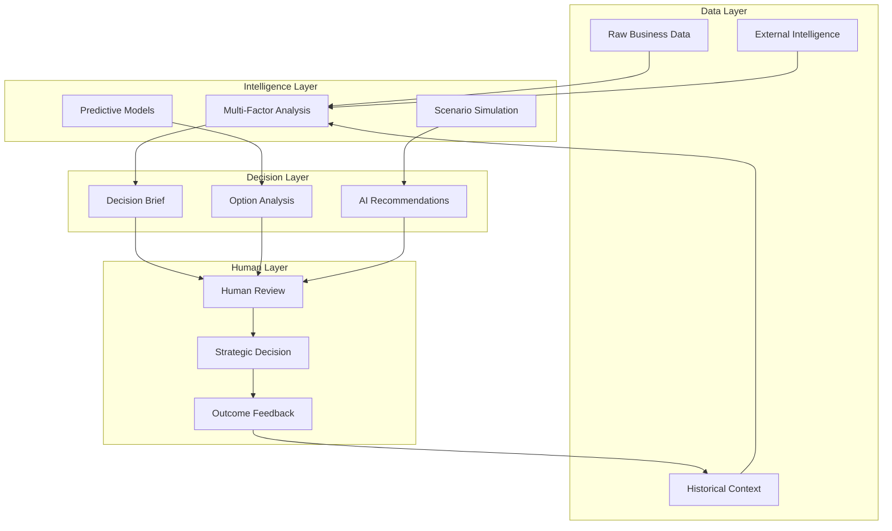
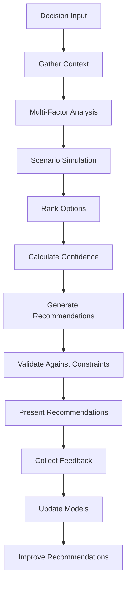

# Decision Support Framework

## Framework Overview

The PsiZero Decision Support Framework transforms raw business data into actionable intelligence, providing context-rich decision briefs and strategic recommendations while maintaining human oversight for critical business choices.

### Decision Support Philosophy



## Decision Classification System

### Decision Types & Complexity Levels

```typescript
interface DecisionClassification {
  type: 'operational' | 'tactical' | 'strategic' | 'crisis'
  domain: 'financial' | 'customer' | 'technical' | 'market' | 'product' | 'organizational'
  complexity: 'routine' | 'complicated' | 'complex' | 'chaotic'
  urgency: 'low' | 'medium' | 'high' | 'critical'
  
  impact: {
    financial: number        // USD impact
    customer: number         // customers affected
    strategic: 'low' | 'medium' | 'high'
    reputational: 'low' | 'medium' | 'high'
  }
  
  constraints: {
    timeToDecision: number   // hours
    reversibility: 'easy' | 'difficult' | 'irreversible'
    informationAvailable: 'complete' | 'partial' | 'minimal'
    stakeholderAlignment: 'aligned' | 'mixed' | 'conflicted'
  }
}

interface DecisionContext {
  businessEnvironment: {
    marketConditions: 'favorable' | 'neutral' | 'challenging'
    competitivePressure: 'low' | 'medium' | 'high'
    resourceAvailability: 'abundant' | 'adequate' | 'constrained'
    regualtoryEnvironment: 'stable' | 'changing' | 'uncertain'
  }
  
  organizationalFactors: {
    teamCapacity: number     // 0-100%
    expertiseAvailable: boolean
    changeManagementCapacity: 'high' | 'medium' | 'low'
    riskTolerance: 'conservative' | 'moderate' | 'aggressive'
  }
  
  dataQuality: {
    completeness: number     // 0-100%
    accuracy: number         // 0-100%
    timeliness: number       // 0-100%
    relevance: number        // 0-100%
  }
}
```

## Multi-Factor Decision Analysis Engine

### Core Analysis Framework

```typescript
interface DecisionAnalysisFramework {
  // Financial Analysis
  financialAnalysis: {
    revenue_impact: {
      immediate: number
      short_term: number      // 3-6 months
      long_term: number       // 1-3 years
      probability_weights: number[]
    }
    
    cost_analysis: {
      implementation_cost: number
      ongoing_operational_cost: number
      opportunity_cost: number
      risk_mitigation_cost: number
    }
    
    roi_calculation: {
      net_present_value: number
      internal_rate_of_return: number
      payback_period: number
      break_even_analysis: BreakEvenPoint
    }
  }
  
  // Strategic Analysis
  strategicAnalysis: {
    alignment_scoring: {
      mission_alignment: number        // 0-100
      vision_alignment: number         // 0-100
      strategic_goals_alignment: number // 0-100
      competitive_advantage: number    // 0-100
    }
    
    market_positioning: {
      market_share_impact: number
      competitive_response_likelihood: number
      customer_perception_impact: number
      brand_value_impact: number
    }
    
    long_term_implications: {
      scalability_factor: number
      sustainability_score: number
      innovation_potential: number
      market_trend_alignment: number
    }
  }
  
  // Risk Analysis
  riskAnalysis: {
    risk_identification: RiskFactor[]
    probability_assessment: ProbabilityDistribution
    impact_assessment: ImpactAnalysis
    mitigation_strategies: MitigationStrategy[]
    
    risk_scoring: {
      financial_risk: number
      operational_risk: number
      strategic_risk: number
      reputational_risk: number
      regulatory_risk: number
    }
  }
  
  // Stakeholder Analysis
  stakeholderAnalysis: {
    internal_stakeholders: {
      team_impact: StakeholderImpact
      customer_impact: StakeholderImpact
      investor_impact: StakeholderImpact
    }
    
    external_stakeholders: {
      partner_impact: StakeholderImpact
      supplier_impact: StakeholderImpact
      regulatory_impact: StakeholderImpact
      community_impact: StakeholderImpact
    }
  }
}

interface StakeholderImpact {
  influence_level: 'low' | 'medium' | 'high'
  support_likelihood: number // 0-100%
  impact_on_decision: 'positive' | 'neutral' | 'negative'
  engagement_strategy: string
}
```

### Scenario Planning & Simulation

```typescript
interface ScenarioAnalysis {
  base_case: {
    assumptions: Assumption[]
    probability: number
    outcomes: Outcome[]
    key_metrics: Metric[]
  }
  
  optimistic_case: {
    assumptions: Assumption[]
    probability: number
    outcomes: Outcome[]
    upside_potential: number
  }
  
  pessimistic_case: {
    assumptions: Assumption[]
    probability: number
    outcomes: Outcome[]
    downside_risk: number
  }
  
  stress_test_scenarios: {
    market_downturn: ScenarioResult
    competitive_response: ScenarioResult
    regulatory_change: ScenarioResult
    economic_recession: ScenarioResult
  }
  
  monte_carlo_simulation: {
    iterations: number
    confidence_intervals: ConfidenceInterval[]
    risk_metrics: {
      value_at_risk: number
      expected_shortfall: number
      probability_of_loss: number
    }
  }
}

interface Assumption {
  name: string
  base_value: number
  optimistic_value: number
  pessimistic_value: number
  probability_distribution: 'normal' | 'uniform' | 'triangular' | 'beta'
  correlation_with: string[]
}
```

## AI-Powered Recommendation Engine

### Recommendation Generation Process



### Recommendation Scoring Algorithm

```typescript
interface RecommendationEngine {
  scoring_methodology: {
    weighted_criteria: {
      financial_impact: number      // weight: 0.35
      strategic_alignment: number   // weight: 0.25
      risk_level: number           // weight: 0.20
      implementation_feasibility: number // weight: 0.15
      stakeholder_support: number  // weight: 0.05
    }
    
    normalization: "min_max_scaling_0_to_100"
    aggregation: "weighted_geometric_mean"
    uncertainty_adjustment: "confidence_interval_penalty"
  }
  
  confidence_calculation: {
    data_quality_factor: number     // 0-1
    model_accuracy_factor: number   // 0-1  
    historical_similarity_factor: number // 0-1
    expert_validation_factor: number // 0-1
    
    confidence_score: "geometric_mean_of_factors"
    confidence_levels: {
      high: ">80%"
      medium: "60-80%"
      low: "<60%"
    }
  }
  
  recommendation_types: {
    strong_recommendation: {
      criteria: "score>85_and_confidence>80"
      action: "proceed_with_implementation"
      review_required: false
    }
    
    conditional_recommendation: {
      criteria: "score>70_or_confidence>60"
      action: "proceed_with_conditions"
      review_required: true
    }
    
    weak_recommendation: {
      criteria: "score>50_or_confidence>40"
      action: "consider_with_caution"
      review_required: true
    }
    
    no_recommendation: {
      criteria: "score<50_or_confidence<40"
      action: "gather_more_information"
      review_required: true
    }
  }
}
```

## Decision Brief Generation

### Automated Decision Brief Template

```typescript
interface DecisionBrief {
  executive_summary: {
    decision_required: string
    recommendation: string
    key_factors: string[]
    timeline: string
    next_steps: string[]
  }
  
  situation_analysis: {
    background: string
    current_state: string
    problem_statement: string
    stakeholders: string[]
    constraints: string[]
  }
  
  options_analysis: {
    option_1: OptionAnalysis
    option_2: OptionAnalysis
    option_3?: OptionAnalysis
    option_comparison: ComparisonMatrix
  }
  
  financial_projections: {
    investment_required: InvestmentBreakdown
    revenue_projections: RevenueProjection[]
    cost_projections: CostProjection[]
    roi_analysis: ROIAnalysis
  }
  
  risk_assessment: {
    identified_risks: Risk[]
    risk_matrix: RiskMatrix
    mitigation_strategies: MitigationStrategy[]
    contingency_plans: ContingencyPlan[]
  }
  
  implementation_plan: {
    timeline: ProjectTimeline
    resource_requirements: ResourceRequirement[]
    success_metrics: SuccessMetric[]
    monitoring_plan: MonitoringPlan
  }
  
  appendices: {
    detailed_analysis: string
    supporting_data: DataSet[]
    sensitivity_analysis: SensitivityAnalysis
    expert_opinions: ExpertOpinion[]
  }
}

interface OptionAnalysis {
  name: string
  description: string
  
  pros: string[]
  cons: string[]
  
  financial_impact: {
    cost: number
    revenue_impact: number
    roi: number
    payback_period: number
  }
  
  strategic_impact: {
    market_position: string
    competitive_advantage: string
    long_term_value: string
  }
  
  risk_level: 'low' | 'medium' | 'high'
  implementation_complexity: 'simple' | 'moderate' | 'complex'
  timeline: string
  
  success_probability: number
  confidence_level: number
}
```

### Sample Decision Brief Output

```markdown
# Decision Brief: Q1 2025 Pricing Strategy

## Executive Summary
**Decision Required:** Approve new pricing strategy for Q1 2025
**AI Recommendation:** Implement tiered price increase with grandfathering (Option 2)
**Confidence Level:** 87%
**Timeline:** Implementation by March 1, 2025

### Key Factors
- Market analysis shows 15-20% pricing power
- Customer health scores indicate 89% retention likelihood
- Competitive pricing has increased 12% industry-wide
- Current margins below industry benchmark

## Situation Analysis

### Background
PsiZero's current pricing has remained static for 18 months while:
- Infrastructure costs increased 23%
- Feature set expanded significantly
- Market maturity improved pricing acceptance
- Competition raised prices 12-18%

### Current Financial Position
- MRR: $47,200 (+18% YoY)
- Gross Margin: 76% (industry average: 82%)
- Customer LTV: $2,847
- Churn Rate: 4.2%

## Options Analysis

### Option 1: No Price Change
**Pros:** Zero customer friction, maintains current growth
**Cons:** Margin compression, competitive disadvantage
**Financial Impact:** -$8,400 opportunity cost/month
**Risk Level:** Medium (competitive positioning risk)

### Option 2: Tiered Increase with Grandfathering ⭐ RECOMMENDED
**Pros:** Balances revenue growth with customer retention
**Cons:** Implementation complexity, some customer friction
**Financial Impact:** +$12,600 additional MRR within 6 months
**Risk Level:** Low
**Success Probability:** 89%

### Option 3: Across-the-Board 15% Increase
**Pros:** Maximum revenue impact, simple implementation
**Cons:** Higher churn risk, customer satisfaction impact
**Financial Impact:** +$18,200 additional MRR, -$4,300 churn impact
**Risk Level:** High

## Financial Projections (Option 2)

### Revenue Impact
- Month 1-3: +$4,200/month (new customers only)
- Month 4-6: +$8,400/month (existing customer migrations)
- Month 7-12: +$12,600/month (full implementation)

### Implementation Costs
- Technical implementation: $2,500
- Customer communication: $1,200
- Support overhead: $800/month (first 6 months)

### ROI Analysis
- Net Present Value: $127,400
- Payback Period: 2.3 months
- IRR: 347%

## Risk Assessment

### Primary Risks
1. **Customer Churn** (Probability: 15%, Impact: -$8,400 MRR)
   - Mitigation: Grandfathering, value communication
2. **Competitive Response** (Probability: 40%, Impact: -$2,100 MRR)
   - Mitigation: Feature differentiation, customer lock-in
3. **Implementation Delays** (Probability: 25%, Impact: -$4,200 opportunity)
   - Mitigation: Phased rollout, dedicated project team

## Implementation Timeline

### Phase 1 (Weeks 1-2): Technical Preparation
- Update billing system
- Prepare customer communication materials
- Train customer success team

### Phase 2 (Weeks 3-4): New Customer Rollout
- Implement new pricing for new signups
- Monitor conversion rates and feedback
- Adjust messaging as needed

### Phase 3 (Weeks 5-8): Existing Customer Migration
- Communicate value proposition to existing customers
- Offer migration incentives
- Provide granular usage analytics

## Success Metrics
- **Primary:** Monthly revenue increase >$10,000 by month 6
- **Secondary:** Customer churn rate remains <6%
- **Tertiary:** Customer satisfaction score maintains >4.2/5

## Recommendation Rationale

The AI recommendation engine scores Option 2 highest based on:
- **Financial Optimization:** Balanced revenue growth with retention
- **Risk Management:** Grandfathering reduces churn probability to 6%
- **Strategic Alignment:** Positions PsiZero competitively while maintaining customer relationships
- **Implementation Feasibility:** Moderate complexity with clear execution path

**Confidence Level: 87%** based on:
- High data quality (94% completeness)
- Strong historical precedent (similar strategy succeeded in 2023)
- Robust financial modeling with sensitivity analysis
- Stakeholder alignment assessment

## Next Steps
1. **Approve/Reject/Modify** recommendation by January 15
2. **If approved:** Begin technical implementation immediately
3. **Schedule:** Weekly progress reviews with finance and customer success
4. **Contingency:** Prepare rollback plan if churn exceeds 8%
```

## Real-Time Decision Dashboard

### Executive Decision Interface

```typescript
interface DecisionDashboard {
  active_decisions: {
    pending_approval: DecisionBrief[]
    in_implementation: ImplementationStatus[]
    monitoring_outcomes: OutcomeTracking[]
  }
  
  decision_pipeline: {
    upcoming_decisions: ScheduledDecision[]
    triggers_activated: DecisionTrigger[]
    information_gathering: InformationRequest[]
  }
  
  decision_quality_metrics: {
    accuracy_score: number          // % of decisions that met success criteria
    implementation_success: number  // % of decisions successfully implemented
    outcome_satisfaction: number    // Average satisfaction with decision outcomes
    decision_speed: number          // Average time from trigger to decision
  }
  
  ai_performance_metrics: {
    recommendation_acceptance_rate: number
    prediction_accuracy: number
    confidence_calibration: number
    human_override_analysis: OverrideAnalysis[]
  }
}

interface DecisionTrigger {
  type: 'threshold' | 'scheduled' | 'event' | 'pattern'
  description: string
  activation_criteria: string
  urgency: 'low' | 'medium' | 'high' | 'critical'
  estimated_decision_timeline: string
  preliminary_analysis_available: boolean
}
```

### Check-In Meeting Formats

#### Daily Strategic Check-In (5 minutes)
```typescript
interface DailyStrategicBriefing {
  format: "conversational_summary"
  
  sections: {
    decisions_requiring_attention: {
      urgent_decisions: DecisionSummary[]
      upcoming_deadlines: DeadlineSummary[]
      new_triggers: TriggerSummary[]
    }
    
    implementation_updates: {
      progress_highlights: ProgressUpdate[]
      blockers_identified: Blocker[]
      course_corrections: CourseCorrection[]
    }
    
    intelligence_highlights: {
      market_intelligence: MarketUpdate[]
      performance_anomalies: Anomaly[]
      opportunity_alerts: OpportunityAlert[]
    }
  }
  
  interaction_prompts: [
    "Which decision would you like to dive deeper into?",
    "Should we escalate any of these implementation blockers?",
    "Are there any strategic priorities we should adjust based on these insights?"
  ]
}
```

#### Weekly Strategic Review (30 minutes)
```typescript
interface WeeklyStrategicReview {
  agenda: {
    decision_outcomes_review: {
      completed_decisions: CompletedDecision[]
      success_metrics: SuccessMetric[]
      lessons_learned: LessonLearned[]
    }
    
    strategic_landscape_analysis: {
      market_trend_analysis: TrendAnalysis
      competitive_intelligence: CompetitiveUpdate
      customer_insight_synthesis: CustomerInsightSummary
    }
    
    forward_looking_analysis: {
      upcoming_strategic_decisions: StrategicDecision[]
      resource_allocation_recommendations: ResourceRecommendation[]
      risk_monitoring_updates: RiskUpdate[]
    }
    
    decision_framework_optimization: {
      ai_performance_review: AIPerformanceReview
      process_improvement_suggestions: ProcessImprovement[]
      calibration_adjustments: CalibrationAdjustment[]
    }
  }
}
```

## Continuous Learning & Improvement

### Decision Outcome Tracking

```typescript
interface DecisionOutcomeTracking {
  outcome_measurement: {
    success_criteria_definition: SuccessCriteria[]
    measurement_timeline: MeasurementSchedule
    data_collection_methods: DataCollectionMethod[]
    performance_benchmarks: Benchmark[]
  }
  
  feedback_collection: {
    stakeholder_satisfaction_surveys: SatisfactionSurvey[]
    implementation_team_feedback: ImplementationFeedback[]
    customer_impact_assessment: CustomerImpactAssessment
    financial_impact_validation: FinancialValidation
  }
  
  learning_integration: {
    model_performance_updates: ModelUpdate[]
    decision_framework_refinements: FrameworkRefinement[]
    process_optimization_insights: ProcessInsight[]
    best_practice_documentation: BestPractice[]
  }
}
```

### Model Calibration & Improvement

```typescript
interface AIModelCalibration {
  prediction_accuracy_tracking: {
    financial_projections: AccuracyMetric
    timeline_estimates: AccuracyMetric
    risk_assessments: AccuracyMetric
    success_probability: AccuracyMetric
  }
  
  bias_detection_and_correction: {
    systematic_bias_identification: BiasAnalysis[]
    correction_mechanisms: BiasCorrection[]
    fairness_auditing: FairnessAudit[]
  }
  
  model_retraining: {
    retraining_schedule: "monthly_with_significant_new_data"
    feature_importance_updates: FeatureImportanceUpdate[]
    hyperparameter_optimization: HyperparameterUpdate[]
    cross_validation_results: CrossValidationResult[]
  }
}
```

This comprehensive decision support framework ensures that PsiZero's strategic decisions are data-driven, well-analyzed, and continuously improved through outcome tracking and AI model refinement.