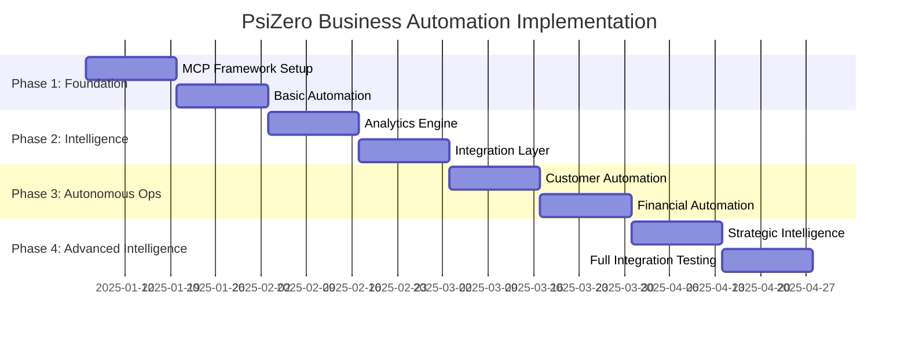

# Implementation Roadmap: 16-Week Transformation Plan

## Overview

This comprehensive 16-week implementation roadmap transforms PsiZero from manual operations to a semi-autonomous, AI-driven business platform. The phased approach ensures minimal disruption while maximizing automation benefits.

### Implementation Philosophy



### Success Criteria by Phase

```typescript
interface PhaseSuccessCriteria {
  phase_1_foundation: {
    technical: [
      "mcp_servers_deployed_and_operational",
      "basic_data_integration_complete",
      "daily_reporting_automated",
      "invoice_processing_automated"
    ]
    
    business: [
      "20_percent_reduction_in_manual_reporting_time",
      "zero_billing_errors_introduced",
      "team_adoption_rate_above_80_percent"
    ]
  }
  
  phase_2_intelligence: {
    technical: [
      "predictive_models_deployed",
      "real_time_analytics_operational",
      "decision_support_system_active"
    ]
    
    business: [
      "churn_prediction_accuracy_above_80_percent",
      "revenue_forecasting_accuracy_above_90_percent",
      "customer_health_monitoring_automated"
    ]
  }
  
  phase_3_autonomous: {
    technical: [
      "end_to_end_customer_lifecycle_automation",
      "financial_operations_80_percent_automated",
      "support_automation_operational"
    ]
    
    business: [
      "customer_onboarding_completion_rate_above_85_percent",
      "support_response_time_under_30_seconds",
      "payment_recovery_rate_above_80_percent"
    ]
  }
  
  phase_4_advanced: {
    technical: [
      "strategic_intelligence_system_operational",
      "market_intelligence_automated",
      "full_system_integration_complete"
    ]
    
    business: [
      "80_percent_of_routine_operations_automated",
      "decision_quality_improvement_measurable",
      "roi_targets_achieved"
    ]
  }
}
```

## Phase 1: Foundation (Weeks 1-4)

### Week 1-2: MCP Server Framework & Infrastructure

#### Objectives
- Establish core MCP server architecture
- Set up development and deployment infrastructure
- Implement basic data connectivity
- Create standardized server templates

#### Detailed Tasks

**Week 1: Infrastructure Setup**
```yaml
day_1_2:
  - setup_development_environment
  - configure_kubernetes_cluster
  - establish_ci_cd_pipeline
  - create_monitoring_infrastructure

day_3_4:
  - implement_base_mcp_server_template
  - setup_authentication_and_security
  - configure_api_gateway
  - establish_logging_and_metrics

day_5:
  - integration_testing_framework
  - documentation_setup
  - team_training_session
```

**Week 2: Core MCP Servers**
```yaml
business_intelligence_mcp:
  tasks:
    - implement_data_connector_framework
    - create_basic_dashboard_generator
    - setup_metric_collection_system
    - implement_simple_reporting_engine
  
  deliverables:
    - functional_business_intelligence_mcp
    - basic_daily_reporting_capability
    - real_time_metric_dashboard
    - data_quality_monitoring

financial_management_mcp:
  tasks:
    - integrate_with_stripe_api
    - implement_invoice_processing_automation
    - create_usage_calculation_engine
    - setup_payment_monitoring
  
  deliverables:
    - automated_invoice_generation
    - payment_failure_detection
    - usage_tracking_system
    - basic_financial_reporting
```

#### Technical Specifications

**Development Environment Setup**
```typescript
interface DevelopmentInfrastructure {
  containerization: {
    platform: "Docker + Kubernetes"
    registry: "Google Container Registry"
    orchestration: "Kubernetes 1.28+"
  }
  
  cicd_pipeline: {
    source_control: "Git with feature branches"
    build_system: "GitHub Actions"
    testing: "Automated unit and integration tests"
    deployment: "Blue-green deployment strategy"
  }
  
  monitoring_stack: {
    metrics: "Prometheus + Grafana"
    logging: "ELK Stack (Elasticsearch, Logstash, Kibana)"
    alerting: "AlertManager + PagerDuty"
    tracing: "Jaeger for distributed tracing"
  }
  
  security: {
    secrets_management: "Kubernetes Secrets + HashiCorp Vault"
    network_security: "Network policies + service mesh"
    authentication: "JWT with refresh tokens"
    authorization: "RBAC with attribute-based controls"
  }
}
```

**Data Integration Architecture**
```typescript
interface DataIntegrationFramework {
  data_sources: {
    psizero_api: {
      connection_type: "REST API with webhooks"
      authentication: "Bearer token"
      refresh_rate: "Real-time for critical events, 1-minute batch for metrics"
      data_types: ["usage_metrics", "customer_data", "api_performance"]
    }
    
    supabase: {
      connection_type: "PostgreSQL direct connection"
      authentication: "Connection string with SSL"
      refresh_rate: "Real-time for user actions, 5-minute batch for analytics"
      data_types: ["user_profiles", "subscription_data", "support_tickets"]
    }
    
    stripe: {
      connection_type: "REST API with webhooks"
      authentication: "API key"
      refresh_rate: "Real-time webhooks for transactions, daily batch for reports"
      data_types: ["invoices", "payments", "subscriptions", "customers"]
    }
  }
  
  data_processing: {
    ingestion: "Apache Kafka for real-time streaming"
    transformation: "Apache Spark for batch processing"
    storage: "PostgreSQL for operational data, ClickHouse for analytics"
    caching: "Redis for frequently accessed data"
  }
}
```

### Week 3-4: Basic Automation Implementation

#### Objectives
- Deploy first automated workflows
- Implement customer health monitoring
- Create basic support automation
- Establish feedback collection mechanisms

#### Priority Automation Workflows

**Daily Business Intelligence Briefing**
```typescript
interface DailyBriefingImplementation {
  trigger: {
    schedule: "0 8 * * *" // 8:00 AM PST
    timezone: "America/Los_Angeles"
  }
  
  data_collection: {
    overnight_metrics: {
      revenue: "sum(payments) WHERE created_at >= yesterday"
      new_customers: "count(signups) WHERE created_at >= yesterday"
      api_usage: "sum(api_calls) WHERE timestamp >= yesterday"
      system_health: "avg(uptime) WHERE timestamp >= yesterday"
    }
    
    trend_analysis: {
      revenue_trend: "compare_to_previous_day_week_month"
      usage_trend: "detect_anomalies_and_patterns"
      customer_health_changes: "identify_significant_score_changes"
    }
  }
  
  report_generation: {
    format: "conversational_summary"
    sections: [
      "executive_summary",
      "key_metrics_update", 
      "automated_actions_completed",
      "items_requiring_attention",
      "opportunities_identified"
    ]
    
    delivery_channels: [
      "slack_direct_message",
      "email_summary",
      "dashboard_update"
    ]
  }
}
```

**Invoice Processing Automation**
```typescript
interface InvoiceAutomationImplementation {
  monthly_billing_cycle: {
    trigger: "first_day_of_month_or_custom_billing_date"
    
    usage_calculation: {
      api_calls: "aggregate_by_customer_and_api_category"
      overages: "calculate_usage_beyond_plan_limits"
      proration: "handle_plan_changes_mid_cycle"
    }
    
    invoice_generation: {
      template_engine: "dynamic_invoice_template_with_usage_breakdown"
      pdf_generation: "automated_pdf_creation_with_branding"
      delivery: "email_with_customer_portal_link"
    }
    
    error_handling: {
      validation: "comprehensive_data_validation_before_processing"
      rollback: "ability_to_rollback_erroneous_invoices"
      manual_review: "flag_unusual_invoices_for_human_review"
    }
  }
}
```

#### Testing & Validation Framework

```typescript
interface TestingFramework {
  unit_tests: {
    coverage_target: "90_percent"
    frameworks: ["Jest", "Pytest"]
    automation: "run_on_every_commit"
  }
  
  integration_tests: {
    api_testing: "comprehensive_endpoint_testing"
    data_pipeline_testing: "end_to_end_data_flow_validation"
    workflow_testing: "complete_automation_scenario_testing"
  }
  
  performance_tests: {
    load_testing: "simulate_expected_production_load"
    stress_testing: "identify_breaking_points"
    scalability_testing: "validate_auto_scaling_behavior"
  }
  
  user_acceptance_tests: {
    stakeholder_validation: "business_user_workflow_validation"
    feedback_collection: "structured_feedback_on_automation_quality"
    success_criteria_validation: "confirm_success_metrics_achievement"
  }
}
```

## Phase 2: Intelligence Layer (Weeks 5-8)

### Week 5-6: Advanced Analytics & Prediction Engine

#### Objectives
- Deploy machine learning models for prediction
- Implement customer health scoring
- Create revenue forecasting system
- Establish anomaly detection

#### Advanced Analytics Implementation

**Customer Health Scoring System**
```typescript
interface CustomerHealthScoringSystem {
  feature_engineering: {
    usage_features: [
      "api_calls_per_day_trend",
      "unique_apis_used_ratio",
      "error_rate_trend",
      "session_frequency_pattern"
    ]
    
    engagement_features: [
      "support_ticket_sentiment_score",
      "documentation_page_views",
      "feature_adoption_velocity",
      "community_participation_level"
    ]
    
    commercial_features: [
      "payment_history_reliability",
      "plan_utilization_percentage",
      "upgrade_downgrade_history",
      "contract_renewal_probability"
    ]
  }
  
  ml_pipeline: {
    data_preprocessing: "feature_scaling_and_normalization"
    model_type: "gradient_boosting_classifier"
    training_data: "historical_customer_data_with_outcomes"
    validation: "time_series_cross_validation"
    deployment: "real_time_scoring_api"
  }
  
  health_score_calculation: {
    score_range: "0_to_100"
    update_frequency: "daily"
    trend_tracking: "7_day_and_30_day_trends"
    alert_thresholds: {
      critical: "<30"
      warning: "<60" 
      healthy: ">80"
    }
  }
}
```

**Revenue Forecasting Engine**
```typescript
interface RevenueForecastingEngine {
  forecasting_models: {
    mrr_forecasting: {
      model_type: "ARIMA_with_external_regressors"
      features: [
        "historical_mrr",
        "new_customer_acquisition_rate",
        "churn_rate",
        "expansion_revenue_rate",
        "seasonal_factors",
        "marketing_spend",
        "market_conditions"
      ]
      forecast_horizon: "12_months"
      confidence_intervals: ["80_percent", "95_percent"]
    }
    
    customer_ltv_prediction: {
      model_type: "survival_analysis_with_regression"
      features: [
        "customer_health_score",
        "usage_patterns",
        "segment_characteristics",
        "acquisition_channel",
        "onboarding_success_metrics"
      ]
      prediction_accuracy_target: "85_percent"
    }
    
    churn_prediction: {
      model_type: "random_forest_classifier"
      prediction_horizon: "30_days"
      accuracy_target: "80_percent_precision_recall"
      false_positive_tolerance: "15_percent"
    }
  }
  
  forecast_generation: {
    update_frequency: "weekly"
    scenario_analysis: ["optimistic", "realistic", "pessimistic"]
    sensitivity_analysis: "key_variable_impact_assessment"
    monte_carlo_simulation: "1000_iterations_for_confidence_bounds"
  }
}
```

### Week 7-8: Integration Layer & Communication Systems

#### Objectives
- Integrate with external platforms
- Implement automated communication systems
- Create workflow orchestration
- Establish monitoring and alerting

#### External Platform Integrations

```typescript
interface ExternalIntegrations {
  communication_platforms: {
    slack: {
      integration_type: "bot_with_interactive_commands"
      capabilities: [
        "daily_briefing_delivery",
        "alert_notifications",
        "interactive_decision_approval",
        "status_queries"
      ]
      setup: "oauth_app_with_workspace_installation"
    }
    
    email: {
      service: "SendGrid_with_template_engine"
      capabilities: [
        "automated_customer_communications",
        "internal_reporting",
        "alert_notifications",
        "personalized_campaigns"
      ]
      compliance: "GDPR_and_CAN_SPAM_compliant"
    }
  }
  
  business_tools: {
    notion: {
      integration_type: "api_based_content_management"
      use_cases: [
        "automated_documentation_updates",
        "decision_brief_storage",
        "knowledge_base_management"
      ]
    }
    
    google_workspace: {
      integration_type: "service_account_with_domain_wide_delegation"
      use_cases: [
        "calendar_integration_for_meetings",
        "document_generation_and_storage",
        "shared_dashboard_creation"
      ]
    }
  }
}
```

#### Workflow Orchestration Framework

```typescript
interface WorkflowOrchestration {
  orchestration_engine: {
    platform: "Apache_Airflow"
    features: [
      "dag_based_workflow_definition",
      "dependency_management",
      "retry_and_error_handling",
      "monitoring_and_alerting"
    ]
  }
  
  workflow_patterns: {
    data_pipeline_workflows: {
      schedule: "continuous_and_batch_processing"
      error_handling: "automatic_retry_with_exponential_backoff"
      monitoring: "real_time_status_tracking"
    }
    
    business_process_workflows: {
      triggers: "event_driven_and_scheduled"
      approval_mechanisms: "human_in_the_loop_integration"
      audit_trail: "comprehensive_action_logging"
    }
    
    integration_workflows: {
      data_synchronization: "bi_directional_sync_with_conflict_resolution"
      api_orchestration: "multi_step_api_call_coordination"
      error_recovery: "graceful_degradation_and_fallback"
    }
  }
}
```

## Phase 3: Autonomous Operations (Weeks 9-12)

### Week 9-10: Customer Lifecycle Automation

#### Objectives
- Deploy end-to-end customer onboarding automation
- Implement proactive customer success workflows
- Create automated retention campaigns
- Establish expansion opportunity identification

#### Customer Onboarding Automation

```typescript
interface CustomerOnboardingAutomation {
  segmentation_engine: {
    classification_criteria: {
      company_size: "employees_count_and_revenue"
      use_case: "api_interest_and_technical_requirements"
      experience_level: "developer_experience_assessment"
      urgency: "timeline_and_implementation_pressure"
    }
    
    onboarding_tracks: {
      enterprise: {
        duration: "30_days"
        touchpoints: [
          "welcome_call_scheduling",
          "technical_architecture_review",
          "security_compliance_discussion",
          "integration_planning_session",
          "go_live_support"
        ]
        success_metrics: [
          "production_deployment_within_30_days",
          "team_training_completion",
          "integration_best_practices_adoption"
        ]
      }
      
      startup: {
        duration: "14_days"
        touchpoints: [
          "quick_start_guide_delivery",
          "use_case_specific_tutorials",
          "community_access_provision",
          "success_milestone_celebration"
        ]
        success_metrics: [
          "first_successful_api_call_within_24_hours",
          "10_successful_requests_within_7_days",
          "production_use_within_14_days"
        ]
      }
      
      developer: {
        duration: "7_days" 
        touchpoints: [
          "api_documentation_tour",
          "code_examples_provision",
          "sandbox_environment_setup",
          "integration_support_availability"
        ]
        success_metrics: [
          "successful_integration_within_48_hours",
          "multiple_api_exploration",
          "community_engagement"
        ]
      }
    }
  }
  
  automation_workflows: {
    welcome_sequence: {
      trigger: "customer_signup_completion"
      personalization: "segment_and_use_case_specific"
      content_delivery: "progressive_information_sharing"
      interaction_tracking: "engagement_measurement_and_optimization"
    }
    
    progress_monitoring: {
      milestone_tracking: "automated_progress_assessment"
      intervention_triggers: "stalling_or_confusion_detection"
      success_celebration: "achievement_recognition_and_motivation"
      escalation_rules: "human_intervention_criteria"
    }
    
    graduation_process: {
      completion_criteria: "objective_success_metric_achievement"
      transition_to_success_program: "ongoing_relationship_management"
      expansion_opportunity_identification: "growth_potential_assessment"
    }
  }
}
```

#### Proactive Customer Success Implementation

```typescript
interface ProactiveCustomerSuccess {
  health_monitoring_system: {
    real_time_scoring: {
      update_frequency: "daily"
      scoring_algorithm: "weighted_multi_factor_model"
      trend_analysis: "7_day_30_day_90_day_trends"
      prediction_horizon: "30_day_churn_probability"
    }
    
    intervention_triggers: {
      score_thresholds: {
        critical: "<30_immediate_escalation"
        warning: "<60_automated_intervention"
        opportunity: ">80_expansion_evaluation"
      }
      
      behavioral_triggers: {
        usage_decline: "20_percent_decrease_over_7_days"
        error_rate_increase: "double_baseline_error_rate"
        support_ticket_sentiment: "negative_sentiment_detection"
        competitive_intelligence: "competitor_evaluation_signals"
      }
    }
  }
  
  intervention_workflows: {
    retention_campaigns: {
      personalization: "segment_and_risk_factor_specific"
      channel_optimization: "preferred_communication_method"
      timing_optimization: "engagement_likelihood_maximization"
      success_measurement: "retention_rate_and_satisfaction_improvement"
    }
    
    expansion_campaigns: {
      opportunity_identification: "usage_pattern_and_growth_indicator_analysis"
      value_proposition_customization: "specific_benefit_articulation"
      proposal_automation: "personalized_upgrade_recommendation_generation"
      conversion_tracking: "expansion_revenue_attribution"
    }
    
    advocacy_programs: {
      advocate_identification: "high_satisfaction_and_success_scoring"
      engagement_strategies: "case_study_participation_referral_programs"
      reward_systems: "recognition_and_incentive_management"
      relationship_nurturing: "ongoing_advocate_relationship_management"
    }
  }
}
```

### Week 11-12: Financial Operations Automation

#### Objectives
- Automate complete billing cycle
- Implement intelligent payment recovery
- Create financial forecasting system
- Establish cost optimization automation

#### Complete Billing Automation

```typescript
interface CompleteBillingAutomation {
  usage_metering_system: {
    real_time_tracking: {
      api_call_metering: "precise_per_call_tracking_with_metadata"
      feature_usage_tracking: "detailed_feature_utilization_measurement"
      storage_usage_calculation: "dynamic_storage_consumption_monitoring"
      bandwidth_usage_monitoring: "data_transfer_measurement_and_optimization"
    }
    
    aggregation_engine: {
      billing_period_calculation: "flexible_billing_cycle_support"
      proration_handling: "plan_change_mid_cycle_calculation"
      overage_calculation: "usage_beyond_plan_limit_pricing"
      discount_application: "promotional_and_loyalty_discount_management"
    }
  }
  
  invoice_generation_system: {
    automated_invoice_creation: {
      template_engine: "dynamic_template_with_usage_breakdown"
      pdf_generation: "professional_branded_invoice_creation"
      multi_currency_support: "international_customer_billing"
      tax_calculation: "automated_tax_calculation_by_jurisdiction"
    }
    
    delivery_optimization: {
      timing_optimization: "customer_preference_based_delivery_timing"
      channel_selection: "email_customer_portal_api_delivery"
      reminder_automation: "payment_due_reminder_sequence"
      accessibility_compliance: "accessibility_compliant_invoice_formats"
    }
  }
  
  payment_processing_system: {
    automated_collection: {
      payment_method_optimization: "intelligent_payment_method_selection"
      retry_logic: "smart_retry_scheduling_for_failed_payments"
      dunning_management: "progressive_collection_sequence"
      grace_period_automation: "service_restriction_management"
    }
    
    reconciliation_automation: {
      payment_matching: "automated_payment_to_invoice_matching"
      dispute_handling: "chargeback_and_dispute_workflow_automation"
      refund_processing: "automated_refund_calculation_and_processing"
      accounting_integration: "real_time_accounting_system_synchronization"
    }
  }
}
```

#### Intelligent Payment Recovery System

```typescript
interface PaymentRecoverySystem {
  failure_classification: {
    decline_type_analysis: {
      soft_declines: "temporary_issues_retry_optimization"
      hard_declines: "permanent_issues_immediate_customer_contact"
      fraud_prevention: "security_related_decline_handling"
      insufficient_funds: "timing_based_retry_strategy"
    }
    
    customer_segmentation: {
      high_value_customers: "priority_personal_outreach"
      enterprise_customers: "dedicated_account_management"
      long_term_customers: "loyalty_based_extended_grace_periods"
      new_customers: "educational_payment_method_guidance"
    }
  }
  
  recovery_workflows: {
    automated_retry_sequences: {
      timing_optimization: "customer_behavior_based_retry_scheduling"
      payment_method_updates: "proactive_payment_method_refresh"
      alternative_payment_methods: "multiple_payment_option_provision"
      success_rate_optimization: "a_b_testing_of_recovery_strategies"
    }
    
    communication_automation: {
      personalized_messaging: "segment_and_situation_specific_communication"
      multi_channel_approach: "email_sms_phone_in_app_notification"
      escalation_sequences: "progressive_urgency_communication"
      resolution_assistance: "payment_method_update_facilitation"
    }
    
    service_management: {
      grace_period_automation: "intelligent_service_restriction_timing"
      feature_limitation: "gradual_service_limitation_progression"
      restoration_automation: "immediate_service_restoration_upon_payment"
      customer_communication: "transparent_service_status_communication"
    }
  }
}
```

## Phase 4: Advanced Intelligence (Weeks 13-16)

### Week 13-14: Strategic Intelligence System

#### Objectives
- Deploy market intelligence automation
- Implement competitive analysis system  
- Create strategic decision support
- Establish business intelligence platform

#### Market Intelligence Automation

```typescript
interface MarketIntelligenceSystem {
  data_collection_automation: {
    competitor_monitoring: {
      pricing_intelligence: "automated_competitor_pricing_tracking"
      feature_analysis: "product_feature_comparison_monitoring"
      marketing_intelligence: "competitor_marketing_strategy_analysis"
      funding_and_partnership_tracking: "business_development_intelligence"
    }
    
    industry_trend_analysis: {
      market_research_aggregation: "industry_report_and_analysis_synthesis"
      social_sentiment_monitoring: "industry_sentiment_and_discussion_tracking"
      regulatory_change_tracking: "compliance_requirement_change_monitoring"
      technology_trend_analysis: "emerging_technology_impact_assessment"
    }
    
    customer_market_intelligence: {
      customer_feedback_analysis: "systematic_feedback_pattern_identification"
      feature_request_prioritization: "market_driven_product_development_insights"
      churn_reason_analysis: "competitive_loss_reason_identification"
      expansion_opportunity_mapping: "market_expansion_potential_assessment"
    }
  }
  
  intelligence_processing: {
    automated_analysis: {
      trend_identification: "statistical_trend_analysis_and_pattern_recognition"
      impact_assessment: "business_impact_scoring_and_prioritization"
      opportunity_identification: "market_opportunity_detection_and_evaluation"
      threat_assessment: "competitive_threat_analysis_and_mitigation_recommendations"
    }
    
    strategic_insights: {
      positioning_analysis: "market_positioning_optimization_recommendations"
      competitive_advantage_identification: "unique_value_proposition_strengthening"
      market_timing_analysis: "optimal_market_entry_and_expansion_timing"
      partnership_opportunity_identification: "strategic_partnership_potential_evaluation"
    }
  }
}
```

#### Strategic Decision Support System

```typescript
interface StrategicDecisionSupport {
  decision_intelligence_platform: {
    context_aggregation: {
      internal_performance_data: "comprehensive_business_metric_integration"
      external_market_intelligence: "competitive_and_industry_context_integration"
      stakeholder_input: "team_and_customer_feedback_integration"
      historical_decision_outcomes: "past_decision_effectiveness_analysis"
    }
    
    scenario_modeling: {
      strategic_option_generation: "ai_powered_strategic_alternative_development"
      impact_simulation: "multi_dimensional_impact_modeling"
      risk_assessment: "comprehensive_risk_analysis_and_mitigation_planning"
      outcome_probability_estimation: "evidence_based_success_probability_calculation"
    }
    
    recommendation_engine: {
      multi_criteria_optimization: "balanced_recommendation_considering_multiple_objectives"
      stakeholder_preference_integration: "decision_maker_preference_learning_and_application"
      implementation_feasibility_assessment: "resource_and_capability_constraint_consideration"
      timing_optimization: "optimal_decision_timing_and_sequencing_recommendations"
    }
  }
  
  decision_support_workflows: {
    automated_briefing_generation: {
      executive_summary_creation: "concise_strategic_situation_summarization"
      option_analysis_compilation: "comprehensive_alternative_evaluation"
      risk_benefit_assessment: "balanced_pros_and_cons_analysis"
      implementation_planning: "detailed_execution_roadmap_development"
    }
    
    collaborative_decision_making: {
      stakeholder_input_collection: "systematic_stakeholder_consultation_facilitation"
      consensus_building_support: "decision_alignment_process_facilitation"
      dissenting_opinion_analysis: "alternative_perspective_consideration_and_integration"
      decision_documentation: "comprehensive_decision_rationale_and_context_recording"
    }
  }
}
```

### Week 15-16: Full System Integration & Optimization

#### Objectives
- Complete end-to-end system integration
- Optimize performance and reliability
- Implement comprehensive monitoring
- Conduct final testing and validation

#### System Integration & Performance Optimization

```typescript
interface SystemIntegrationOptimization {
  performance_optimization: {
    latency_optimization: {
      api_response_time_targets: "sub_100ms_for_critical_operations"
      database_query_optimization: "query_performance_tuning_and_indexing"
      caching_strategy_implementation: "multi_layer_caching_for_frequent_operations"
      cdn_integration: "global_content_delivery_optimization"
    }
    
    scalability_enhancement: {
      auto_scaling_configuration: "demand_based_automatic_resource_scaling"
      load_balancing_optimization: "intelligent_traffic_distribution"
      database_scaling_strategy: "read_replica_and_sharding_implementation"
      microservice_optimization: "service_communication_and_dependency_optimization"
    }
    
    reliability_improvement: {
      fault_tolerance_implementation: "graceful_degradation_and_error_recovery"
      circuit_breaker_patterns: "cascade_failure_prevention"
      backup_and_recovery_automation: "automated_backup_and_disaster_recovery"
      health_check_comprehensive_implementation: "proactive_issue_detection_and_resolution"
    }
  }
  
  monitoring_and_observability: {
    comprehensive_monitoring: {
      application_performance_monitoring: "end_to_end_transaction_tracing"
      infrastructure_monitoring: "resource_utilization_and_capacity_monitoring"
      business_metric_monitoring: "real_time_business_kpi_tracking"
      user_experience_monitoring: "customer_interaction_quality_measurement"
    }
    
    intelligent_alerting: {
      anomaly_detection_based_alerting: "ml_powered_abnormal_behavior_detection"
      contextual_alert_prioritization: "business_impact_based_alert_severity"
      alert_fatigue_prevention: "intelligent_alert_correlation_and_suppression"
      escalation_automation: "severity_based_automatic_escalation_procedures"
    }
  }
}
```

#### Comprehensive Testing & Validation

```typescript
interface ComprehensiveTestingFramework {
  functional_testing: {
    end_to_end_workflow_testing: {
      customer_lifecycle_scenarios: "complete_customer_journey_automation_testing"
      financial_operations_scenarios: "billing_to_payment_complete_cycle_testing"
      decision_support_scenarios: "strategic_decision_workflow_testing"
      crisis_management_scenarios: "emergency_response_workflow_testing"
    }
    
    integration_testing: {
      external_api_integration_testing: "third_party_service_integration_validation"