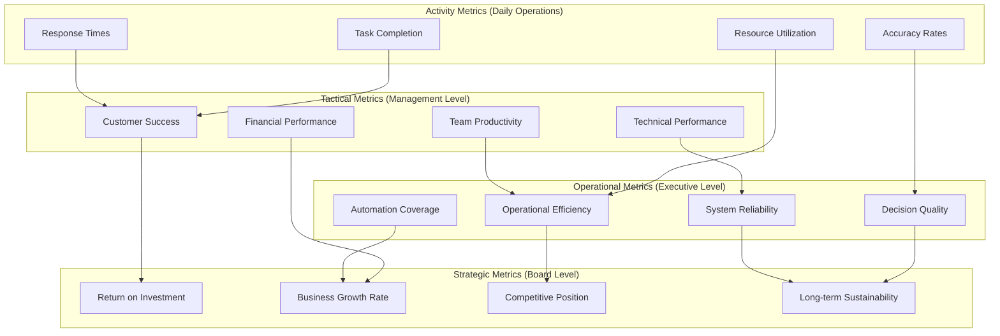

# Success Metrics & Monitoring Framework

## Overview

This comprehensive monitoring framework tracks the success of PsiZero's business automation transformation across operational efficiency, business performance, customer impact, and strategic outcomes.

### Metrics Hierarchy



## Primary Success Metrics (KPIs)

### Business Performance Metrics

```typescript
interface BusinessPerformanceKPIs {
  revenue_metrics: {
    monthly_recurring_revenue: {
      current_baseline: "$47,200"
      six_month_target: "$56,640" // +20% growth
      measurement_frequency: "daily"
      automation_attribution: "track_revenue_from_automated_processes"
    }
    
    customer_acquisition_cost: {
      current_baseline: "$187"
      six_month_target: "<$150" // 20% reduction
      measurement_frequency: "weekly"
      automation_impact: "lead_qualification_and_nurturing_efficiency"
    }
    
    customer_lifetime_value: {
      current_baseline: "$2,847"
      six_month_target: ">$3,200" // 12% increase
      measurement_frequency: "monthly"
      automation_drivers: "retention_improvement_and_expansion_automation"
    }
    
    net_revenue_retention: {
      current_baseline: "108%"
      six_month_target: ">115%" 
      measurement_frequency: "monthly"
      automation_contribution: "proactive_expansion_and_retention"
    }
  }
  
  operational_efficiency_metrics: {
    cost_reduction: {
      labor_cost_savings: {
        target: "$8,000_per_month"
        measurement: "hours_saved_multiplied_by_hourly_rate"
        tracking: "task_automation_time_measurement"
      }
      
      operational_cost_optimization: {
        target: "$3,500_per_month"
        measurement: "infrastructure_optimization_and_process_efficiency"
        tracking: "cost_per_customer_and_cost_per_transaction"
      }
      
      error_cost_avoidance: {
        target: "$2,000_per_month"
        measurement: "prevented_errors_and_manual_correction_costs"
        tracking: "error_rate_reduction_and_quality_improvement"
      }
    }
    
    time_to_value_acceleration: {
      decision_making_speed: {
        baseline: "4_hours_average_analysis_time"
        target: "<1_hour_average" // 75% reduction
        measurement: "time_from_data_request_to_actionable_insight"
      }
      
      customer_onboarding_time: {
        baseline: "21_days_average_to_production"
        target: "<14_days_average" // 33% reduction
        measurement: "signup_to_first_production_api_call"
      }
      
      issue_resolution_time: {
        baseline: "4_hours_average_support_resolution"
        target: "<2_hours_average" // 50% reduction
        measurement: "ticket_creation_to_resolution"
      }
    }
  }
}
```

### Automation Performance Metrics

```typescript
interface AutomationPerformanceKPIs {
  automation_coverage: {
    overall_automation_percentage: {
      six_month_target: ">80%"
      measurement: "automated_tasks_divided_by_total_identifiable_tasks"
      breakdown_by_domain: {
        customer_operations: ">78%"
        financial_operations: ">92%"
        technical_operations: ">85%"
        sales_marketing: ">73%"
        business_intelligence: ">95%"
      }
    }
    
    decision_automation_rate: {
      level_1_autonomous: ">90%" // routine decisions
      level_2_semi_autonomous: ">70%" // approval-based decisions
      level_3_decision_support: ">95%" // strategic analysis completion
    }
  }
  
  automation_quality: {
    decision_accuracy: {
      target: ">90%"
      measurement: "correct_decisions_divided_by_total_automated_decisions"
      validation_method: "outcome_tracking_and_human_expert_validation"
      confidence_calibration: "prediction_accuracy_vs_stated_confidence"
    }
    
    process_reliability: {
      uptime_target: ">99.5%"
      error_rate_target: "<0.1%"
      false_positive_rate: "<5%"
      escalation_accuracy: ">95%"
    }
    
    human_override_analysis: {
      override_rate_target: "<10%"
      override_reason_analysis: "systematic_learning_from_human_corrections"
      model_improvement_rate: "monthly_accuracy_improvement_measurement"
    }
  }
  
  automation_efficiency: {
    processing_speed: {
      report_generation: "<2_minutes"
      customer_health_scoring: "<30_seconds"
      invoice_processing: "<5_minutes"
      decision_brief_creation: "<10_minutes"
    }
    
    resource_utilization: {
      cpu_utilization_target: "60-80%_average"
      memory_efficiency: "<90%_peak_usage"
      cost_per_automated_task: "decreasing_trend_target_10%_quarterly"
    }
  }
}
```

### Customer Impact Metrics

```typescript
interface CustomerImpactKPIs {
  customer_satisfaction: {
    net_promoter_score: {
      current_baseline: "42"
      six_month_target: ">50"
      measurement_frequency: "monthly"
      automation_correlation: "track_satisfaction_improvement_from_automated_services"
    }
    
    customer_effort_score: {
      current_baseline: "3.2"
      six_month_target: "<2.5" // lower is better
      measurement_areas: [
        "onboarding_ease",
        "support_resolution_efficiency", 
        "billing_and_payment_simplicity",
        "feature_discovery_and_adoption"
      ]
    }
    
    support_satisfaction: {
      current_baseline: "4.1/5.0"
      six_month_target: ">4.5/5.0"
      automation_impact_tracking: "satisfaction_comparison_automated_vs_manual_resolution"
    }
  }
  
  customer_success_metrics: {
    onboarding_success_rate: {
      current_baseline: "73%"
      six_month_target: ">85%"
      definition: "customers_reaching_production_use_within_30_days"
      automation_contribution: "automated_onboarding_vs_manual_comparison"
    }
    
    feature_adoption_rate: {
      baseline: "average_2.3_apis_per_customer"
      target: ">3.0_apis_per_customer"
      measurement: "unique_apis_used_per_customer_per_month"
      automation_driver: "personalized_feature_recommendations"
    }
    
    customer_health_improvement: {
      target: "15%_improvement_in_average_customer_health_scores"
      measurement: "month_over_month_health_score_progression"
      intervention_success_rate: ">80%_of_at_risk_customers_recovered"
    }
  }
  
  retention_and_expansion: {
    churn_rate_reduction: {
      current_baseline: "4.2%_monthly"
      six_month_target: "<3.5%_monthly"
      automation_attribution: "churn_prevented_by_automated_interventions"
    }
    
    expansion_revenue_growth: {
      current_baseline: "8%_of_total_revenue"
      six_month_target: ">12%_of_total_revenue" 
      automation_contribution: "expansion_opportunities_identified_and_converted"
    }
    
    time_to_expansion: {
      baseline: "6.2_months_average"
      target: "<4.5_months_average"
      measurement: "signup_to_first_plan_upgrade_or_usage_increase"
    }
  }
}
```

## Secondary Success Metrics

### Financial Performance Indicators

```typescript
interface FinancialPerformanceIndicators {
  profitability_metrics: {
    gross_margin_improvement: {
      current_baseline: "76%"
      target: ">80%"
      drivers: [
        "cost_optimization_automation",
        "pricing_optimization",
        "operational_efficiency_gains"
      ]
    }
    
    operating_margin_progression: {
      current_baseline: "23%"
      target: ">30%"
      automation_contribution: "reduced_operational_costs_and_improved_productivity"
    }
    
    cash_flow_optimization: {
      days_sales_outstanding: {
        current: "31_days"
        target: "<25_days"
        automation_impact: "automated_billing_and_payment_recovery"
      }
      
      cash_conversion_cycle: {
        current: "28_days"
        target: "<20_days"
        improvement_drivers: "billing_automation_and_collection_efficiency"
      }
    }
  }
  
  cost_structure_optimization: {
    cost_per_customer: {
      current_baseline: "$34_per_customer_per_month"
      target: "<$25_per_customer_per_month"
      breakdown: [
        "support_cost_per_customer",
        "infrastructure_cost_per_customer",
        "sales_and_marketing_cost_per_customer"
      ]
    }
    
    automation_roi_tracking: {
      implementation_cost_recovery: "within_6_months"
      ongoing_roi_target: ">500%_annually"
      roi_calculation_methodology: "net_savings_divided_by_total_automation_investment"
    }
  }
}
```

### Technical Performance Indicators

```typescript
interface TechnicalPerformanceIndicators {
  system_reliability: {
    uptime_metrics: {
      overall_system_availability: ">99.9%"
      mcp_server_availability: ">99.5%_per_server"
      automation_workflow_reliability: ">99%_successful_execution_rate"
    }
    
    performance_metrics: {
      api_response_times: {
        p50: "<100ms"
        p95: "<500ms"
        p99: "<1000ms"
      }
      
      automation_processing_times: {
        real_time_decisions: "<5_seconds"
        batch_processing: "<30_minutes"
        report_generation: "<2_minutes"
      }
    }
    
    error_and_recovery_metrics: {
      error_rate: "<0.1%"
      mean_time_to_recovery: "<15_minutes"
      false_positive_alert_rate: "<5%"
      automated_recovery_success_rate: ">90%"
    }
  }
  
  scalability_metrics: {
    throughput_scaling: {
      concurrent_user_support: ">1000_users"
      api_calls_per_second: ">500_sustained"
      automation_job_processing: ">100_concurrent_workflows"
    }
    
    resource_efficiency: {
      cost_per_api_call: "decreasing_trend"
      infrastructure_utilization: "70-85%_optimal_range"
      auto_scaling_effectiveness: "<2_minutes_scale_up_time"
    }
  }
}
```

### Team Productivity Indicators

```typescript
interface TeamProductivityIndicators {
  time_allocation_optimization: {
    strategic_work_time: {
      current_baseline: "35%_of_time_on_strategic_activities"
      target: ">60%_of_time_on_strategic_activities"
      measurement: "time_tracking_and_activity_categorization"
    }
    
    manual_task_reduction: {
      current_baseline: "40_hours_per_week_manual_tasks"
      target: "<10_hours_per_week_manual_tasks"
      automation_attribution: "specific_task_automation_time_savings"
    }
  }
  
  decision_quality_improvement: {
    decision_speed: {
      current: "3.2_days_average_decision_time"
      target: "<1_day_average_decision_time"
      quality_maintenance: "decision_quality_scores_maintained_or_improved"
    }
    
    information_accessibility: {
      time_to_insight: {
        current: "2_hours_average"
        target: "<15_minutes_average"
        measurement: "query_to_actionable_insight_timeline"
      }
      
      data_completeness: {
        target: ">95%_complete_data_for_decisions"
        quality_score: ">90%_data_accuracy"
      }
    }
  }
  
  skill_development_and_satisfaction: {
    role_evolution: {
      strategic_skill_development: "measurable_improvement_in_strategic_thinking_time"
      automation_skill_acquisition: "team_members_capable_of_automation_oversight"
      job_satisfaction_improvement: ">10%_improvement_in_satisfaction_scores"
    }
    
    cognitive_load_reduction: {
      routine_decision_burden: "80%_reduction_in_routine_decisions"
      context_switching: "50%_reduction_in_task_context_switching"
      stress_level_measurement: "decreased_stress_from_operational_burdens"
    }
  }
}
```

## Real-Time Monitoring Dashboard

### Executive Dashboard Layout

```typescript
interface ExecutiveDashboard {
  overview_section: {
    key_performance_indicators: [
      {
        metric: "Monthly Recurring Revenue"
        current_value: "$52,400"
        target: "$56,640"
        trend: "+12% vs last month"
        status: "on_track"
      },
      {
        metric: "Automation Coverage"
        current_value: "78%"
        target: "80%"
        trend: "+15% vs implementation start"
        status: "on_track"
      },
      {
        metric: "Customer Health Score"
        current_value: "82.3"
        target: ">80"
        trend: "+5.2 points vs baseline"
        status: "exceeding"
      },
      {
        metric: "Operational Efficiency"
        current_value: "76% time savings"
        target: "75%"
        trend: "+3% vs last quarter"
        status: "exceeding"
      }
    ]
  }
  
  automation_performance: {
    automation_success_rates: {
      customer_operations: "89% success rate"
      financial_operations: "96% success rate"
      technical_operations: "91% success rate"
      decision_support: "94% accuracy"
    }
    
    cost_savings_tracker: {
      monthly_savings: "$16,247"
      ytd_savings: "$89,342"
      roi_percentage: "673%"
      payback_status: "achieved_in_month_4"
    }
  }
  
  customer_impact_summary: {
    satisfaction_metrics: {
      nps_score: "47 (+5 vs baseline)"
      support_satisfaction: "4.4/5.0 (+0.3)"
      onboarding_success: "87% (+14%)"
    }
    
    business_impact: {
      churn_rate: "3.8% (-0.4%)"
      expansion_revenue: "14% of total (+6%)"
      customer_lifetime_value: "$3,156 (+11%)"
    }
  }
  
  operational_status: {
    system_health: {
      overall_uptime: "99.8%"
      automation_reliability: "99.2%"
      error_rate: "0.08%"
      alert_status: "2_minor_alerts_active"
    }
    
    recent_achievements: [
      "Automated 47 invoices this morning",
      "Prevented 3 customer churns this week", 
      "Identified $12k expansion opportunity",
      "Optimized infrastructure saving $340/month"
    ]
  }
}
```

### Operational Monitoring Framework

```typescript
interface OperationalMonitoring {
  real_time_metrics: {
    automation_workflow_status: {
      active_workflows: "count_and_status_of_running_automations"
      queue_length: "pending_automation_tasks"
      processing_time: "current_average_processing_times"
      error_alerts: "real_time_error_notifications"
    }
    
    business_metric_tracking: {
      hourly_revenue: "revenue_generation_by_hour"
      customer_interactions: "real_time_customer_activity"
      support_queue: "current_support_ticket_status"
      system_performance: "infrastructure_performance_metrics"
    }
  }
  
  predictive_monitoring: {
    trend_analysis: {
      revenue_trajectory: "real_time_revenue_forecast_updates"
      customer_health_trends: "predictive_customer_health_analysis"
      capacity_planning: "resource_utilization_forecasting"
      anomaly_detection: "behavioral_pattern_anomaly_identification"
    }
    
    early_warning_systems: {
      churn_risk_alerts: "customers_with_increasing_churn_probability"
      system_degradation_warnings: "performance_degradation_predictions"
      financial_variance_alerts: "budget_variance_early_detection"
      market_change_notifications: "external_factor_impact_alerts"
    }
  }
}
```

## Success Validation Framework

### Measurement Methodology

```typescript
interface MeasurementMethodology {
  data_collection: {
    automated_metrics: {
      system_generated: "automatic_capture_from_automation_systems"
      api_analytics: "usage_and_performance_data_from_apis"
      financial_systems: "revenue_cost_and_efficiency_data"
      customer_systems: "satisfaction_and_engagement_data"
    }
    
    manual_validation: {
      spot_checks: "random_sampling_validation_of_automated_metrics"
      stakeholder_surveys: "periodic_satisfaction_and_impact_surveys"
      expert_assessments: "quarterly_automation_quality_reviews"
      customer_interviews: "qualitative_impact_assessment"
    }
  }
  
  analysis_frameworks: {
    statistical_analysis: {
      baseline_comparison: "pre_automation_vs_post_automation_statistical_significance"
      trend_analysis: "time_series_analysis_for_trend_identification"
      correlation_analysis: "automation_implementation_correlation_with_outcomes"
      causation_validation: "controlled_testing_for_causation_confirmation"
    }
    
    business_impact_analysis: {
      roi_calculation: "comprehensive_return_on_investment_analysis"
      cost_benefit_analysis: "detailed_cost_savings_vs_implementation_costs"
      strategic_value_assessment: "qualitative_strategic_benefit_evaluation"
      competitive_advantage_measurement: "market_position_improvement_assessment"
    }
  }
}
```

### Quality Assurance Framework

```typescript
interface QualityAssuranceFramework {
  metric_validation: {
    data_quality_checks: {
      completeness: "ensure_comprehensive_data_capture"
      accuracy: "validate_data_accuracy_through_cross_reference"
      timeliness: "ensure_real_time_or_near_real_time_data_freshness"
      consistency: "validate_consistent_measurement_methodologies"
    }
    
    measurement_reliability: {
      reproducibility: "consistent_results_across_measurement_periods"
      inter_rater_reliability: "consistency_across_different_evaluators"
      test_retest_reliability: "stability_of_measurements_over_time"
    }
  }
  
  continuous_improvement: {
    metric_evolution: {
      relevance_review: "quarterly_review_of_metric_relevance_and_effectiveness"
      threshold_adjustment: "dynamic_adjustment_of_success_thresholds_based_on_performance"
      new_metric_identification: "identification_of_additional_success_indicators"
    }
    
    feedback_integration: {
      stakeholder_feedback: "incorporation_of_stakeholder_feedback_on_measurement_effectiveness"
      automation_learning: "integration_of_automation_system_feedback_for_improvement"
      market_benchmark_updates: "regular_updates_based_on_industry_benchmarks"
    }
  }
}
```

## Reporting & Communication Strategy

### Stakeholder Communication Framework

```typescript
interface StakeholderCommunication {
  reporting_schedule: {
    daily_operations: {
      audience: "operations_team"
      format: "automated_dashboard_with_alerts"
      content: "real_time_operational_metrics_and_anomalies"
      delivery: "slack_dashboard_email"
    }
    
    weekly_business_review: {
      audience: "management_team"
      format: "executive_summary_with_key_insights"
      content: "weekly_performance_trends_and_strategic_insights"
      delivery: "email_report_with_dashboard_link"
    }
    
    monthly_strategic_review: {
      audience: "leadership_and_board"
      format: "comprehensive_performance_analysis"
      content: "strategic_impact_assessment_and_future_planning"
      delivery: "presentation_with_supporting_documentation"
    }
    
    quarterly_roi_assessment: {
      audience: "investors_and_stakeholders"
      format: "formal_roi_and_impact_report"
      content: "quantitative_impact_analysis_and_strategic_value_demonstration"
      delivery: "formal_report_with_presentation"
    }
  }
  
  communication_optimization: {
    audience_customization: {
      technical_teams: "detailed_technical_metrics_and_performance_data"
      business_teams: "business_impact_and_efficiency_metrics"
      executives: "strategic_outcomes_and_high_level_trends"
      customers: "service_improvement_and_value_demonstration"
    }
    
    visualization_strategy: {
      real_time_dashboards: "live_updating_visual_displays_for_operational_teams"
      trend_analysis_charts: "historical_and_predictive_trend_visualizations"
      impact_summaries: "clear_before_after_and_roi_visualizations"
      narrative_reports: "story_driven_impact_communication"
    }
  }
}
```

### Success Story Documentation

```typescript
interface SuccessStoryDocumentation {
  case_study_development: {
    automation_success_stories: {
      customer_success_automation: "detailed_case_study_of_customer_lifecycle_automation_impact"
      financial_operations_transformation: "comprehensive_analysis_of_billing_and_financial_automation"
      decision_support_effectiveness: "examples_of_improved_strategic_decision_making"
      technical_operations_optimization: "infrastructure_and_technical_automation_success_stories"
    }
    
    quantitative_impact_stories: {
      roi_achievement_timeline: "month_by_month_roi_progression_documentation"
      efficiency_transformation: "before_and_after_operational_efficiency_analysis"
      customer_satisfaction_improvement: "customer_feedback_and_satisfaction_improvement_stories"
      competitive_advantage_development: "market_position_improvement_documentation"
    }
  }
  
  knowledge_sharing: {
    internal_knowledge_base: {
      best_practices_documentation: "successful_automation_patterns_and_methodologies"
      lessons_learned_repository: "challenges_overcome_and_solutions_developed"
      implementation_guides: "replicable_automation_implementation_procedures"
    }
    
    external_thought_leadership: {
      industry_presentations: "conference_presentations_on_automation_success"
      case_study_publications: "industry_publication_of_automation_transformation"
      peer_knowledge_sharing: "industry_peer_group_knowledge_sharing_participation"
    }
  }
}
```

This comprehensive success metrics and monitoring framework ensures that PsiZero's automation transformation is measured, validated, and continuously improved while providing clear visibility into the business impact and return on investment.