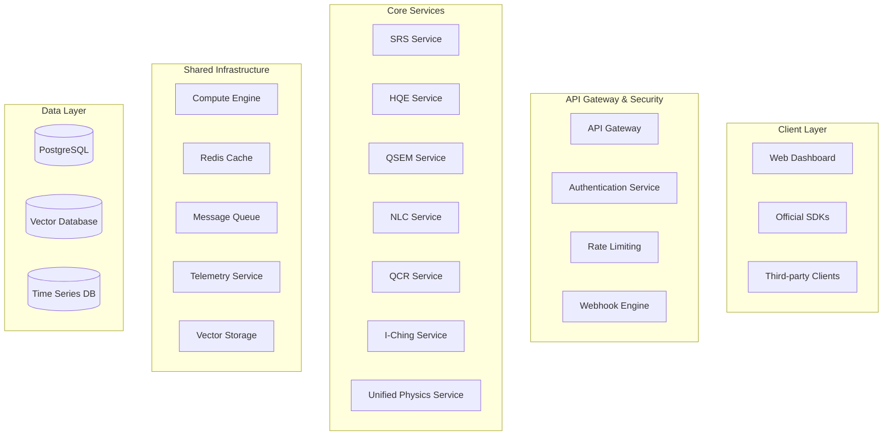
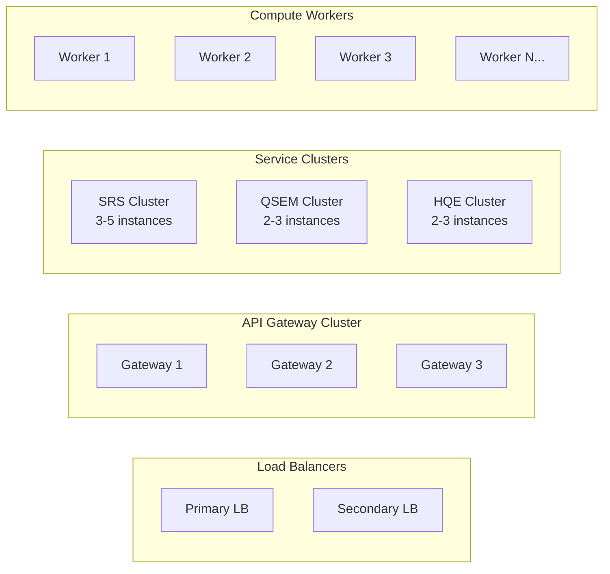
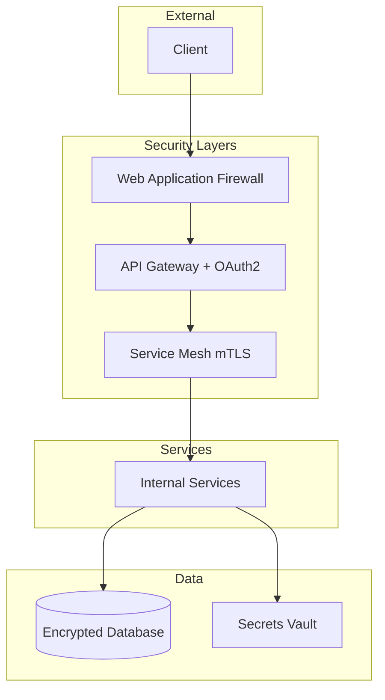

# PsiZero Resonance Platform - API Implementation Strategy

## 🏗️ Overall Architecture Design

### System Overview
The PsiZero Resonance Platform implements a microservices architecture with 7 core API services, designed for horizontal scaling and high availability. Each resonance API (SRS, HQE, QSEM, NLC, QCR, I-Ching, Unified Physics) operates as an independent service with shared infrastructure components.

### Architecture Diagram


## 🛠️ Technology Stack

### Backend Services
- **Core Compute**: Rust for performance-critical algorithms
- **API Services**: Go with Gin framework for REST APIs
- **Queue Processing**: Python with Celery for async tasks
- **Real-time**: Node.js with Socket.io for NLC/QCR sessions

### Infrastructure
- **Orchestration**: Kubernetes with Helm charts
- **API Gateway**: Kong with OAuth2 plugin
- **Message Queue**: Apache Kafka for event streaming
- **Cache**: Redis Cluster for distributed caching
- **Service Mesh**: Istio for zero-trust networking

### Databases
- **Primary**: PostgreSQL 15 with connection pooling
- **Vector**: Pinecone for QSEM semantic vectors
- **Time Series**: InfluxDB for telemetry data
- **Cache**: Redis for session and result caching

### Monitoring & Observability
- **Metrics**: Prometheus + Grafana
- **Tracing**: Jaeger distributed tracing
- **Logging**: ELK Stack (Elasticsearch, Logstash, Kibana)
- **Alerting**: PagerDuty integration

## 📊 Scalability Design

### Horizontal Scaling Strategy


### Auto-scaling Policies
- **CPU-based**: Scale up at 70% CPU utilization
- **Memory-based**: Scale up at 80% memory utilization
- **Queue-based**: Scale workers based on queue depth
- **Custom metrics**: Scale based on API request rates

## 🚀 Implementation Phases

### Phase 1: Foundation (Months 1-2)
**Infrastructure & Core Services**

#### Week 1-2: Infrastructure Setup
- [ ] Kubernetes cluster deployment (AWS EKS or GCP GKE)
- [ ] PostgreSQL setup with read replicas
- [ ] Redis cluster configuration
- [ ] Basic monitoring stack (Prometheus + Grafana)

#### Week 3-4: API Gateway
- [ ] Kong API Gateway deployment
- [ ] OAuth2 authentication service
- [ ] Rate limiting implementation
- [ ] Health check endpoints

#### Week 5-8: SRS Service MVP
- [ ] Basic 3-SAT solver implementation in Rust
- [ ] REST API endpoints matching OpenAPI schema
- [ ] Simple entropy space algorithms
- [ ] Basic telemetry collection

**Success Criteria:**
- API Gateway handles 1000 RPS with <100ms latency
- SRS can solve 3-SAT problems with up to 1000 variables
- Basic monitoring and alerting operational

### Phase 2: Core Services Expansion (Months 3-4)
**HQE & I-Ching Services**

#### Month 3: HQE Service
```go
// HQE Service Implementation
type HQEService struct {
    primeEngine *PrimeEngine
    simulator   *QuantumSimulator
    telemetry   *TelemetryCollector
}

func (h *HQEService) Simulate(req *HQERequest) (*HQEResponse, error) {
    session := h.primeEngine.InitializeStates(req.Primes)
    
    for step := 0; step < req.Steps; step++ {
        session.Evolve(req.Lambda)
        h.telemetry.Record(step, session.GetMetrics())
    }
    
    return &HQEResponse{
        Snapshots: session.GetSnapshots(),
        Metrics:   session.GetFinalMetrics(),
    }, nil
}
```

#### Month 4: I-Ching Oracle Service
- [ ] Hexagram evolution algorithms
- [ ] Symbolic entropy dynamics
- [ ] Attractor analysis
- [ ] Pattern recognition system

**Success Criteria:**
- HQE simulations complete within 30 seconds for 1000 steps
- I-Ching provides meaningful guidance with >90% user satisfaction
- System handles 500 concurrent requests across all services

### Phase 3: Advanced Services (Months 5-6)
**QSEM & Basic NLC/QCR**

#### Month 5: QSEM Service
```python
# QSEM Service Core
class QSEMService:
    def __init__(self):
        self.vector_db = PineconeClient()
        self.prime_mapper = PrimeMapper()
        self.quantum_encoder = QuantumEncoder()
    
    async def encode_concepts(self, concepts: List[str]) -> List[QuantumVector]:
        vectors = []
        for concept in concepts:
            prime_weights = await self.prime_mapper.map_concept(concept)
            vector = self.quantum_encoder.create_vector(prime_weights)
            vectors.append(vector)
        return vectors
    
    async def compute_resonance(self, vectors: List[QuantumVector]) -> ResonanceMatrix:
        return self.quantum_encoder.compute_interference(vectors)
```

#### Month 6: NLC & QCR Basic Implementation
- [ ] Session management system
- [ ] Basic quantum channel simulation
- [ ] Consciousness modeling framework
- [ ] WebSocket connections for real-time interaction

**Success Criteria:**
- QSEM encodes concepts with <2 second latency
- Vector database handles 10M+ semantic vectors
- NLC/QCR sessions maintain stable connections for >1 hour

### Phase 4: Enterprise Features (Months 7-8)
**Webhooks & Advanced Analytics**

#### Month 7: Webhook System
```typescript
// Webhook Engine
interface WebhookEngine {
  subscribe(userId: string, events: string[], endpoint: string): Promise<void>;
  publish(event: WebhookEvent): Promise<void>;
  retry(failedWebhook: WebhookDelivery): Promise<void>;
}

class WebhookService implements WebhookEngine {
  async publish(event: WebhookEvent): Promise<void> {
    const subscribers = await this.getSubscribers(event.type);
    
    for (const subscriber of subscribers) {
      await this.queue.add('webhook-delivery', {
        endpoint: subscriber.endpoint,
        payload: event,
        retryCount: 0
      });
    }
  }
}
```

#### Month 8: Unified Physics Service
- [ ] Entropy-gravity coupling algorithms
- [ ] Observer effect modeling
- [ ] Field strength calculations
- [ ] Cosmological applications

**Success Criteria:**
- Webhook delivery success rate >99%
- Advanced analytics provide actionable insights
- Unified Physics computations complete within acceptable timeframes

## 🔒 Security & Performance

### Security Architecture


### Performance Optimizations

#### Caching Strategy
- **L1**: Application-level caching (in-memory)
- **L2**: Redis distributed cache
- **L3**: CDN for static content
- **L4**: Database query result caching

#### Compute Optimization
- **GPU Acceleration**: CUDA for quantum simulations
- **Distributed Computing**: Kubernetes jobs for large problems
- **Algorithm Optimization**: Continuous profiling and improvement

## 📈 Monitoring & Observability

### Key Performance Indicators

#### Technical Metrics
- **Availability**: 99.9% uptime SLA
- **Latency**: P95 < 500ms, P99 < 2s
- **Throughput**: 10,000 RPS peak capacity
- **Error Rate**: <0.1% 4xx/5xx errors

#### Business Metrics
- **API Usage**: Requests per API per user
- **User Growth**: Monthly active users
- **Revenue**: Usage-based billing accuracy
- **Customer Satisfaction**: NPS score >50

#### Scientific Metrics
- **Convergence Rate**: Algorithm success percentage
- **Solution Quality**: Accuracy measurements
- **Computational Efficiency**: Resource utilization

### Alerting Strategy
```yaml
alerts:
  critical:
    - service_down
    - high_error_rate (>5%)
    - security_breach_detected
  warning:
    - high_latency (>1s P95)
    - resource_exhaustion (>90%)
    - unusual_traffic_patterns
  info:
    - performance_degradation
    - capacity_planning_triggers
```

## 💰 Cost Optimization

### Infrastructure Costs
- **Auto-scaling**: Dynamic resource allocation
- **Spot Instances**: 70% cost savings for batch processing
- **Reserved Capacity**: 40% savings for baseline load
- **Multi-cloud**: Cost arbitrage between providers

### Operational Efficiency
- **GitOps**: Automated deployments with ArgoCD
- **Chaos Engineering**: Proactive reliability testing
- **Capacity Planning**: ML-based demand forecasting

## 🗓️ Development Roadmap

### Quarter 1 (Months 1-3)
- [x] Core infrastructure setup
- [x] SRS service implementation
- [x] Basic authentication and monitoring
- [ ] HQE service deployment
- [ ] I-Ching oracle service

### Quarter 2 (Months 4-6)
- [ ] QSEM service with vector database
- [ ] NLC basic implementation
- [ ] QCR consciousness modeling
- [ ] Advanced monitoring and analytics

### Quarter 3 (Months 7-9)
- [ ] Webhook system implementation
- [ ] Unified Physics service
- [ ] Enterprise security features
- [ ] Performance optimizations

### Quarter 4 (Months 10-12)
- [ ] Machine learning enhancements
- [ ] Advanced quantum algorithms
- [ ] Global edge deployment
- [ ] Enterprise customer onboarding

## 🏗️ Service Implementation Details

### SRS Service Architecture
```rust
// SRS Core Implementation
use tokio;
use serde::{Deserialize, Serialize};

#[derive(Serialize, Deserialize)]
pub struct SRSRequest {
    pub problem: String,
    pub spec: ProblemSpec,
    pub config: Option<SRSConfig>,
}

pub struct EntropySpaceEngine {
    operators: ResonanceOperators,
    state: QuantumState,
    telemetry: TelemetryCollector,
}

impl EntropySpaceEngine {
    pub async fn solve(&mut self, request: SRSRequest) -> Result<SRSSolution, SRSError> {
        self.initialize_state(&request.spec).await?;
        
        for iteration in 0..request.config.max_iterations {
            self.apply_projector().await?;
            self.apply_mixer().await?;
            
            let metrics = self.collect_metrics();
            self.telemetry.record(iteration, metrics).await?;
            
            if self.check_convergence().await? {
                break;
            }
        }
        
        self.extract_solution().await
    }
}
```

### QSEM Service Architecture
```python
# QSEM Service Implementation
import asyncio
from typing import List
import numpy as np
from pinecone import Pinecone

class QSEMService:
    def __init__(self):
        self.vector_db = Pinecone(api_key=os.getenv('PINECONE_API_KEY'))
        self.prime_mapper = PrimeMapper()
        self.quantum_encoder = QuantumEncoder()
    
    async def encode_concepts(self, concepts: List[str]) -> List[QuantumVector]:
        tasks = [self._encode_single_concept(concept) for concept in concepts]
        return await asyncio.gather(*tasks)
    
    async def _encode_single_concept(self, concept: str) -> QuantumVector:
        # Map concept to prime basis
        prime_weights = await self.prime_mapper.map_concept(concept)
        
        # Create quantum superposition
        amplitudes = self.quantum_encoder.create_amplitudes(prime_weights)
        
        # Normalize quantum state
        normalized = amplitudes / np.linalg.norm(amplitudes)
        
        return QuantumVector(concept=concept, amplitudes=normalized)
    
    async def compute_resonance(self, vectors: List[QuantumVector]) -> ResonanceMatrix:
        n = len(vectors)
        matrix = np.zeros((n, n), dtype=complex)
        
        for i in range(n):
            for j in range(i, n):
                resonance = np.abs(np.vdot(vectors[i].amplitudes, vectors[j].amplitudes))**2
                matrix[i, j] = resonance
                matrix[j, i] = np.conj(resonance)
        
        return ResonanceMatrix(matrix=matrix, concepts=[v.concept for v in vectors])
```

## 🔧 DevOps & Deployment

### CI/CD Pipeline
```yaml
# .github/workflows/deploy.yml
name: Deploy PsiZero Resonance Platform

on:
  push:
    branches: [main]

jobs:
  test:
    runs-on: ubuntu-latest
    steps:
      - uses: actions/checkout@v2
      - name: Run tests
        run: |
          cargo test --workspace
          go test ./...
          python -m pytest

  build:
    needs: test
    runs-on: ubuntu-latest
    steps:
      - name: Build Docker images
        run: |
          docker build -t psizero/srs-service ./services/srs
          docker build -t psizero/qsem-service ./services/qsem

  deploy:
    needs: build
    runs-on: ubuntu-latest
    steps:
      - name: Deploy to Kubernetes
        run: |
          helm upgrade --install psizero-platform ./helm-chart
```

### Kubernetes Deployment
```yaml
# k8s/srs-deployment.yaml
apiVersion: apps/v1
kind: Deployment
metadata:
  name: srs-service
spec:
  replicas: 3
  selector:
    matchLabels:
      app: srs-service
  template:
    metadata:
      labels:
        app: srs-service
    spec:
      containers:
      - name: srs
        image: psizero/srs-service:latest
        ports:
        - containerPort: 8080
        resources:
          requests:
            memory: "1Gi"
            cpu: "500m"
          limits:
            memory: "2Gi"
            cpu: "1000m"
        env:
        - name: DATABASE_URL
          valueFrom:
            secretKeyRef:
              name: db-secret
              key: url
```

This comprehensive implementation strategy provides a roadmap for building a scalable, enterprise-grade PsiZero Resonance Platform that can handle the computational complexity of quantum and symbolic algorithms while maintaining high availability, security, and performance.