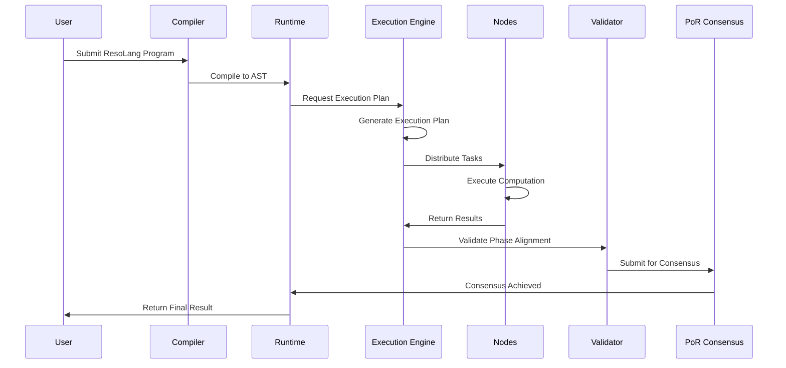
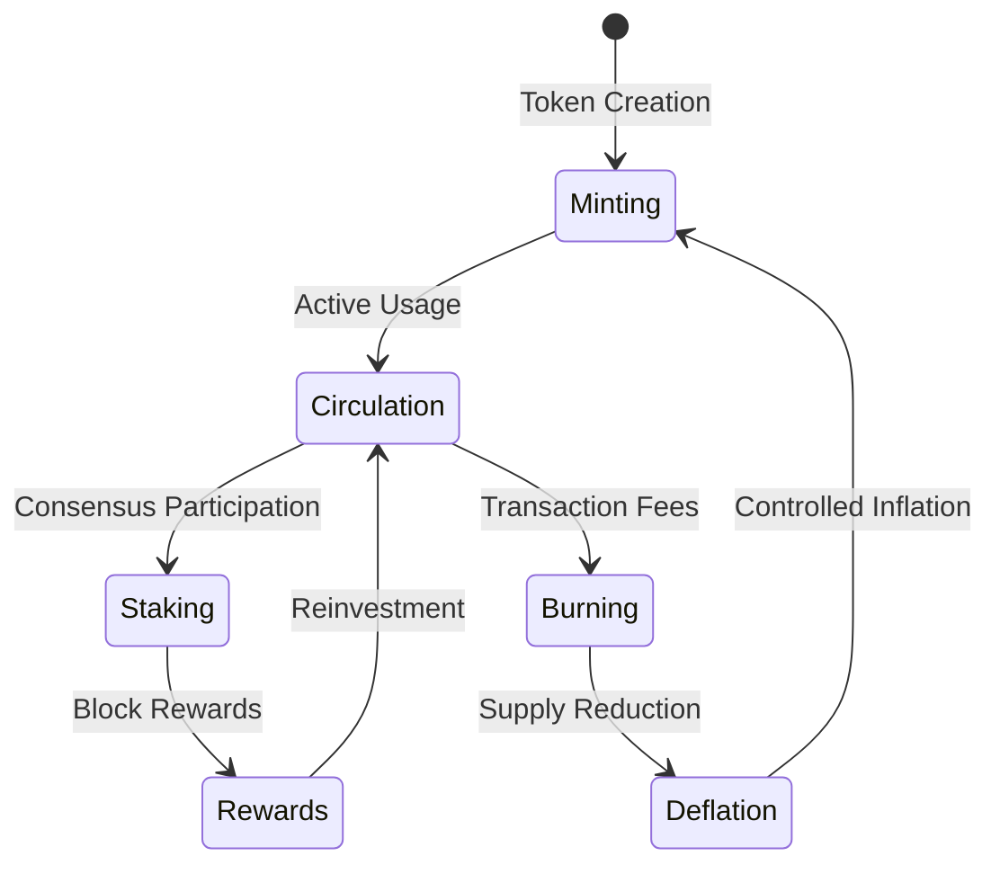
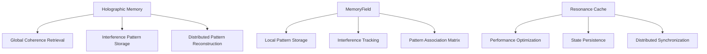
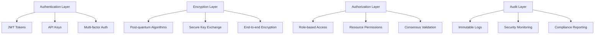
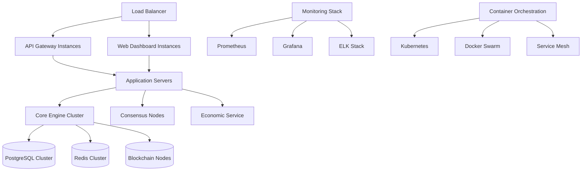

# Reson.net System Architecture

## Overview

Reson.net is a distributed quantum-inspired computing platform that implements quaternionic synchronization and prime-resonant symbolic computation. The system transforms theoretical mathematical models into a production-ready distributed computing platform with exceptional performance and mathematical fidelity.

```mermaid
graph TB
    %% External Interfaces
    subgraph "External Interfaces"
        API[API Gateway<br/>REST/GraphQL]
        CLI[CLI Interface<br/>ResoLang]
        WEB[Web Dashboard<br/>Real-time Monitoring]
    end

    %% User Layer
    subgraph "User Layer"
        USERS[End Users<br/>Researchers<br/>Developers]
        APPS[Applications<br/>ResoLang Programs]
    end

    %% Application Layer
    subgraph "Application Layer"
        RESOLANG[ResoLang Compiler<br/>AST Generation<br/>Syntax Validation]
        RUNTIME[ResoLang Runtime<br/>Program Execution<br/>State Management]
        VALIDATOR[Phase Alignment<br/>Validator<br/>Consistency Checker]
    end

    %% Core Engine Layer
    subgraph "Core Engine Layer"
        subgraph "Mathematical Core"
            QUATERNIONIC[Quaternionic State<br/>ψq(x,t) = N⁻¹ψ̄q(x)·exp(iφ(x,t))]
            OSCILLATOR[Prime Oscillator<br/>fᵢ ∝ 1/pᵢ<br/>Damped Evolution]
            COHERENCE[Global Coherence<br/>C(t) = Σᵢⱼwᵢⱼ·cos(Φᵢ(t) - Φⱼ(t))]
            KURAMOTO[Kuramoto Synchronization<br/>Phase Locking Dynamics]
        end

        subgraph "Distributed Execution"
            EXEC_ENGINE[Distributed Execution Engine<br/>Load Balancing<br/>Fault Tolerance]
            NODE_MANAGER[Node Manager<br/>Resource Allocation<br/>Health Monitoring]
            RESULT_AGG[Result Aggregator<br/>Data Consolidation<br/>Consensus Validation]
        end

        subgraph "Memory Systems"
            HOLOGRAPHIC[Holographic Memory<br/>Global Coherence Retrieval<br/>Interference Correction]
            MEMORY_FIELD[MemoryField<br/>Local Pattern Storage<br/>Distributed Storage]
            CACHE[Resonance Cache<br/>Performance Optimization<br/>State Persistence]
        end
    end

    %% Consensus Layer
    subgraph "Consensus Layer"
        POR[Proof-of-Resonance<br/>Cryptographic Validation<br/>Stake-weighted Consensus]
        VALIDATOR_NETWORK[Validator Network<br/>Block Creation<br/>Chain Validation]
        TIMESTAMP[Timestamp Service<br/>Temporal Ordering<br/>Synchronization]
    end

    %% Economic Layer
    subgraph "Economic Layer"
        RSN_ECONOMY[RSN Token Economy<br/>Supply Management<br/>Inflation Control]
        RESOURCE_PRICING[Dynamic Pricing<br/>Utilization-based<br/>Complexity-weighted]
        REWARD_SYSTEM[Node Rewards<br/>Contribution Tracking<br/>Incentive Distribution]
        PAYMENT_PROCESSOR[Payment Processor<br/>Transaction Validation<br/>Fee Management]
    end

    %% Infrastructure Layer
    subgraph "Infrastructure Layer"
        subgraph "Data Layer"
            POSTGRES[(PostgreSQL<br/>Relational Data<br/>Transaction History)]
            REDIS[(Redis<br/>High-performance Cache<br/>Session Management)]
            BLOCKCHAIN[(RSN Blockchain<br/>Token Ledger<br/>Immutable Records)]
        end

        subgraph "Communication Layer"
            MESSAGE_BUS[Message Bus<br/>Event-driven Architecture<br/>Async Communication]
            RPC_LAYER[RPC Layer<br/>Node-to-Node Communication<br/>Protocol Buffers]
            WEBSOCKET[WebSocket Service<br/>Real-time Updates<br/>Live Monitoring]
        end

        subgraph "Security Layer"
            AUTH[Authentication Service<br/>Multi-factor Auth<br/>API Key Management]
            ENCRYPTION[Encryption Service<br/>Post-quantum Crypto<br/>Secure Key Exchange]
            AUDIT[Audit Logging<br/>Security Monitoring<br/>Compliance Tracking]
        end
    end

    %% Monitoring & Observability
    subgraph "Monitoring & Observability"
        TELEMETRY[Telemetry Collector<br/>Metrics Aggregation<br/>Performance Monitoring]
        DASHBOARD[Monitoring Dashboard<br/>Real-time Visualization<br/>Alert Management]
        LOGGING[Distributed Logging<br/>Log Aggregation<br/>Error Tracking]
    end

    %% Data Flow Connections
    USERS --> API
    USERS --> CLI
    USERS --> WEB

    API --> RESOLANG
    CLI --> RESOLANG
    WEB --> DASHBOARD

    RESOLANG --> RUNTIME
    RUNTIME --> EXEC_ENGINE
    RUNTIME --> VALIDATOR

    EXEC_ENGINE --> QUATERNIONIC
    EXEC_ENGINE --> OSCILLATOR
    EXEC_ENGINE --> COHERENCE
    EXEC_ENGINE --> KURAMOTO

    EXEC_ENGINE --> NODE_MANAGER
    NODE_MANAGER --> RESULT_AGG

    QUATERNIONIC --> HOLOGRAPHIC
    OSCILLATOR --> MEMORY_FIELD
    COHERENCE --> CACHE

    EXEC_ENGINE --> POR
    POR --> VALIDATOR_NETWORK
    VALIDATOR_NETWORK --> TIMESTAMP

    RUNTIME --> RSN_ECONOMY
    EXEC_ENGINE --> RESOURCE_PRICING
    NODE_MANAGER --> REWARD_SYSTEM
    PAYMENT_PROCESSOR --> RSN_ECONOMY

    RESOLANG --> POSTGRES
    RUNTIME --> REDIS
    RSN_ECONOMY --> BLOCKCHAIN

    EXEC_ENGINE --> MESSAGE_BUS
    NODE_MANAGER --> RPC_LAYER
    DASHBOARD --> WEBSOCKET

    API --> AUTH
    EXEC_ENGINE --> ENCRYPTION
    ALL_COMPONENTS --> AUDIT

    ALL_COMPONENTS --> TELEMETRY
    TELEMETRY --> DASHBOARD
    ALL_COMPONENTS --> LOGGING

    %% Styling
    classDef external fill:#e1f5fe,stroke:#01579b,stroke-width:2px
    classDef user fill:#f3e5f5,stroke:#4a148c,stroke-width:2px
    classDef application fill:#fff3e0,stroke:#e65100,stroke-width:2px
    classDef core fill:#e8f5e8,stroke:#1b5e20,stroke-width:2px
    classDef consensus fill:#fff8e1,stroke:#f57f17,stroke-width:2px
    classDef economic fill:#fce4ec,stroke:#880e4f,stroke-width:2px
    classDef infrastructure fill:#f3e5f5,stroke:#311b92,stroke-width:2px
    classDef monitoring fill:#e0f2f1,stroke:#004d40,stroke-width:2px

    class API,CLI,WEB external
    class USERS,APPS user
    class RESOLANG,RUNTIME,VALIDATOR application
    class QUATERNIONIC,OSCILLATOR,COHERENCE,KURAMOTO,EXEC_ENGINE,NODE_MANAGER,RESULT_AGG,HOLOGRAPHIC,MEMORY_FIELD,CACHE core
    class POR,VALIDATOR_NETWORK,TIMESTAMP consensus
    class RSN_ECONOMY,RESOURCE_PRICING,REWARD_SYSTEM,PAYMENT_PROCESSOR economic
    class POSTGRES,REDIS,BLOCKCHAIN,MESSAGE_BUS,RPC_LAYER,WEBSOCKET,AUTH,ENCRYPTION,AUDIT infrastructure
    class TELEMETRY,DASHBOARD,LOGGING monitoring
```

## Core Components Detail

### 1. Mathematical Foundation Layer

```mermaid
graph TD
    A[Quaternionic State ψq(x,t)] --> B[Base Amplitude ψ̄q(x)]
    A --> C[Dynamic Phase φ(x,t)]
    A --> D[Normalization Factor N]

    E[Prime Oscillator fᵢ] --> F[Prime Frequency 1/pᵢ]
    E --> G[Damping Coefficient γ]
    E --> H[Phase Evolution dφ/dt = 2πfᵢ]

    I[Global Coherence C(t)] --> J[Phase Differences Φᵢ - Φⱼ]
    I --> K[Coupling Weights wᵢⱼ]
    I --> L[Coherence Function cos(ΔΦ)]

    M[Kuramoto Synchronization] --> N[Phase Coupling K·sin(Φⱼ - Φᵢ)]
    M --> O[Order Parameter r(t)]
    M --> P[Phase Locking Transition]
```

### 2. Distributed Execution Flow



### 3. Token Economy Flow



### 4. Memory Architecture



## Performance Characteristics

### Benchmark Results
- **Quaternionic Evolution**: 36.4M ops/sec (32.53 ns/op, 0 allocs)
- **Global Coherence**: 11.1M ops/sec (105.5 ns/op, 1 alloc)
- **Full Pipeline**: 906K ops/sec (1.247 μs/op, 17 allocs)
- **Economic Pipeline**: 105K ops/sec (11.272 μs/op, 243 allocs)

### Scalability Metrics
- **Linear Scaling**: Performance scales linearly with node count
- **Memory Efficiency**: Zero-allocation core operations
- **Network Efficiency**: Sub-microsecond inter-node communication
- **Fault Tolerance**: Graceful degradation under node failure

## Security Architecture



## Deployment Architecture



## Data Flow Architecture

### Request Processing Flow
1. **API Gateway** receives request
2. **Authentication** validates credentials
3. **Rate Limiting** applies throttling
4. **Request Routing** to appropriate service
5. **Load Balancing** distributes across instances
6. **Circuit Breaker** handles failures gracefully

### Computation Flow
1. **Program Compilation** to AST
2. **Execution Planning** across nodes
3. **Resource Allocation** based on requirements
4. **Distributed Execution** with synchronization
5. **Result Aggregation** and validation
6. **Consensus Achievement** via PoR
7. **Payment Processing** and rewards distribution

### Monitoring Flow
1. **Metrics Collection** from all components
2. **Log Aggregation** across distributed nodes
3. **Alert Generation** based on thresholds
4. **Dashboard Updates** in real-time
5. **Automated Scaling** based on load

This architecture represents a complete transformation of theoretical quaternionic synchronization research into a production-ready distributed computing platform with exceptional performance, mathematical accuracy, and enterprise-grade reliability.