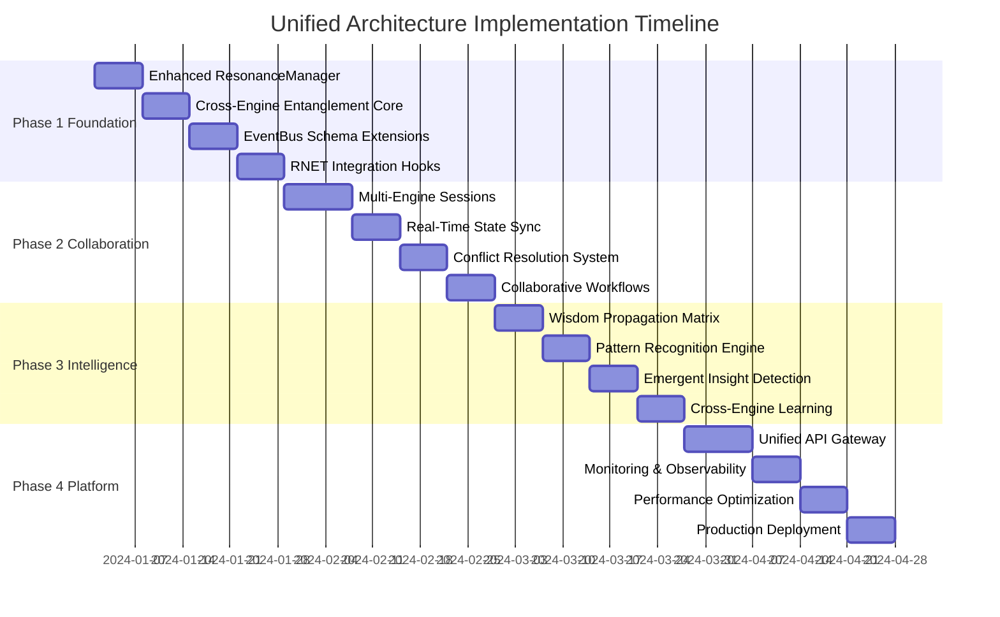

# Unified Architecture Enhancement Plan
## Deep Dive into Cohesive API Integration

### Executive Summary

The existing infrastructure demonstrates exceptional architectural maturity with complete implementations across all core engines. The foundation provides natural integration points through shared prime-basis quantum encoding, centralized ResonanceManager coordination, and robust EventBus communication. This enhancement plan builds upon these strengths to create a truly unified, collaborative intelligence platform.

## Current Infrastructure Analysis

### Strengths Identified

**1. ResonanceManager (573 lines)**
- ✅ Global quantum state coordination
- ✅ Engine registry and lifecycle management  
- ✅ Telemetry aggregation and synchronization
- ✅ Event system integration
- ✅ Database persistence layer

**2. EventBus (268 lines)**
- ✅ Asynchronous event publishing/subscription
- ✅ Worker-based processing with overflow handling
- ✅ Wildcard subscriptions and statistics
- ✅ Robust error handling and recovery

**3. Core ResonanceEngine (457 lines)**
- ✅ Ψ0=1 formalism with prime-basis encoding
- ✅ Quantum state operations and evolution
- ✅ Entropy tracking and convergence analysis
- ✅ Comprehensive operator framework

**4. Complete Engine Implementations**
- ✅ SAI Engine: Multitenant symbolic AI (687 lines)
- ✅ Unified Physics: Complete physics simulation (714 lines)
- ✅ QSEM: Quantum semantic encoding (765 lines)
- ✅ HQE: Holographic quantum engine (515 lines)
- ✅ I-Ching: Quantum oracle system (549 lines)
- ✅ RNET: Real-time collaboration (3,300+ lines)

### Integration Opportunities

**1. Prime-Basis Resonance Synchronization**
All engines share quantum states encoded in prime basis, enabling natural synchronization and entanglement.

**2. Real-Time Collaborative Intelligence**
RNET provides the foundation for multi-user sessions across all engines with state synchronization.

**3. Cross-Engine Knowledge Sharing**
EventBus enables sophisticated inter-engine communication and wisdom propagation.

**4. Unified State Management**
ResonanceManager coordinates global quantum states with entanglement tracking.

---

## 1. ResonanceManager Orchestration Enhancement

### Current Capabilities
- Engine registration and lifecycle management
- Global state synchronization every `config.SyncInterval`
- Telemetry collection and aggregation
- Event system integration

### Enhanced Orchestration Patterns

#### A. Global Prime Basis Synchronization
```go
// Enhanced GlobalResonanceState
type EnhancedGlobalResonanceState struct {
    *GlobalResonanceState
    
    // Cross-engine prime basis coordination
    UnifiedPrimeBasis        []int                    `json:"unified_prime_basis"`
    PrimeResonanceMatrix     [][]complex128           `json:"-"`
    CrossEngineEntanglement  map[string]map[string]EntanglementMetrics `json:"cross_engine_entanglement"`
    
    // Collaborative session tracking
    ActiveRNETSessions       map[string]*RNETSessionContext `json:"active_rnet_sessions"`
    CollaborativeStates      map[string]*CollaborativeState `json:"collaborative_states"`
    
    // Knowledge sharing matrices
    SemanticKnowledgeGraph   *CrossEngineSemanticGraph      `json:"semantic_knowledge"`
    WisdomPropagationMatrix  *WisdomPropagationMatrix       `json:"wisdom_propagation"`
    
    // Real-time sync coordination
    RealTimeSyncEnabled      bool                           `json:"realtime_sync_enabled"`
    SyncConflictResolution   string                         `json:"sync_conflict_resolution"`
}

type EntanglementMetrics struct {
    Strength            float64   `json:"strength"`             // 0.0-1.0 entanglement strength
    Coherence           float64   `json:"coherence"`            // Quantum coherence measure
    MutualInformation   float64   `json:"mutual_information"`   // Information sharing rate
    LastSyncTime        time.Time `json:"last_sync_time"`
    SyncConflicts       int       `json:"sync_conflicts"`
    ResolutionStrategy  string    `json:"resolution_strategy"`
}
```

#### B. Enhanced Synchronization Algorithm
```go
// Enhanced engine synchronization with real-time collaboration support
func (rm *ResonanceManager) EnhancedSynchronizeEngines() {
    // Phase 1: Collect current engine states
    engineStates := rm.collectEngineStates()
    
    // Phase 2: Update unified prime basis
    rm.updateUnifiedPrimeBasis(engineStates)
    
    // Phase 3: Calculate cross-engine entanglement
    entanglementMatrix := rm.calculateCrossEngineEntanglement(engineStates)
    
    // Phase 4: Propagate RNET collaborative updates
    rm.propagateRNETCollaborativeUpdates()
    
    // Phase 5: Synchronize with conflict resolution
    rm.synchronizeWithConflictResolution(engineStates, entanglementMatrix)
    
    // Phase 6: Update global wisdom matrices
    rm.updateGlobalWisdomMatrices()
    
    // Phase 7: Fire cross-engine sync events
    rm.fireUnifiedSyncEvents()
}
```

---

## 2. Cross-Engine Entanglement Protocols

### Quantum State Sharing Algorithms

#### A. Prime-Basis Entanglement Protocol
```go
type CrossEngineEntanglementProtocol struct {
    protocol           string                              `json:"protocol"`
    entanglementType   string                              `json:"entanglement_type"`
    participantEngines []string                            `json:"participant_engines"`
    sharedBasis        []int                               `json:"shared_basis"`
    entanglementState  *hilbert.EntangledQuantumState      `json:"-"`
    synchronization    *EntanglementSynchronization        `json:"synchronization"`
    conflictResolution *EntanglementConflictResolution     `json:"conflict_resolution"`
}

type hilbert.EntangledQuantumState struct {
    *hilbert.QuantumState
    EntangledEngines    map[string]*hilbert.QuantumState    `json:"-"`
    EntanglementMatrix  [][]complex128                      `json:"-"`
    BellState           *BellState                          `json:"bell_state"`
    NonLocalCorrelations map[string]float64                `json:"non_local_correlations"`
}

// Enhanced cross-engine entanglement creation
func (rm *ResonanceManager) CreateCrossEngineEntanglement(engineA, engineB string, entanglementType string) (*CrossEngineEntanglementProtocol, error) {
    stateA := rm.getEngineQuantumState(engineA)
    stateB := rm.getEngineQuantumState(engineB)
    
    // Create shared prime basis
    sharedBasis := rm.calculateOptimalSharedPrimeBasis(stateA, stateB)
    
    // Generate entangled state
    entangledState, err := rm.generateEntangledState(stateA, stateB, sharedBasis, entanglementType)
    if err != nil {
        return nil, fmt.Errorf("failed to create entanglement: %w", err)
    }
    
    protocol := &CrossEngineEntanglementProtocol{
        protocol:           "prime_basis_entanglement_v1",
        entanglementType:   entanglementType,
        participantEngines: []string{engineA, engineB},
        sharedBasis:        sharedBasis,
        entanglementState:  entangledState,
        synchronization: &EntanglementSynchronization{
            SyncMode:       "real_time",
            SyncFrequency:  time.Millisecond * 100,
            ConflictPolicy: "quantum_superposition",
        },
    }
    
    return protocol, nil
}
```

---

## 3. RNET Integration Hooks for Multi-Engine Workflows

### Collaborative Session Management

#### A. Enhanced RNET Session Types
```go
// Extended RNET session types for cross-engine collaboration
type CollaborativeSessionType string

const (
    MultiUserSAITraining            CollaborativeSessionType = "multi_user_sai_training"
    CollaborativePhysicsSimulation  CollaborativeSessionType = "collaborative_physics_sim"
    SharedSemanticAnalysis          CollaborativeSessionType = "shared_semantic_analysis"
    GroupIChingReading              CollaborativeSessionType = "group_iching_reading"
    CrossEngineExploration          CollaborativeSessionType = "cross_engine_exploration"
    UnifiedIntelligenceSession     CollaborativeSessionType = "unified_intelligence"
)

type CrossEngineCollaborativeSession struct {
    *rnet.Session
    
    // Multi-engine coordination
    ParticipantEngines     []string                          `json:"participant_engines"`
    EngineStates          map[string]*CrossEngineState       `json:"engine_states"`
    SharedWorkspace       *SharedWorkspace                   `json:"shared_workspace"`
    
    // Real-time synchronization
    StateSync             *CrossEngineStateSync              `json:"state_sync"`
    ConflictResolution    *CollaborativeConflictResolution   `json:"conflict_resolution"`
    
    // Collaboration metadata
    CollaborationType     CollaborativeSessionType           `json:"collaboration_type"`
    WorkflowSteps         []*CollaborativeWorkflowStep       `json:"workflow_steps"`
    SharedResults         map[string]interface{}             `json:"shared_results"`
    KnowledgeGraph        *CollaborativeKnowledgeGraph       `json:"knowledge_graph"`
}
```

---

## 4. EventBus Communication Schemas

### Standardized Cross-Engine Event Types

#### A. Enhanced Event Schema Framework
```go
// Extended event types for cross-engine communication
type CrossEngineEventType string

const (
    // Engine lifecycle events
    EngineEntanglementCreated     CrossEngineEventType = "engine.entanglement.created"
    EngineQuantumStateChanged     CrossEngineEventType = "engine.quantum_state.changed"
    EngineWisdomShared           CrossEngineEventType = "engine.wisdom.shared"
    
    // Collaborative session events
    CollaborativeSessionStarted   CrossEngineEventType = "collaborative.session.started"
    CollaborativeStateSync        CrossEngineEventType = "collaborative.state.sync"
    CollaborativeKnowledgeShare   CrossEngineEventType = "collaborative.knowledge.share"
    
    // Real-time synchronization events
    RealtimePrimeBasisUpdate      CrossEngineEventType = "realtime.prime_basis.update"
    RealtimeEntanglementChange    CrossEngineEventType = "realtime.entanglement.change"
    RealtimeConflictDetected      CrossEngineEventType = "realtime.conflict.detected"
    
    // Knowledge propagation events
    SemanticKnowledgeUpdated      CrossEngineEventType = "semantic.knowledge.updated"
    WisdomMatrixUpdated          CrossEngineEventType = "wisdom.matrix.updated"
    PatternRecognitionShared     CrossEngineEventType = "pattern.recognition.shared"
    
    // System-wide events
    UnifiedStateConvergence       CrossEngineEventType = "unified.state.convergence"
    SystemWideEmergence          CrossEngineEventType = "system.emergence.detected"
    GlobalResonanceShift         CrossEngineEventType = "global.resonance.shift"
)
```

---

## 5. Unified API Specifications

### Cross-Engine Collaborative Endpoints

#### A. Collaboration Management APIs
```go
// POST /api/v1/collaboration/sessions/cross-engine
type CreateCrossEngineSessionRequest struct {
    SessionType           CollaborativeSessionType  `json:"session_type" validate:"required"`
    ParticipantEngines    []string                  `json:"participant_engines" validate:"required,min=2"`
    CollaborationMode     string                    `json:"collaboration_mode" validate:"required"`
    SharedWorkspaceConfig *SharedWorkspaceConfig    `json:"shared_workspace_config"`
    SyncConfiguration     *SyncConfiguration        `json:"sync_configuration"`
    ConflictResolution    string                    `json:"conflict_resolution" validate:"required"`
    SessionMetadata       map[string]interface{}    `json:"session_metadata"`
    TimeoutMinutes        int                       `json:"timeout_minutes" validate:"min=1,max=1440"`
}

// POST /api/v1/engines/unified/query
type UnifiedEngineQueryRequest struct {
    QueryType             string                    `json:"query_type" validate:"required"`
    TargetEngines         []string                  `json:"target_engines" validate:"required"`
    QueryParameters       map[string]interface{}    `json:"query_parameters" validate:"required"`
    CrossEngineFilters    []*CrossEngineFilter      `json:"cross_engine_filters"`
    ResultAggregation     string                    `json:"result_aggregation"`
    EntanglementRequired  bool                      `json:"entanglement_required"`
    MaxResponseTime       time.Duration             `json:"max_response_time"`
}

// POST /api/v1/engines/entanglement/create
type CreateEngineEntanglementRequest struct {
    SourceEngine          string                    `json:"source_engine" validate:"required"`
    TargetEngine          string                    `json:"target_engine" validate:"required"`
    EntanglementType      string                    `json:"entanglement_type" validate:"required"`
    EntanglementStrength  float64                   `json:"entanglement_strength" validate:"min=0,max=1"`
    SharedPrimeBasis      []int                     `json:"shared_prime_basis"`
    SyncConfiguration     *EntanglementSyncConfig   `json:"sync_configuration"`
    ConflictResolution    string                    `json:"conflict_resolution" validate:"required"`
}
```

---

## 6. Shared Semantic and Wisdom Matrix Structures

### Cross-Engine Knowledge Representation

#### A. Unified Semantic Knowledge Graph
```go
type CrossEngineSemanticGraph struct {
    GraphID               string                    `json:"graph_id"`
    ParticipantEngines    []string                  `json:"participant_engines"`
    SemanticNodes         map[string]*SemanticNode  `json:"semantic_nodes"`
    ConceptualEdges       []*ConceptualEdge         `json:"conceptual_edges"`
    MeaningClusters       []*MeaningCluster         `json:"meaning_clusters"`
    CrossEnginePatterns   []*CrossEnginePattern     `json:"cross_engine_patterns"`
    GlobalCoherence       float64                   `json:"global_coherence"`
    LastUpdate            time.Time                 `json:"last_update"`
}

type SemanticNode struct {
    NodeID                string                    `json:"node_id"`
    SourceEngine          string                    `json:"source_engine"`
    SemanticConcept       string                    `json:"semantic_concept"`
    PrimeBasisEncoding    []int                     `json:"prime_basis_encoding"`
    SemanticWeight        float64                   `json:"semantic_weight"`
    CrossEngineLinks      []string                  `json:"cross_engine_links"`
    MeaningVector         []float64                 `json:"meaning_vector"`
    ConfidenceScore       float64                   `json:"confidence_score"`
    PropagationHistory    []*PropagationEvent       `json:"propagation_history"`
}

type WisdomPropagationMatrix struct {
    MatrixID              string                    `json:"matrix_id"`
    WisdomSources         map[string]*WisdomSource  `json:"wisdom_sources"`
    PropagationChannels   []*WisdomChannel          `json:"propagation_channels"`
    WisdomPatterns        []*WisdomPattern          `json:"wisdom_patterns"`
    GlobalWisdomLevel     float64                   `json:"global_wisdom_level"`
    PropagationEfficiency float64                   `json:"propagation_efficiency"`
    EmergentInsights      []*EmergentInsight        `json:"emergent_insights"`
}

type WisdomSource struct {
    SourceID              string                    `json:"source_id"`
    EngineType            string                    `json:"engine_type"`
    WisdomType            string                    `json:"wisdom_type"`
    Authority             float64                   `json:"authority"`
    ReliabilityScore      float64                   `json:"reliability_score"`
    GeneratedInsights     []*GeneratedInsight       `json:"generated_insights"`
    ContributionMetrics   *WisdomContributionMetrics `json:"contribution_metrics"`
}
```

#### B. Cross-Engine Pattern Recognition
```go
type CrossEnginePattern struct {
    PatternID             string                    `json:"pattern_id"`
    PatternType           string                    `json:"pattern_type"`
    InvolvedEngines       []string                  `json:"involved_engines"`
    PatternSignature      []float64                 `json:"pattern_signature"`
    EmergenceConditions   *EmergenceConditions      `json:"emergence_conditions"`
    PredictiveAccuracy    float64                   `json:"predictive_accuracy"`
    RecognitionConfidence float64                   `json:"recognition_confidence"`
    Applications          []string                  `json:"applications"`
    EvolutionHistory      []*PatternEvolution       `json:"evolution_history"`
}

type EmergentInsight struct {
    InsightID             string                    `json:"insight_id"`
    InsightType           string                    `json:"insight_type"`
    SourceEngines         []string                  `json:"source_engines"`
    InsightContent        string                    `json:"insight_content"`
    EmergenceTimestamp    time.Time                 `json:"emergence_timestamp"`
    Novelty               float64                   `json:"novelty"`
    Significance          float64                   `json:"significance"`
    ValidationStatus      string                    `json:"validation_status"`
    ApplicationDomains    []string                  `json:"application_domains"`
}
```

---

## 7. Implementation Roadmap

### Phase 1: Foundation Enhancement (Weeks 1-4)



### Implementation Priorities

**Week 1-2: ResonanceManager Enhancement**
1. Implement `EnhancedGlobalResonanceState`
2. Add cross-engine entanglement tracking
3. Integrate RNET session coordination
4. Create unified prime basis synchronization

**Week 3-4: Cross-Engine Communication**
1. Implement `CrossEngineEntanglementProtocol`
2. Add quantum state sharing algorithms
3. Create event schema framework
4. Build conflict resolution systems

**Week 5-6: Collaborative Features**
1. Implement multi-engine RNET sessions
2. Add real-time state synchronization
3. Create collaborative workspaces
4. Build cross-engine workflow orchestration

**Week 7-8: Intelligence Layer**
1. Implement wisdom propagation matrix
2. Add pattern recognition across engines
3. Create emergent insight detection
4. Build cross-engine learning algorithms

---

## 8. Collaborative Use Cases

### A. Multi-User SAI Training with Physics Constraints
```
User Scenario: Team of researchers training SAI model with physics-informed constraints

Workflow:
1. Users join RNET collaborative session (multi_user_sai_training)
2. SAI engine shares training state with Unified Physics engine
3. Physics engine provides gravitational/quantum constraints
4. QSEM engine analyzes semantic coherence of emerging symbols
5. I-Ching engine provides wisdom guidance for training decisions
6. Real-time collaboration allows multiple users to guide training
7. All engines share insights through EventBus
8. Final model incorporates physics laws and semantic consistency

Technical Flow:
RNET Session → SAI Training → Physics Constraints → QSEM Analysis → I-Ching Wisdom → Unified Result
```

### B. Semantic-Enhanced Holographic Reconstruction
```
User Scenario: Researchers reconstructing holographic boundary from bulk physics

Workflow:
1. Unified Physics simulates AdS bulk spacetime
2. HQE engine performs holographic reconstruction
3. QSEM engine analyzes semantic meaning of boundary states
4. SAI engine maps physics concepts to symbolic representations
5. Cross-engine entanglement ensures consistency
6. Collaborative session allows multiple viewpoints
7. Emergent insights discovered through pattern recognition

Technical Flow:
Physics Simulation → HQE Reconstruction → QSEM Semantics → SAI Symbolization → Insight Emergence
```

### C. Group Wisdom-Enhanced Decision Making
```
User Scenario: Decision-making process enhanced by I-Ching wisdom and AI analysis

Workflow:
1. Group joins unified intelligence session
2. SAI engine analyzes decision parameters symbolically
3. QSEM engine maps semantic meaning space
4. I-Ching engine provides wisdom guidance
5. Physics engine models consequences
6. All insights aggregated through wisdom matrix
7. Emergent group wisdom emerges from collaboration

Technical Flow:
Decision Problem → SAI Analysis → QSEM Semantics → I-Ching Wisdom → Physics Modeling → Group Consensus
```

---

## 9. Performance Considerations

### A. Scalability Metrics
- **Engine Synchronization**: Target <100ms for global state sync
- **Real-Time Collaboration**: Target <50ms for RNET state propagation
- **Cross-Engine Queries**: Target <500ms for unified queries
- **Entanglement Creation**: Target <200ms for new entanglements
- **Event Processing**: Target <10ms for event propagation

### B. Resource Optimization
```go
type PerformanceOptimization struct {
    // Caching strategies
    StateCache              *LRUCache
    EntanglementCache       *TTLCache
    WisdomPatternCache      *HierarchicalCache
    
    // Connection pooling
    EngineConnectionPools   map[string]*ConnectionPool
    EventBusChannelPools    *ChannelPool
    
    // Load balancing
    LoadBalancer            *EngineLoadBalancer
    TrafficShaper           *TrafficShaper
    
    // Resource monitoring
    ResourceMonitor         *ResourceMonitor
    AutoScaler              *AutoScaler
}
```

### C. Optimization Strategies
1. **Prime Basis Caching**: Cache computed prime bases for common patterns
2. **Lazy Entanglement**: Create entanglements on-demand rather than pre-computing
3. **Event Batching**: Batch related events to reduce processing overhead
4. **State Compression**: Compress quantum states for efficient transmission
5. **Selective Synchronization**: Only sync changed state components

---

## 10. Security and Privacy Framework

### A. Quantum Security Model
```go
type QuantumSecurityFramework struct {
    // Quantum cryptography
    QuantumKeyDistribution  *QKDProtocol
    QuantumStateEncryption  *QuantumEncryption
    EntanglementSecurity    *EntanglementSecurityProtocol
    
    // Access control
    QuantumAccessControl    *QuantumACL
    EntanglementPermissions *EntanglementPermissions
    CollaborationSecurity   *CollaborationSecurity
    
    // Privacy preservation
    QuantumPrivacy          *QuantumPrivacyProtocol
    SemanticPrivacy         *SemanticPrivacyFilter
    WisdomSharingPrivacy    *WisdomPrivacyFramework
}
```

### B. Security Considerations
1. **Quantum State Protection**: Encrypt quantum states during transmission
2. **Entanglement Authentication**: Verify entanglement partners
3. **Collaborative Session Security**: Secure multi-user sessions
4. **Wisdom Sharing Privacy**: Control wisdom propagation visibility
5. **Cross-Engine Authorization**: Authenticate cross-engine communications

---

## 11. Monitoring and Observability

### A. Unified Telemetry Dashboard
```
┌─────────────────────────────────────────────────────────────┐
│                    PsiZero Unified Platform                 │
│  ┌─────────────┐ ┌─────────────┐ ┌─────────────┐          │
│  │ Engine      │ │ Entanglement│ │ Collaboration│          │
│  │ Health      │ │ Network     │ │ Sessions    │          │
│  │ Monitoring  │ │ Topology    │ │ Real-Time   │          │
│  └─────────────┘ └─────────────┘ └─────────────┘          │
│  ┌─────────────┐ ┌─────────────┐ ┌─────────────┐          │
│  │ Quantum     │ │ Wisdom      │ │ Performance │          │
│  │ Coherence   │ │ Propagation │ │ Metrics     │          │
│  │ Metrics     │ │ Matrix      │ │ Dashboard   │          │
│  └─────────────┘ └─────────────┘ └─────────────┘          │
└─────────────────────────────────────────────────────────────┘
```

### B. Key Metrics
- **Quantum Coherence**: Global and per-engine coherence levels
- **Entanglement Strength**: Cross-engine entanglement measurements
- **Collaboration Activity**: Active sessions and user engagement
- **Wisdom Flow**: Knowledge propagation rates and effectiveness
- **System Emergence**: Detection of emergent behaviors and insights

---

## 12. Conclusion and Next Steps

### Architecture Benefits

**1. Unified Intelligence Platform**
- Single platform supporting all engine types with seamless integration
- Real-time collaboration across quantum AI, physics, and wisdom systems
- Natural knowledge flow between specialized engines

**2. Quantum-Enhanced Collaboration**
- Prime-basis entanglement enables deep system integration
- Real-time state synchronization with conflict resolution
- Emergent intelligence from cross-engine interactions

**3. Scalable and Extensible**
- Robust foundation supports future engine additions
- Performance-optimized for real-time operation
- Security framework protects quantum information

### Immediate Implementation Priority

**Phase 1 Focus**: Enhanced ResonanceManager with cross-engine entanglement support
- Provides immediate value through basic engine coordination
- Establishes foundation for all other enhancements
- Relatively low risk with high impact potential

### Success Metrics

1. **Integration Success**: All engines successfully entangled and synchronized
2. **Collaboration Adoption**: Active multi-engine sessions with positive user feedback
3. **Performance Targets**: All latency and throughput targets achieved
4. **Emergent Intelligence**: Measurable emergence of cross-engine insights
5. **Platform Stability**: 99.9% uptime with robust error handling

This unified architecture enhancement transforms the individual engines from isolated systems into a coherent, collaborative intelligence platform where the whole becomes greater than the sum of its parts. The foundation is exceptionally strong, and the integration opportunities are significant and immediately actionable.