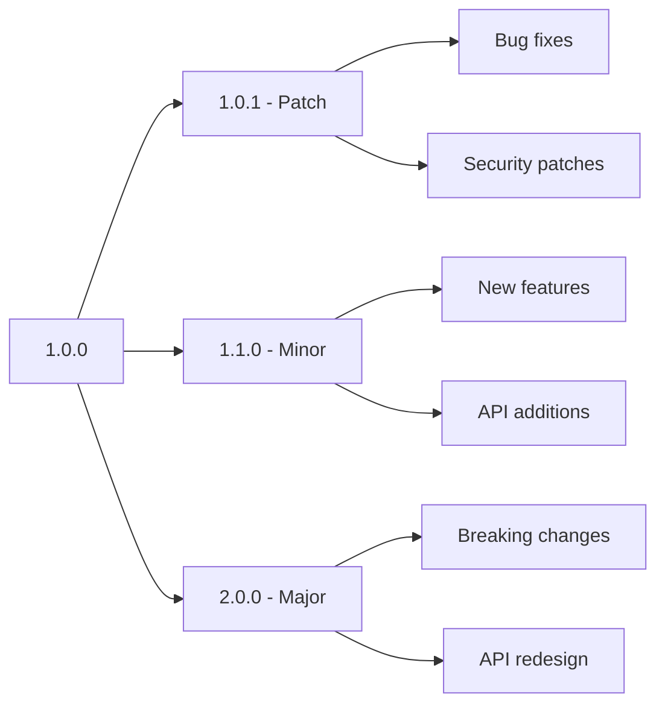
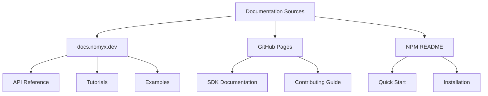
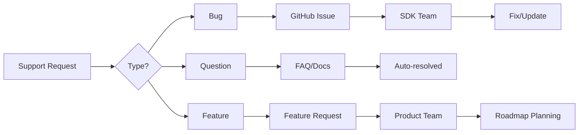

# Nomyx Resonance SDK Publishing & Distribution Strategy

## Overview

Comprehensive strategy for publishing, distributing, and maintaining the Nomyx Resonance SDK as a premier developer tool for quantum-enhanced AI and collaborative computing.

## Publishing Strategy

### NPM Package Management

#### Package Organization
```json
{
  "name": "@nomyx/resonance-sdk",
  "organization": "@nomyx",
  "scope": "public",
  "registry": "https://registry.npmjs.org/",
  "publishConfig": {
    "access": "public",
    "registry": "https://registry.npmjs.org/"
  }
}
```

#### Version Strategy (Semantic Versioning)



**Version Guidelines:**
- **Patch (1.0.x)**: Bug fixes, security patches, documentation updates
- **Minor (1.x.0)**: New features, engine additions, backward-compatible changes
- **Major (x.0.0)**: Breaking API changes, architectural redesigns

#### Release Channels

```typescript
// Release channel structure
interface ReleaseChannels {
  stable: string;      // @nomyx/resonance-sdk@latest
  beta: string;        // @nomyx/resonance-sdk@beta
  alpha: string;       // @nomyx/resonance-sdk@alpha
  nightly: string;     // @nomyx/resonance-sdk@nightly
}
```

### Release Process

#### Automated Release Pipeline

```yaml
# .github/workflows/release.yml
name: Release Pipeline

on:
  push:
    branches: [main]
    tags: ['v*']

jobs:
  test:
    runs-on: ubuntu-latest
    strategy:
      matrix:
        node-version: [16.x, 18.x, 20.x]
    steps:
      - uses: actions/checkout@v4
      - name: Setup Node.js
        uses: actions/setup-node@v4
        with:
          node-version: ${{ matrix.node-version }}
      - run: npm ci
      - run: npm run test:coverage
      - run: npm run lint
      - run: npm run type-check

  build:
    needs: test
    runs-on: ubuntu-latest
    steps:
      - uses: actions/checkout@v4
      - run: npm ci
      - run: npm run build
      - name: Upload artifacts
        uses: actions/upload-artifact@v3
        with:
          name: dist
          path: dist/

  release:
    needs: [test, build]
    runs-on: ubuntu-latest
    if: startsWith(github.ref, 'refs/tags/v')
    steps:
      - uses: actions/checkout@v4
      - run: npm ci
      - run: npm run build
      
      # Determine release channel
      - name: Determine release channel
        id: channel
        run: |
          if [[ ${{ github.ref }} =~ -alpha ]]; then
            echo "channel=alpha" >> $GITHUB_OUTPUT
          elif [[ ${{ github.ref }} =~ -beta ]]; then
            echo "channel=beta" >> $GITHUB_OUTPUT
          else
            echo "channel=latest" >> $GITHUB_OUTPUT
          fi
      
      # Publish to NPM
      - name: Publish to NPM
        run: npm publish --tag ${{ steps.channel.outputs.channel }}
        env:
          NODE_AUTH_TOKEN: ${{ secrets.NPM_TOKEN }}
      
      # Create GitHub release
      - name: Create GitHub Release
        uses: actions/create-release@v1
        env:
          GITHUB_TOKEN: ${{ secrets.GITHUB_TOKEN }}
        with:
          tag_name: ${{ github.ref }}
          release_name: Release ${{ github.ref }}
          draft: false
          prerelease: ${{ steps.channel.outputs.channel != 'latest' }}
```

#### Manual Release Checklist

```markdown
## Pre-Release Checklist

### Code Quality
- [ ] All tests passing (unit, integration, e2e)
- [ ] Code coverage above 90%
- [ ] No linting errors
- [ ] TypeScript compilation successful
- [ ] Performance benchmarks meet targets

### Documentation
- [ ] API documentation updated
- [ ] CHANGELOG.md updated with new features
- [ ] Migration guide updated (if breaking changes)
- [ ] Examples updated and tested
- [ ] README.md reflects current version

### Testing
- [ ] Beta testing completed with partner developers
- [ ] Real backend integration tested
- [ ] Cross-platform compatibility verified
- [ ] Performance regression testing passed

### Security
- [ ] Security audit completed
- [ ] Dependencies updated and vulnerability scanned
- [ ] API keys and secrets properly managed
- [ ] Rate limiting tested

### Release Preparation
- [ ] Version number updated in package.json
- [ ] Git tag created and pushed
- [ ] Release notes prepared
- [ ] Distribution channels notified
```

## Distribution Channels

### Primary Distribution

#### NPM Registry
```bash
# Installation commands for developers
npm install @nomyx/resonance-sdk
yarn add @nomyx/resonance-sdk
pnpm add @nomyx/resonance-sdk
```

#### CDN Distribution
```html
<!-- UMD build for browser usage -->
<script src="https://unpkg.com/@nomyx/resonance-sdk@latest/dist/index.umd.js"></script>

<!-- ES modules -->
<script type="module">
  import { ResonanceClient } from 'https://cdn.skypack.dev/@nomyx/resonance-sdk';
</script>
```

### Secondary Distribution

#### GitHub Packages
```bash
# Alternative registry for GitHub users
npm install @nomyx/resonance-sdk --registry=https://npm.pkg.github.com
```

#### Docker Container
```dockerfile
# Developer environment container
FROM node:18-alpine
WORKDIR /app
RUN npm install -g @nomyx/resonance-sdk
COPY . .
EXPOSE 3000
CMD ["npm", "start"]
```

## Documentation Distribution

### Documentation Hosting Strategy



#### Primary Documentation Site
```yaml
# docs.nomyx.dev configuration
host: docs.nomyx.dev
framework: NextJS/Docusaurus
features:
  - Interactive API explorer
  - Code playground
  - Real-time examples
  - Version switcher
  - Search functionality
  - Multi-language support
```

#### TypeDoc API Reference
```bash
# Generate and deploy API docs
npm run docs
npm run docs:deploy
```

### Documentation Sync Strategy

```typescript
// Auto-sync documentation across platforms
interface DocumentationSync {
  sources: {
    apiReference: 'typedoc-generated';
    tutorials: 'markdown-files';
    examples: 'live-code-samples';
  };
  targets: {
    primarySite: 'docs.nomyx.dev';
    github: 'README.md + /docs';
    npm: 'package README';
    discord: 'bot-commands';
  };
  automation: {
    onRelease: boolean;
    onCommit: boolean;
    scheduled: 'daily';
  };
}
```

## Developer Outreach Strategy

### Launch Campaign

#### Phase 1: Soft Launch (Beta Testing)
```markdown
**Timeline**: 4 weeks before public release

**Target Audience**: 
- Partner organizations
- Quantum computing researchers
- AI/ML developers
- Early adopters from waitlist

**Activities**:
- Private beta program with 50 selected developers
- Direct feedback collection
- Bug bounty program
- Documentation feedback sessions
```

#### Phase 2: Community Launch
```markdown
**Timeline**: 2 weeks before public release

**Target Audience**:
- Developer communities (Reddit, Hacker News, Dev.to)
- Quantum computing forums
- AI/ML conferences and meetups

**Activities**:
- Developer preview blog posts
- Community demos and presentations
- Influencer outreach (tech YouTubers, bloggers)
- Conference speaking submissions
```

#### Phase 3: Public Launch
```markdown
**Timeline**: Release day and 4 weeks after

**Activities**:
- Press release and media outreach
- Product Hunt launch
- Hackathon sponsorships
- Developer advocacy programs
- Partnership announcements
```

### Content Marketing Strategy

#### Blog Content Calendar
```typescript
interface ContentCalendar {
  weekly: {
    'Tutorial Tuesdays': 'Step-by-step guides';
    'Quantum Thursdays': 'Deep-dive technical content';
    'Community Fridays': 'Developer spotlights and use cases';
  };
  monthly: {
    'Release Updates': 'New features and improvements';
    'Research Papers': 'Academic collaborations and findings';
    'Case Studies': 'Real-world implementation examples';
  };
}
```

#### Video Content Strategy
- **YouTube Channel**: "Nomyx Developers"
- **Content Types**: Tutorials, live coding, Q&A sessions
- **Frequency**: 2-3 videos per week
- **Platforms**: YouTube, Twitch, LinkedIn

### Community Building

#### Developer Community Platforms

```yaml
Discord Server: "Nomyx Developers"
channels:
  - general-discussion
  - sdk-support
  - quantum-ai-research
  - showcase-projects
  - feature-requests
  - beta-testing

GitHub Discussions:
  categories:
    - Q&A
    - Ideas
    - Show and Tell
    - General

Reddit: r/NomyxDev
focus:
  - SDK tutorials
  - Project showcases
  - Technical discussions
```

#### Developer Advocacy Program

```typescript
interface AdvocacyProgram {
  tiers: {
    community: {
      requirements: ['Active community participation'];
      benefits: ['Early access', 'Exclusive content'];
    };
    champion: {
      requirements: ['Published content', 'Speaking engagements'];
      benefits: ['Direct team access', 'Beta features', 'Swag'];
    };
    partner: {
      requirements: ['Enterprise usage', 'Case study'];
      benefits: ['Technical account manager', 'Custom features'];
    };
  };
}
```

## Support Strategy

### Multi-Tier Support System

#### Community Support (Free)
```markdown
**Channels**: 
- GitHub Issues (bugs, feature requests)
- Discord community chat
- Stack Overflow (nomyx-resonance-sdk tag)
- Documentation and FAQ

**Response Time**: Best effort, community-driven
**Coverage**: General usage questions, bug reports
```

#### Developer Support (Premium)
```markdown
**Channels**:
- Direct email support
- Priority GitHub issues
- Video consultations
- Slack channel integration

**Response Time**: 24-48 hours
**Coverage**: Implementation guidance, architecture review
```

#### Enterprise Support (Custom)
```markdown
**Channels**:
- Dedicated technical account manager
- Private Slack/Teams integration
- Video calls and on-site support
- Custom feature development

**Response Time**: 4-8 hours
**Coverage**: Mission-critical support, custom implementations
```

### Knowledge Base Strategy



## Metrics and Analytics

### Success Metrics

#### Adoption Metrics
```typescript
interface AdoptionMetrics {
  downloads: {
    npm: 'Weekly downloads from NPM';
    github: 'Repository stars, forks, watchers';
    documentation: 'Unique visitors to docs site';
  };
  engagement: {
    community: 'Discord active members, GitHub discussions';
    content: 'Blog views, video watch time';
    support: 'Response times, resolution rates';
  };
  retention: {
    apiUsage: 'Active API key usage over time';
    versionAdoption: 'Speed of version upgrade adoption';
    contributorGrowth: 'Community contributor pipeline';
  };
}
```

#### Quality Metrics
```typescript
interface QualityMetrics {
  technical: {
    bugReports: 'Issues opened vs resolved';
    performance: 'API response times, SDK bundle size';
    compatibility: 'Cross-platform success rates';
  };
  developer: {
    satisfaction: 'NPS surveys, feedback ratings';
    timeToValue: 'First successful implementation time';
    documentation: 'Doc usefulness ratings';
  };
}
```

### Analytics Implementation

```typescript
// SDK analytics (privacy-focused)
interface SDKAnalytics {
  usage: {
    apiCalls: 'Anonymous usage patterns';
    features: 'Most/least used SDK features';
    errors: 'Common error patterns';
  };
  performance: {
    latency: 'SDK operation response times';
    reliability: 'Success/failure rates';
    compatibility: 'Platform/version compatibility';
  };
  privacy: {
    optIn: boolean;
    anonymized: boolean;
    localOnly: boolean;
  };
}
```

## Marketing Partnerships

### Strategic Partnerships

#### Technology Partners
```yaml
cloud_providers:
  - AWS (Quantum Computing Services)
  - Google Cloud (Quantum AI)
  - Microsoft Azure (Quantum Development Kit)
  - IBM Quantum Network

development_tools:
  - JetBrains (IDE integration)
  - VS Code (extension development)
  - GitHub (Actions integration)
  - Vercel (documentation hosting)

education:
  - Universities (quantum computing programs)
  - Coursera/EdX (online courses)
  - Coding bootcamps (curriculum integration)
```

#### Content Partnerships
```yaml
media_partners:
  - TechCrunch (launch coverage)
  - IEEE Computer Society (technical articles)
  - Quantum Computing Report (industry coverage)
  - Developer publications (tutorials and guides)

conference_partnerships:
  - QCon (quantum computing track)
  - Strange Loop (emerging technologies)
  - React Conf (developer tools showcase)
  - AI conferences (ML/AI integration talks)
```

## Risk Management

### Distribution Risks

#### Technical Risks
```markdown
**NPM Registry Issues**
- Mitigation: GitHub Packages backup, CDN distribution
- Monitoring: Registry health checks, automated failover

**Version Conflicts**
- Mitigation: Semantic versioning, deprecation policies
- Testing: Comprehensive compatibility testing

**Security Vulnerabilities**
- Mitigation: Regular dependency audits, security patches
- Response: Emergency release procedures, security advisories
```

#### Business Risks
```markdown
**Competition**
- Mitigation: Unique value proposition, rapid innovation
- Monitoring: Competitive analysis, feature differentiation

**Platform Dependencies**
- Mitigation: Multi-platform support, open standards
- Diversification: Multiple distribution channels

**Community Fragmentation**
- Mitigation: Clear communication, consistent experience
- Engagement: Regular community events, feedback loops
```

## Budget Allocation

### Initial Launch Budget (Year 1)

```yaml
development: 40%
  - Core team salaries
  - Infrastructure costs
  - Testing and QA

marketing: 30%
  - Content creation
  - Conference sponsorships
  - Community building

operations: 20%
  - Support team
  - Documentation
  - Analytics tools

contingency: 10%
  - Emergency bug fixes
  - Unexpected opportunities
  - Market changes
```

### Ongoing Operational Budget

```yaml
development: 50%
  - Feature development
  - Maintenance
  - Performance optimization

community: 25%
  - Developer advocacy
  - Events and conferences
  - Content creation

support: 15%
  - Technical support
  - Documentation updates
  - Training materials

marketing: 10%
  - Digital advertising
  - Partnership development
  - Brand awareness
```

This comprehensive publishing strategy ensures the Nomyx Resonance SDK reaches its target developer audience effectively while building a sustainable, engaged community around the platform.