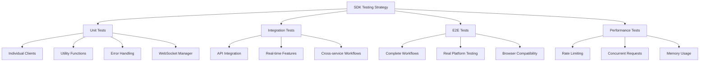

# Nomyx Resonance SDK Testing Strategy

## Overview

Comprehensive testing strategy for the Nomyx Resonance SDK covering unit tests, integration tests, end-to-end tests, and mock backend responses for all 9 API subsystems.

## Testing Architecture

### Test Types and Coverage



## Mock Backend Infrastructure

### Nock-based API Mocking

```typescript
// tests/mocks/api-mocks.ts
import nock from 'nock';
import { API_BASE_URL } from '../setup';

export class APIMockManager {
  private interceptors: nock.Interceptor[] = [];
  
  constructor(private baseUrl: string = API_BASE_URL) {}
  
  // RNET Foundation Layer Mocks
  mockRNETEndpoints(): void {
    // Space creation
    nock(this.baseUrl)
      .post('/v1/spaces')
      .reply(201, {
        id: 'space_test123',
        name: 'test-space',
        basis: { primes: [2, 3, 5, 7] },
        status: 'active',
        createdAt: '2024-01-01T00:00:00Z'
      });
    
    // Space listing
    nock(this.baseUrl)
      .get('/v1/spaces')
      .reply(200, {
        spaces: [
          {
            id: 'space_test123',
            name: 'test-space',
            memberCount: 1,
            status: 'active'
          }
        ],
        total: 1
      });
    
    // Session creation for real-time
    nock(this.baseUrl)
      .post('/v1/spaces/space_test123/sessions')
      .reply(201, {
        token: 'session_token_abc123',
        expires: '2024-01-01T01:00:00Z',
        capabilities: ['read', 'write', 'collaborate']
      });
    
    // Delta proposals
    nock(this.baseUrl)
      .post('/v1/spaces/space_test123/deltas')
      .reply(200, {
        deltaId: 'delta_456',
        applied: true,
        conflicts: [],
        newSnapshot: {
          version: 2,
          state: { resonance: 0.95 }
        }
      });
  }
  
  // SAI Flagship Service Mocks
  mockSAIEndpoints(): void {
    // Engine creation
    nock(this.baseUrl)
      .post('/v1/engines')
      .reply(201, {
        id: 'engine_ai789',
        name: 'test-ai-engine',
        status: 'ready',
        capabilities: ['text-generation', 'embeddings'],
        createdAt: '2024-01-01T00:00:00Z'
      });
    
    // Training job start
    nock(this.baseUrl)
      .post('/v1/training/jobs')
      .reply(202, {
        id: 'job_train123',
        status: 'starting',
        engineId: 'engine_ai789',
        estimatedDuration: 3600
      });
    
    // Training job status
    nock(this.baseUrl)
      .get('/v1/training/jobs/job_train123')
      .reply(200, {
        id: 'job_train123',
        status: 'running',
        progress: {
          iteration: 50,
          maxIterations: 1000,
          loss: 0.15,
          accuracy: 0.92
        }
      });
    
    // Text processing
    nock(this.baseUrl)
      .post('/v1/inference/generate')
      .reply(200, {
        generated: 'This is AI-generated text based on quantum resonance patterns.',
        confidence: 0.87,
        tokens: 12,
        primeSignature: [2, 3, 5, 7, 11]
      });
  }
  
  // Specialized Engine Mocks
  mockEngineEndpoints(): void {
    // SRS P=NP Solver
    nock(this.baseUrl)
      .post('/v1/srs/solve')
      .reply(200, {
        problemId: 'prob_srs123',
        solution: { satisfiable: true, assignment: [true, false, true] },
        complexity: 'polynomial',
        executionTime: 0.005,
        primeFactorization: [2, 3, 5]
      });
    
    // HQE Quantum Simulation
    nock(this.baseUrl)
      .post('/v1/hqe/simulate')
      .reply(200, {
        simulationId: 'sim_hqe456',
        results: {
          entanglement: 0.94,
          coherence: 0.87,
          quantumStates: [[1, 0], [0, 1]],
          holographicEncoding: 'success'
        },
        executionTime: 0.12
      });
    
    // QSEM Semantic Encoding
    nock(this.baseUrl)
      .post('/v1/qsem/encode')
      .reply(200, {
        encoding: {
          vector: [0.1, 0.5, 0.9, 0.3],
          basis: [2, 3, 5, 7],
          semantic: 'quantum-nlp-vector'
        },
        resonanceScore: 0.91
      });
    
    // NLC Non-local Communication
    nock(this.baseUrl)
      .post('/v1/nlc/sessions')
      .reply(201, {
        sessionId: 'nlc_session789',
        channelId: 'quantum_channel_1',
        entangled: true,
        latency: 0.001
      });
    
    // QCR Consciousness Simulation
    nock(this.baseUrl)
      .post('/v1/qcr/sessions')
      .reply(201, {
        sessionId: 'qcr_session101',
        consciousnessLevel: 0.76,
        observerEffect: 'detected',
        quantumCoherence: 0.89
      });
    
    // I-Ching Oracle
    nock(this.baseUrl)
      .post('/v1/iching/evolve')
      .reply(200, {
        hexagram: {
          primary: 'KUN_EARTH',
          transformed: 'QIAN_HEAVEN',
          lines: [6, 6, 9, 6, 6, 6]
        },
        quantumEvolution: {
          probability: 0.73,
          resonance: 0.85
        }
      });
    
    // Unified Physics
    nock(this.baseUrl)
      .post('/v1/unified/gravity/compute')
      .reply(200, {
        gravitationalField: {
          strength: 9.81,
          direction: [0, 0, -1],
          curvature: 0.00001
        },
        spacetimeMetric: [[1, 0, 0, 0], [0, -1, 0, 0], [0, 0, -1, 0], [0, 0, 0, -1]]
      });
  }
  
  // Error scenario mocks
  mockErrorScenarios(): void {
    // Rate limiting
    nock(this.baseUrl)
      .post('/v1/rate-limited-endpoint')
      .reply(429, {
        error: 'RATE_LIMITED',
        message: 'Rate limit exceeded',
        retryAfter: 60
      });
    
    // Service unavailable
    nock(this.baseUrl)
      .post('/v1/unavailable-endpoint')
      .reply(503, {
        error: 'SERVICE_UNAVAILABLE',
        message: 'Service temporarily unavailable'
      });
    
    // Version conflicts
    nock(this.baseUrl)
      .post('/v1/spaces/conflict_space/deltas')
      .reply(409, {
        error: 'VERSION_CONFLICT',
        message: 'Space version conflict',
        currentVersion: 5,
        expectedVersion: 3
      });
  }
  
  cleanup(): void {
    nock.cleanAll();
  }
}
```

### WebSocket Mock Infrastructure

```typescript
// tests/mocks/websocket-mocks.ts
import { EventEmitter } from 'events';

export class MockWebSocket extends EventEmitter {
  public readyState: number = 1; // OPEN
  public url: string;
  
  constructor(url: string) {
    super();
    this.url = url;
    
    // Simulate connection
    setTimeout(() => {
      this.emit('open');
    }, 10);
  }
  
  send(data: string): void {
    const message = JSON.parse(data);
    
    // Simulate different types of responses
    setTimeout(() => {
      switch (message.type) {
        case 'propose_delta':
          this.emit('message', {
            data: JSON.stringify({
              type: 'delta',
              delta: {
                id: 'delta_mock123',
                changes: message.delta.changes,
                applied: true
              }
            })
          });
          break;
          
        case 'join_space':
          this.emit('message', {
            data: JSON.stringify({
              type: 'member_joined',
              member: {
                id: 'user_mock456',
                name: 'Test User'
              }
            })
          });
          break;
      }
    }, 50);
  }
  
  close(): void {
    this.readyState = 3; // CLOSED
    this.emit('close');
  }
}

// Mock WebSocket constructor for tests
global.WebSocket = MockWebSocket as any;
```

## Unit Test Suites

### Core Client Tests

```typescript
// tests/unit/resonance-client.test.ts
import { ResonanceClient } from '../../src/resonance-client';
import { APIMockManager } from '../mocks/api-mocks';

describe('ResonanceClient', () => {
  let client: ResonanceClient;
  let mockManager: APIMockManager;
  
  beforeEach(() => {
    mockManager = new APIMockManager();
    mockManager.mockRNETEndpoints();
    mockManager.mockSAIEndpoints();
    mockManager.mockEngineEndpoints();
    
    client = new ResonanceClient({
      apiKey: 'test_api_key',
      baseURL: 'https://api.nomyx.dev'
    });
  });
  
  afterEach(() => {
    mockManager.cleanup();
  });
  
  describe('initialization', () => {
    it('should initialize with all API clients', () => {
      expect(client.rnet).toBeDefined();
      expect(client.sai).toBeDefined();
      expect(client.engines.srs).toBeDefined();
      expect(client.engines.hqe).toBeDefined();
      expect(client.engines.qsem).toBeDefined();
      expect(client.engines.nlc).toBeDefined();
      expect(client.engines.qcr).toBeDefined();
      expect(client.engines.iching).toBeDefined();
      expect(client.engines.unified).toBeDefined();
    });
    
    it('should configure dynamic API correctly', () => {
      expect(client['dynamicApi']).toBeDefined();
      // Test that rate limiting and retry logic are configured
    });
  });
  
  describe('RNET foundation layer', () => {
    it('should create spaces correctly', async () => {
      const space = await client.rnet.createSpace({
        name: 'test-space',
        basis: { primes: [2, 3, 5, 7] }
      });
      
      expect(space.id).toBe('space_test123');
      expect(space.name).toBe('test-space');
      expect(space.status).toBe('active');
    });
    
    it('should handle space collaboration', async () => {
      const session = await client.rnet.joinSpace('space_test123', {
        role: 'writer'
      });
      
      expect(session).toBeDefined();
      expect(session.spaceId).toBe('space_test123');
    });
  });
  
  describe('SAI flagship service', () => {
    it('should create AI engines', async () => {
      const engine = await client.sai.createEngine({
        name: 'test-ai-engine',
        type: 'text-generation'
      });
      
      expect(engine.id).toBe('engine_ai789');
      expect(engine.status).toBe('ready');
    });
    
    it('should process text generation requests', async () => {
      const result = await client.sai.processText('engine_ai789', {
        prompt: 'Generate quantum text',
        maxTokens: 100
      });
      
      expect(result.generated).toContain('quantum resonance patterns');
      expect(result.confidence).toBeGreaterThan(0.8);
    });
  });
});
```

### Engine-Specific Tests

```typescript
// tests/unit/engines/srs-client.test.ts
describe('SRS Client - P=NP Solver', () => {
  let client: ResonanceClient;
  let mockManager: APIMockManager;
  
  beforeEach(() => {
    mockManager = new APIMockManager();
    mockManager.mockEngineEndpoints();
    
    client = new ResonanceClient({
      apiKey: 'test_api_key'
    });
  });
  
  it('should solve 3-SAT problems', async () => {
    const problem = {
      variables: ['x1', 'x2', 'x3'],
      clauses: [
        ['x1', '!x2', 'x3'],
        ['!x1', 'x2', '!x3']
      ]
    };
    
    const solution = await client.engines.srs.solve(problem);
    
    expect(solution.satisfiable).toBe(true);
    expect(solution.assignment).toHaveLength(3);
    expect(solution.complexity).toBe('polynomial');
  });
  
  it('should handle complex NP problems', async () => {
    const complexProblem = {
      type: 'traveling-salesman',
      cities: 10,
      distances: Array(10).fill(0).map(() => Array(10).fill(0))
    };
    
    const solution = await client.engines.srs.solve(complexProblem);
    expect(solution.primeFactorization).toBeDefined();
  });
});
```

## Integration Tests

### Cross-Service Workflow Tests

```typescript
// tests/integration/collaborative-workflow.test.ts
describe('Collaborative AI Workflow', () => {
  let client: ResonanceClient;
  let mockManager: APIMockManager;
  
  beforeEach(() => {
    mockManager = new APIMockManager();
    mockManager.mockRNETEndpoints();
    mockManager.mockSAIEndpoints();
    mockManager.mockEngineEndpoints();
    
    client = new ResonanceClient({
      apiKey: 'test_api_key'
    });
  });
  
  it('should create collaborative AI space and train models', async () => {
    // 1. Create RNET space
    const space = await client.rnet.createSpace({
      name: 'ai-lab',
      basis: { primes: [2, 3, 5, 7, 11] }
    });
    
    // 2. Create SAI engine in space context
    const engine = await client.sai.createEngine({
      spaceId: space.id,
      name: 'collaborative-ai'
    });
    
    // 3. Start training with real-time progress
    const training = await client.sai.startTraining(engine.id, {
      dataset: 'quantum-patterns',
      spaceId: space.id
    });
    
    // 4. Monitor training progress
    const progressEvents: any[] = [];
    training.on('progress', (progress) => {
      progressEvents.push(progress);
    });
    
    // 5. Wait for initial progress
    await new Promise(resolve => {
      training.once('progress', resolve);
    });
    
    expect(progressEvents).toHaveLength(1);
    expect(training.jobData.id).toBe('job_train123');
  });
  
  it('should handle multi-engine quantum computations', async () => {
    const space = await client.rnet.createSpace({
      name: 'quantum-lab',
      basis: { primes: [2, 3, 5, 7] }
    });
    
    // Parallel engine operations
    const [hqeResult, qsemResult, srsResult] = await Promise.all([
      client.engines.hqe.simulate({
        qubits: 4,
        gates: ['H', 'CNOT', 'H']
      }),
      client.engines.qsem.encode({
        text: 'quantum machine learning',
        basis: [2, 3, 5, 7]
      }),
      client.engines.srs.solve({
        variables: ['q1', 'q2'],
        clauses: [['q1', '!q2']]
      })
    ]);
    
    expect(hqeResult.results.entanglement).toBeGreaterThan(0.9);
    expect(qsemResult.resonanceScore).toBeGreaterThan(0.8);
    expect(srsResult.satisfiable).toBe(true);
  });
});
```

### Real-time Features Integration

```typescript
// tests/integration/realtime-features.test.ts
describe('Real-time Features Integration', () => {
  it('should handle concurrent space collaboration', async () => {
    const client1 = new ResonanceClient({ apiKey: 'user1_key' });
    const client2 = new ResonanceClient({ apiKey: 'user2_key' });
    
    // User 1 creates space
    const space = await client1.rnet.createSpace({
      name: 'collaborative-space',
      basis: { primes: [2, 3, 5] }
    });
    
    // Both users join
    const [session1, session2] = await Promise.all([
      client1.rnet.joinSpace(space.id, { role: 'owner' }),
      client2.rnet.joinSpace(space.id, { role: 'writer' })
    ]);
    
    // Track events
    const deltaEvents: any[] = [];
    session2.on('deltaApplied', (delta) => {
      deltaEvents.push(delta);
    });
    
    // User 1 proposes changes
    await session1.proposeDelta({
      changes: [{ type: 'update', path: 'resonance', value: 0.95 }]
    });
    
    // Wait for propagation
    await new Promise(resolve => setTimeout(resolve, 100));
    
    expect(deltaEvents).toHaveLength(1);
    expect(deltaEvents[0].applied).toBe(true);
  });
});
```

## Performance Tests

### Rate Limiting and Concurrency

```typescript
// tests/performance/rate-limiting.test.ts
describe('Rate Limiting Performance', () => {
  let client: ResonanceClient;
  
  beforeEach(() => {
    client = new ResonanceClient({
      apiKey: 'test_key',
      timeout: 5000
    });
  });
  
  it('should handle rate limiting gracefully', async () => {
    // Mock rate-limited responses
    const mockManager = new APIMockManager();
    mockManager.mockErrorScenarios();
    
    const requests = Array(10).fill(0).map(() => 
      client.engines.srs.solve({ variables: ['x'], clauses: [['x']] })
    );
    
    const results = await Promise.allSettled(requests);
    
    // Some should succeed, some should be rate limited but retried
    const successful = results.filter(r => r.status === 'fulfilled');
    expect(successful.length).toBeGreaterThan(0);
    
    mockManager.cleanup();
  });
  
  it('should maintain performance under high concurrency', async () => {
    const startTime = Date.now();
    
    const concurrent = Array(50).fill(0).map(async (_, i) => {
      return client.engines.qsem.encode({
        text: `test text ${i}`,
        basis: [2, 3, 5]
      });
    });
    
    const results = await Promise.all(concurrent);
    const duration = Date.now() - startTime;
    
    expect(results).toHaveLength(50);
    expect(duration).toBeLessThan(10000); // Should complete within 10s
  });
});
```

## Test Setup and Configuration

### Global Test Setup

```typescript
// tests/setup.ts
import { APIMockManager } from './mocks/api-mocks';
import './mocks/websocket-mocks';

export const API_BASE_URL = 'https://api.nomyx.dev';

// Global test configuration
beforeAll(() => {
  // Setup global mocks
  process.env.NOMYX_API_KEY = 'test_api_key';
  process.env.NODE_ENV = 'test';
});

afterEach(() => {
  // Clean up after each test
  jest.clearAllMocks();
});

// Test utilities
export const createTestClient = (config: Partial<any> = {}) => {
  return new (require('../src/resonance-client').ResonanceClient)({
    apiKey: 'test_key',
    baseURL: API_BASE_URL,
    ...config
  });
};

export const waitForEvent = (emitter: any, event: string, timeout = 5000) => {
  return new Promise((resolve, reject) => {
    const timer = setTimeout(() => {
      reject(new Error(`Event '${event}' not received within ${timeout}ms`));
    }, timeout);
    
    emitter.once(event, (data: any) => {
      clearTimeout(timer);
      resolve(data);
    });
  });
};
```

## Test Execution Strategy

### Test Commands and Coverage

```bash
# Unit tests only
npm run test:unit

# Integration tests only  
npm run test:integration

# E2E tests (requires running backend)
npm run test:e2e

# Performance tests
npm run test:performance

# All tests with coverage
npm run test:coverage

# Watch mode for development
npm run test:watch

# Specific test suites
npm test -- --testNamePattern="ResonanceClient"
npm test -- --testPathPattern="engines"
```

### Coverage Requirements

- **Unit Tests**: 90%+ code coverage
- **Integration Tests**: All API endpoints tested
- **E2E Tests**: Complete user workflows validated
- **Performance Tests**: Rate limiting and concurrency verified

### Continuous Integration

```yaml
# In .github/workflows/ci.yml
- name: Run unit tests
  run: npm run test:unit

- name: Run integration tests  
  run: npm run test:integration

- name: Check coverage threshold
  run: npm run test:coverage -- --coverageThreshold='{"global":{"branches":90,"functions":90,"lines":90,"statements":90}}'
```

This testing strategy ensures comprehensive validation of the SDK across all 9 API subsystems with proper mocking, real-time feature testing, and performance validation.