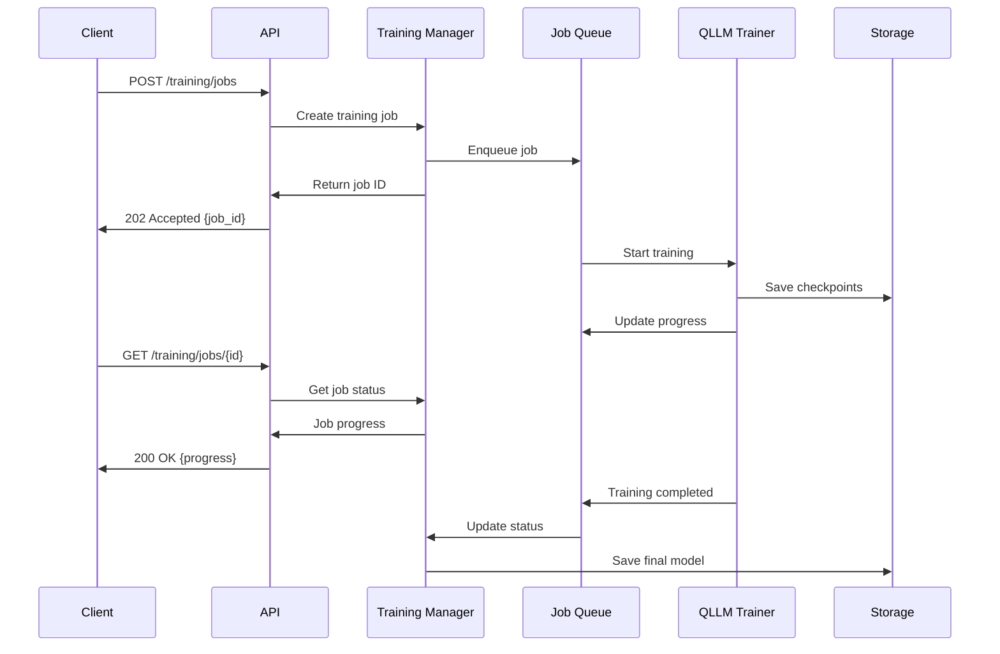
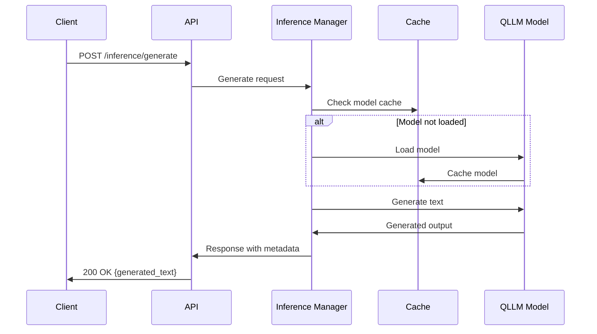

# QLLM REST API Design Document

## Overview

This document outlines the comprehensive design for a REST API that provides training and inference capabilities for the Quantum Resonance Language Model (QLLM). The API enables users to create, train, and use QLLM models through HTTP endpoints, supporting all existing features including quantum resonance principles, extension systems, and advanced training capabilities.

## Architecture

### High-Level Architecture

```mermaid
graph TB
    subgraph Client Layer
        WebUI[Web Interface]
        CLI[CLI Client]
        SDK[Python SDK]
        Third[Third-party Apps]
    end
    
    subgraph API Gateway
        Auth[Authentication]
        Rate[Rate Limiting]
        CORS[CORS Handler]
        Logger[Request Logger]
    end
    
    subgraph API Server
        Router[FastAPI Router]
        Models[Model Endpoints]
        Training[Training Endpoints]
        Inference[Inference Endpoints]
        Config[Config Endpoints]
        Extensions[Extension Endpoints]
    end
    
    subgraph Core Services
        ModelMgr[Model Manager]
        TrainMgr[Training Manager]
        InferMgr[Inference Manager]
        JobQueue[Async Job Queue]
        ExtMgr[Extension Manager]
    end
    
    subgraph Storage Layer
        ModelStore[(Model Storage)]
        ConfigStore[(Config Storage)]
        JobDB[(Job Status DB)]
        Cache[(Redis Cache)]
        FileSystem[(File System)]
    end
    
    subgraph Existing QLLM Core
        SemanticModel[Semantic Resonance Model]
        UnifiedTrainer[Unified Trainer]
        Extensions[Extension System]
        DataLoaders[Data Loaders]
        Evaluation[Evaluation Suite]
    end
    
    Client Layer --> API Gateway
    API Gateway --> API Server
    API Server --> Core Services
    Core Services --> Storage Layer
    Core Services --> Existing QLLM Core
```

### Technology Stack

- **API Framework**: FastAPI (async support, automatic OpenAPI docs)
- **Database**: PostgreSQL (job status, metadata)
- **Cache**: Redis (sessions, temporary data)
- **Queue**: Celery with Redis broker (async training jobs)
- **Storage**: File system with configurable backends (S3, local)
- **Authentication**: JWT with role-based access control
- **Documentation**: OpenAPI/Swagger with ReDoc

## Core Components Integration

### Model Integration

The API leverages existing QLLM components:

- **Base Models**: [`SemanticResonanceModel`](src/model/semantic_resonance_model.py) and [`SemanticResonanceModelWithExtensions`](src/model/semantic_resonance_model_with_extensions.py)
- **Configuration**: [`ModelConfig`](src/config/model_config.py) for model parameters
- **Extensions**: All existing extensions (multimodal, memory, quantum, etc.)

### Training Integration

- **Trainer**: [`UnifiedTrainer`](src/training/unified_trainer.py) for training orchestration
- **Training Types**: Standard, dialogue, empathy, function calling
- **Data Loading**: Existing data loaders and processors
- **Evaluation**: [`ComprehensiveEvaluationSuite`](src/evaluation/comprehensive_suite.py)

### Extension System Integration

- **Base Extension**: [`BaseExtension`](src/model/extensions/base_extension.py) interface
- **Extension Manager**: [`ExtensionManager`](src/model/extensions/extension_manager.py)
- **Extension Types**: Memory, multimodal, quantum, observer, structured output

## API Design Principles

### RESTful Design
- Resource-oriented URLs
- HTTP methods for operations (GET, POST, PUT, DELETE)
- Standard HTTP status codes
- Consistent JSON response format

### Asynchronous Operations
- Long-running operations (training) return job IDs
- Status endpoints for monitoring progress
- Server-Sent Events for real-time updates
- Webhook support for job completion notifications

### Error Handling
- Consistent error response format
- Detailed error messages and codes
- Request validation with clear feedback
- Graceful degradation

### Security
- JWT-based authentication
- Role-based access control (admin, user, readonly)
- API key support for service accounts
- Rate limiting and throttling

## API Endpoints

### 1. Model Management (`/api/v1/models`)

#### Core Operations
- `GET /api/v1/models` - List models with filtering
- `POST /api/v1/models` - Create new model
- `GET /api/v1/models/{id}` - Get model details
- `PUT /api/v1/models/{id}` - Update model configuration
- `DELETE /api/v1/models/{id}` - Delete model

#### Model Lifecycle
- `POST /api/v1/models/{id}/load` - Load model for inference
- `POST /api/v1/models/{id}/unload` - Unload model from memory
- `GET /api/v1/models/{id}/status` - Get model status and metrics

### 2. Training Operations (`/api/v1/training`)

#### Job Management
- `POST /api/v1/training/jobs` - Start training job
- `GET /api/v1/training/jobs` - List training jobs
- `GET /api/v1/training/jobs/{id}` - Get job status and metrics
- `POST /api/v1/training/jobs/{id}/stop` - Stop training job
- `POST /api/v1/training/jobs/{id}/resume` - Resume paused job

#### Monitoring
- `GET /api/v1/training/jobs/{id}/logs` - Stream training logs (SSE)
- `GET /api/v1/training/jobs/{id}/metrics` - Get training metrics
- `POST /api/v1/training/jobs/{id}/checkpoint` - Force checkpoint save

### 3. Inference Operations (`/api/v1/inference`)

#### Text Generation
- `POST /api/v1/inference/generate` - Generate text completion
- `POST /api/v1/inference/chat` - Chat completion with context
- `POST /api/v1/inference/batch` - Batch inference processing

#### Advanced Features
- `POST /api/v1/inference/embeddings` - Get text embeddings
- `POST /api/v1/inference/similarity` - Text similarity scoring
- `GET /api/v1/inference/models/{id}/capabilities` - Model capabilities

### 4. Configuration Management (`/api/v1/configs`)

#### Templates and Validation
- `GET /api/v1/configs/templates` - Get configuration templates
- `POST /api/v1/configs/validate` - Validate configuration
- `GET /api/v1/configs/schema` - Get configuration schema

#### Presets
- `GET /api/v1/configs/model-presets` - Model configuration presets
- `GET /api/v1/configs/training-presets` - Training configuration presets

### 5. Extension Management (`/api/v1/extensions`)

#### Extension Operations
- `GET /api/v1/extensions` - List available extensions
- `GET /api/v1/extensions/{name}` - Get extension details
- `POST /api/v1/models/{id}/extensions` - Enable extension
- `DELETE /api/v1/models/{id}/extensions/{name}` - Disable extension

#### Extension Configuration
- `GET /api/v1/extensions/{name}/schema` - Extension config schema
- `PUT /api/v1/models/{id}/extensions/{name}` - Update extension config

### 6. System Operations (`/api/v1/system`)

#### Health and Status
- `GET /api/v1/system/health` - System health check
- `GET /api/v1/system/status` - System status and metrics
- `GET /api/v1/system/version` - API version information

#### Resource Management
- `GET /api/v1/system/resources` - Resource usage statistics
- `POST /api/v1/system/cleanup` - Clean up temporary resources

## Data Flow Diagrams

### Training Workflow



### Inference Workflow



## Authentication & Authorization

### Authentication Flow
1. Client obtains JWT token via `/auth/login`
2. Token included in `Authorization: Bearer <token>` header
3. API validates token and extracts user context
4. User permissions checked for requested operation

### Role-Based Access Control

| Role | Permissions |
|------|-------------|
| **Admin** | Full access to all operations |
| **Trainer** | Create/manage models, start training, inference |
| **User** | Model inference, view model status |
| **Readonly** | View-only access to models and jobs |

### API Key Authentication
- Service accounts use API keys in `X-API-Key` header
- API keys mapped to specific roles and permissions
- Rate limiting based on API key tier

## Error Handling Strategy

### Error Response Format
```json
{
  "error": "error_code",
  "message": "Human readable message",
  "details": {
    "field": "specific_field",
    "code": "validation_error"
  },
  "request_id": "uuid",
  "timestamp": "2025-01-15T10:30:00Z"
}
```

### Common Error Codes
- `validation_error`: Request validation failed
- `not_found`: Resource not found
- `unauthorized`: Authentication required
- `forbidden`: Insufficient permissions
- `rate_limited`: Rate limit exceeded
- `resource_exhausted`: System resources unavailable
- `internal_error`: Server error

## Performance Considerations

### Caching Strategy
- **Model Caching**: Keep frequently used models in memory
- **Configuration Caching**: Cache model configs and templates
- **Response Caching**: Cache static responses (schemas, templates)

### Scaling Strategy
- **Horizontal Scaling**: Multiple API server instances
- **Load Balancing**: Distribute inference requests
- **Queue Scaling**: Scale training workers based on demand
- **Database Optimization**: Connection pooling, read replicas

### Resource Management
- **Memory Limits**: Configurable model memory limits
- **GPU Management**: GPU allocation and sharing
- **Disk Space**: Automatic cleanup of old checkpoints

## Monitoring and Observability

### Metrics Collection
- **Request Metrics**: Latency, throughput, error rates
- **Model Metrics**: Inference time, memory usage
- **Training Metrics**: Progress, loss, resource usage
- **System Metrics**: CPU, memory, disk, GPU utilization

### Logging Strategy
- **Structured Logging**: JSON format with consistent fields
- **Log Levels**: DEBUG, INFO, WARNING, ERROR, CRITICAL
- **Request Tracing**: Unique request IDs for tracking
- **Security Logging**: Authentication events, permission checks

### Health Checks
- **Liveness**: API server is running
- **Readiness**: Dependencies (DB, Redis) are available
- **Custom Checks**: Model availability, GPU status

## Deployment Architecture

### Container Strategy
```dockerfile
# Multi-stage build for optimized images
FROM python:3.11-slim as base
# Install dependencies
FROM base as api-server
# Copy API code and start server
FROM base as worker
# Copy training code and start worker
```

### Infrastructure Components
- **API Server**: FastAPI application
- **Worker Nodes**: Celery workers for training
- **Database**: PostgreSQL cluster
- **Cache**: Redis cluster
- **Load Balancer**: Nginx or cloud load balancer
- **Storage**: Persistent volumes for models and data

### Environment Configuration
- **Development**: Single instance, local storage
- **Staging**: Multi-instance, shared storage
- **Production**: Auto-scaling, distributed storage

## Security Considerations

### Data Protection
- **Encryption**: TLS for API traffic, encryption at rest
- **Input Validation**: Strict validation of all inputs
- **Output Sanitization**: Prevent information leakage

### Access Control
- **Network Security**: VPC, firewall rules
- **API Security**: Rate limiting, input validation
- **Model Security**: Access control for model files

### Compliance
- **Data Privacy**: GDPR compliance for EU data
- **Audit Logging**: Comprehensive audit trails
- **Access Reviews**: Regular permission audits

## Future Enhancements

### Planned Features
- **WebSocket Support**: Real-time training updates
- **Multi-tenant Support**: Isolated model namespaces
- **Model Versioning**: Semantic versioning for models
- **Distributed Training**: Multi-GPU, multi-node training
- **Auto-scaling**: Dynamic resource allocation

### Integration Opportunities
- **MLflow**: Experiment tracking integration
- **Weights & Biases**: Advanced monitoring
- **Hugging Face Hub**: Model publishing
- **Cloud Providers**: Native cloud integrations

## Implementation Roadmap

### Phase 1: Core API (Weeks 1-3)
- [ ] FastAPI server setup
- [ ] Model management endpoints
- [ ] Basic inference endpoints
- [ ] Configuration management

### Phase 2: Training System (Weeks 4-6)
- [ ] Training job management
- [ ] Async job processing
- [ ] Progress monitoring
- [ ] Checkpoint management

### Phase 3: Advanced Features (Weeks 7-9)
- [ ] Extension management
- [ ] Authentication system
- [ ] Monitoring and logging
- [ ] Error handling

### Phase 4: Production Ready (Weeks 10-12)
- [ ] Performance optimization
- [ ] Security hardening
- [ ] Documentation completion
- [ ] Testing and validation

This design provides a comprehensive foundation for implementing a production-ready REST API for the QLLM system, maintaining compatibility with all existing components while adding robust HTTP-based access patterns.