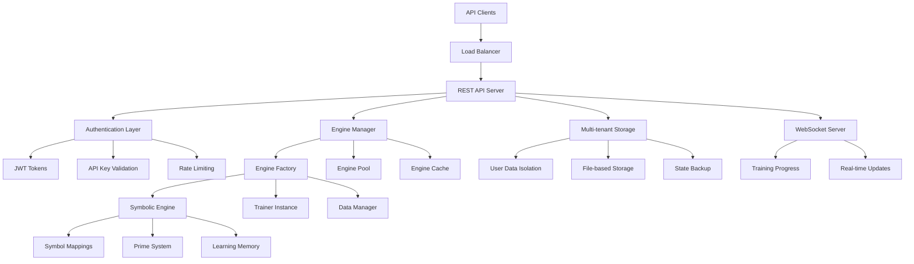

# Symbolic AI API Service - Implementation Plan

## Overview

This document outlines the comprehensive plan for building a multi-tenant REST API service that allows users to build and train symbolic AI models based on the existing symbolic engine architecture.

## Current System Analysis

### Core Components Analyzed

- **[`SymbolicEngine`](src/core/symbolic-engine.js:17)** - Text-to-symbol conversion with prime number signatures
- **[`Trainer`](src/learning/trainer.js:15)** - Comprehensive training system with learning metrics  
- **[`DataManager`](src/utils/data-manager.js:12)** - Unified data persistence and state management
- **[`PrimeSystem`](src/core/prime-system.js:8)** - Prime number assignment for symbolic representation

### Key Features Identified

- Symbol mapping with Unicode representation
- Prime-based cryptographic signatures for patterns
- Entropy-based temperature dynamics  
- Relationship memory and contextual pattern learning
- Training with success metrics and autonomy levels
- File-based state persistence with migration support

## Architecture Design

## API Endpoint Structure

### Authentication & User Management
- `POST /api/auth/register` - Register new user and generate API key
- `POST /api/auth/login` - User login (returns JWT + API key)
- `GET /api/auth/profile` - Get user profile and usage stats
- `POST /api/auth/regenerate-key` - Regenerate API key

### Engine Management
- `POST /api/engines` - Create new symbolic engine
- `GET /api/engines` - List user's engines
- `GET /api/engines/{id}` - Get engine details and stats
- `PUT /api/engines/{id}` - Update engine configuration
- `DELETE /api/engines/{id}` - Delete engine and all data

### Text Processing
- `POST /api/engines/{id}/process` - Process text through symbolic engine
- `POST /api/engines/{id}/batch-process` - Batch process multiple texts
- `GET /api/engines/{id}/symbols` - Get engine's symbol mappings
- `POST /api/engines/{id}/symbols` - Add/update custom symbol mappings

### Training Operations
- `POST /api/engines/{id}/training/start` - Start training session
- `GET /api/engines/{id}/training/status` - Get training progress
- `POST /api/engines/{id}/training/stop` - Stop current training
- `GET /api/engines/{id}/training/history` - Get training history

### Data Management
- `GET /api/engines/{id}/training-data` - Get training dataset
- `POST /api/engines/{id}/training-data` - Add training examples
- `PUT /api/engines/{id}/training-data/{example-id}` - Update training example
- `DELETE /api/engines/{id}/training-data/{example-id}` - Remove training example

### Statistics & Monitoring
- `GET /api/engines/{id}/stats` - Get engine statistics
- `GET /api/engines/{id}/metrics` - Get detailed metrics
- `GET /api/user/usage` - Get user usage statistics
- `GET /api/system/health` - System health check

## Implementation Todo List

### Phase 1: Foundation (Core Infrastructure)
1. **Design and implement API authentication system with API key management**
2. **Create multi-tenant data isolation layer extending current DataManager**
3. **Build REST API server with Express.js framework and route structure**
4. **Implement Engine Factory pattern for per-user symbolic engine instances**

### Phase 2: Core Functionality (Engine Operations)
5. **Create symbolic engine management endpoints for CRUD operations**
6. **Build text processing and symbol conversion API endpoints**
7. **Implement custom symbol mapping management for users**
8. **Add comprehensive error handling and request validation middleware**

### Phase 3: Training System (Learning Operations)
9. **Develop training endpoints with progress tracking and control**
10. **Create training data management endpoints with validation**
11. **Implement engine state persistence and backup mechanisms**
12. **Add WebSocket support for real-time training progress updates**

### Phase 4: Advanced Features (Performance & Monitoring)
13. **Implement rate limiting and usage quota management**
14. **Add logging and monitoring for multi-tenant operations**
15. **Create user dashboard endpoints for engine statistics and metrics**
16. **Add performance optimization and caching layers**

### Phase 5: Documentation & Testing (Quality Assurance)
17. **Create API documentation with OpenAPI/Swagger specifications**
18. **Create comprehensive test suite for API endpoints**
19. **Implement engine sharing and collaboration features**
20. **Deploy and configure production environment setup**

## Technical Implementation Details

### Multi-Tenant Architecture
- **User Isolation**: Each user gets isolated data directories and engine instances
- **Resource Management**: Engine pooling and memory management for concurrent users
- **Authentication**: API key-based authentication with JWT tokens for sessions
- **Rate Limiting**: Per-user rate limits and usage quotas

### Data Storage Strategy
- **File-Based Storage**: Extend existing [`DataManager`](src/utils/data-manager.js:12) for multi-tenant support
- **User Directories**: Structure like `data/users/{userId}/engines/{engineId}/`
- **State Persistence**: Maintain current JSON-based state files with user isolation
- **Backup System**: Automated backup and recovery for user data

### Engine Management
- **Factory Pattern**: Create per-user [`SymbolicEngine`](src/core/symbolic-engine.js:17) instances
- **Instance Pooling**: Manage active engines in memory with LRU eviction
- **Configuration Management**: Allow users to customize engine parameters
- **Custom Mappings**: Support user-defined symbol mappings and prime configurations

### Real-Time Features
- **WebSocket Integration**: Socket.IO for real-time training progress
- **Event Broadcasting**: Training status, completion notifications
- **Live Metrics**: Real-time engine statistics and performance data

### API Features
- **Full Customization**: Users can create custom symbol mappings, modify prime system behavior
- **Batch Operations**: Support for processing multiple texts in single requests  
- **Training Control**: Start, stop, monitor training sessions with detailed progress
- **Comprehensive Analytics**: Engine statistics, learning metrics, usage analytics

## Technology Stack

### Core Framework
- **Express.js** - REST API framework
- **Socket.IO** - WebSocket support for real-time features
- **Node.js 18+** - Runtime (current system requirement)

### Authentication & Security
- **JWT** - JSON Web Tokens for session management
- **bcrypt** - Password hashing
- **express-rate-limit** - Rate limiting middleware
- **helmet** - Security headers

### Validation & Documentation
- **joi** - Request/response validation
- **swagger-jsdoc** - API documentation generation
- **swagger-ui-express** - Interactive API documentation

### Testing & Monitoring
- **jest** - Testing framework
- **supertest** - API endpoint testing
- **winston** - Logging framework
- **pino** - High-performance logging

## Success Metrics

### Performance Targets
- **Response Time**: < 200ms for text processing endpoints
- **Concurrent Users**: Support 100+ concurrent users
- **Uptime**: 99.9% availability
- **Training Speed**: Maintain current training performance per engine

### User Experience Goals
- **Easy Onboarding**: Simple API key generation and first engine creation
- **Comprehensive Documentation**: Complete API reference with examples
- **Real-Time Feedback**: Live training progress and immediate processing results
- **Flexible Customization**: Full control over symbolic mappings and training data

## Deployment Strategy

### Development Environment
- Local development with file-based storage
- Hot reloading for rapid development
- Comprehensive test coverage

### Production Environment  
- Containerized deployment with Docker
- Load balancing for multiple API instances
- File storage with backup/recovery
- Monitoring and alerting

This plan transforms the existing symbolic AI engine into a production-ready, multi-tenant API service while preserving all the sophisticated learning and symbolic processing capabilities of the current system.